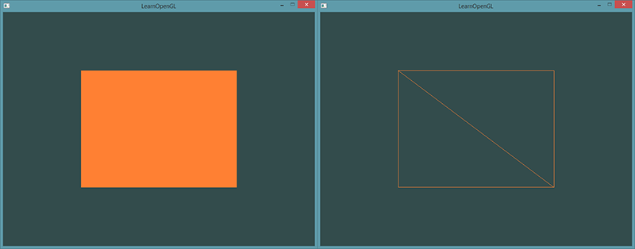

# 以下为入门模块

# 你好，窗口

### 初始化

```c++
if (!glfwInit())			//glfw初始化
	return -1;
glfwWindowHint(GLFW_CONTEXT_VERSION_MAJOR, 3);	//glfw主版本为3
glfwWindowHint(GLFW_CONTEXT_VERSION_MINOR, 3);	//glfw次版本为3
glfwWindowHint(GLFW_OPENGL_PROFILE, GLFW_OPENGL_CORE_PROFILE);	//使用核心模式

GLFWwindow* window = glfwCreateWindow(800, 600, "LearnOpenGL", nullptr, nullptr);	//创建窗口，长宽名字
if (!window)
{
	std::cout << "Failed to create GLFW window" << std::endl;
	glfwTerminate();
	return -1;
}
glfwMakeContextCurrent(window);		//将该窗口设置为当前线程的主上下文

if (glewInit() != GLEW_OK)			//glew初始化
	return -1;

glViewport(0, 0, 800, 600);			//OpenGL渲染窗口的尺寸大小，前两个参数：左下角的位置，后两个参数：宽度和高度（像素）
glfwSetFramebufferSizeCallback(window, framebuffer_size_callback);	//注册视口变化函数
```

### 渲染循环

```C++
while (!glfwWindowShouldClose(window))		//该函数用于检测GLFW是否被要求退出，如果是则返回true
{
	//输入
	processInput(window);					//点击ESC退出
	//渲染指令
	glClearColor(0.2f, 0.3f, 0.3f, 1.0f);	//指定清除缓冲所用的颜色
	glClear(GL_COLOR_BUFFER_BIT);			//指定清除颜色缓冲
	glfwSwapBuffers(window);				//交换颜色缓冲
	glfwPollEvents();						//检查有没有触发什么事件
}
glfwTerminate();							//正确释放/删除之前的分配的左右资源
```


# 你好，三角形

- 顶点数组对象：Vertex Array Object，VAO
- 顶点缓冲对象：Vertex Buffer Object，VBO
- 索引缓冲对象：Element Buffer Object，EBO或Index Buffer Object，IBO

图形渲染管线接受一组3D坐标，然后把它们转变为你屏幕上的有色2D像素输出。图形渲染管线可以被划分为几个阶段，每个阶段将会把前一个阶段的输出作为输入。所有这些阶段都是高度专门化的（它们都有一个特定的函数），并且很容易并行执行。正是由于它们具有并行执行的特性，当今大多数显卡都有成千上万的小处理核心，它们在GPU上为每一个（渲染管线）阶段运行各自的小程序，从而在图形渲染管线中快速处理你的数据。这些小程序叫做着色器(Shader)。

有些着色器允许开发者自己配置，这就允许我们用自己写的着色器来替换默认的。这样我们就可以更细致地控制图形渲染管线中的特定部分了，而且因为它们运行在GPU上，所以它们可以给我们节约宝贵的CPU时间。OpenGL着色器是用OpenGL着色器语言(OpenGL Shading Language, GLSL)写成的，在下一节中我们再花更多时间研究它。


在图形渲染的过程中，最少需要顶点着器和片段着色器两个着色器

## 顶点输入

渲染一个三角形，一共要指定三个顶点，每个顶点都有一个3D位置。将它们以标准化设备坐标的形式（OpenGL的可见区域）定义为一个`float`数组。

```
float vertices[] = {
    -0.5f, -0.5f, 0.0f,
     0.5f, -0.5f, 0.0f,
     0.0f,  0.5f, 0.0f
};
```

**标准化设备坐标**：一旦你的顶点坐标已经在顶点着色器中处理过，它们就应该是**标准化设备坐标**了，标准化设备坐标是一个x、y和z值在-1.0到1.0的一小段空间。任何落在范围外的坐标都会被丢弃/裁剪，不会显示在你的屏幕上。

创建一个VBO对象：

```c++
unsigned int VBO;
glGenBuffers(1, &VBO);
```

新创建的缓冲绑定到GL_ARRAY_BUFFER目标上：

```c++
glBindBuffer(GL_ARRAY_BUFFER, VBO);  
```

从这一刻起，我们使用的任何（在GL_ARRAY_BUFFER目标上的）缓冲调用都会用来配置当前绑定的缓冲(VBO)。然后我们可以调用glBufferData函数，它会把之前定义的顶点数据复制到缓冲的内存中：

```c++
glBufferData(GL_ARRAY_BUFFER, sizeof(vertices), vertices, GL_STATIC_DRAW);
```

glBufferData是一个专门用来把用户定义的数据复制到当前绑定缓冲的函数。它的第一个参数是目标缓冲的类型：顶点缓冲对象当前绑定到GL_ARRAY_BUFFER目标上。第二个参数指定传输数据的大小(以字节为单位)；用一个简单的`sizeof`计算出顶点数据大小就行。第三个参数是我们希望发送的实际数据。

第四个参数指定了我们希望显卡如何管理给定的数据。它有三种形式：

- GL_STATIC_DRAW ：数据不会或几乎不会改变。
- GL_DYNAMIC_DRAW：数据会被改变很多。
- GL_STREAM_DRAW ：数据每次绘制时都会改变。

三角形的位置数据不会改变，每次渲染调用时都保持原样，所以它的使用类型最好是GL_STATIC_DRAW。如果，比如说一个缓冲中的数据将频繁被改变，那么使用的类型就是GL_DYNAMIC_DRAW或GL_STREAM_DRAW，这样就能确保显卡把数据放在能够高速写入的内存部分。

## 顶点着色器

```c++
#version 330 core
layout (location = 0) in vec3 aPos;

void main()
{
    gl_Position = vec4(aPos.x, aPos.y, aPos.z, 1.0);
}
```

## 编译着色器

现在，我们暂时将顶点着色器的源代码硬编码在代码文件顶部的C风格字符串中：

```
const char *vertexShaderSource = "#version 330 core\n"
    "layout (location = 0) in vec3 aPos;\n"
    "void main()\n"
    "{\n"
    "   gl_Position = vec4(aPos.x, aPos.y, aPos.z, 1.0);\n"
    "}\0";
```

为了能够让OpenGL使用它，我们必须在运行时动态编译它的源代码。

我们首先要做的是创建一个着色器对象，注意还是用ID来引用的。所以我们储存这个顶点着色器为`unsigned int`，然后用glCreateShader创建这个着色器：

```
unsigned int vertexShader;
vertexShader = glCreateShader(GL_VERTEX_SHADER);
```

我们把需要创建的着色器类型以参数形式提供给glCreateShader。由于我们正在创建一个顶点着色器，传递的参数是GL_VERTEX_SHADER。

下一步我们把这个着色器源码附加到着色器对象上，然后编译它：

```
glShaderSource(vertexShader, 1, &vertexShaderSource, NULL);
glCompileShader(vertexShader);
```

glShaderSource函数把要编译的着色器对象作为第一个参数。第二参数指定了传递的源码字符串数量，这里只有一个。第三个参数是顶点着色器真正的源码，第四个参数我们先设置为`NULL`。

你可能会希望检测在调用glCompileShader后编译是否成功了，如果没成功的话，你还会希望知道错误是什么，这样你才能修复它们。检测编译时错误可以通过以下代码来实现：

```
int  success;
char infoLog[512];
glGetShaderiv(vertexShader, GL_COMPILE_STATUS, &success);
```

首先我们定义一个整型变量来表示是否成功编译，还定义了一个储存错误消息（如果有的话）的容器。然后我们用glGetShaderiv检查是否编译成功。如果编译失败，我们会用glGetShaderInfoLog获取错误消息，然后打印它。

```
if(!success)
{
    glGetShaderInfoLog(vertexShader, 512, NULL, infoLog);
    std::cout << "ERROR::SHADER::VERTEX::COMPILATION_FAILED\n" << infoLog << std::endl;
}
```

如果编译的时候没有检测到任何错误，顶点着色器就被编译成功了。

## 片段着色器

```c++
#version 330 core
out vec4 FragColor;

void main()
{
    FragColor = vec4(1.0f, 0.5f, 0.2f, 1.0f);
} 
```

```c++
unsigned int fragmentShader;
fragmentShader = glCreateShader(GL_FRAGMENT_SHADER);
glShaderSource(fragmentShader, 1, &fragmentShaderSource, NULL);
glCompileShader(fragmentShader);
```

## 着色器程序

创建一个程序对象：

```c++
unsigned int shaderProgram;
shaderProgram = glCreateProgram();
```

glCreateProgram函数创建一个程序，并返回新创建程序对象的ID引用。现在我们需要把之前编译的着色器附加到程序对象上，然后用glLinkProgram链接它们：

```c++
glAttachShader(shaderProgram, vertexShader);
glAttachShader(shaderProgram, fragmentShader);
glLinkProgram(shaderProgram);
```

就像着色器的编译一样，我们也可以检测链接着色器程序是否失败，并获取相应的日志。与上面不同，我们不会调用glGetShaderiv和glGetShaderInfoLog，现在我们使用：

```c++
glGetProgramiv(shaderProgram, GL_LINK_STATUS, &success);
if(!success) {
    glGetProgramInfoLog(shaderProgram, 512, NULL, infoLog);
    ...
}
```

得到的结果就是一个程序对象，我们可以调用glUseProgram函数，用刚创建的程序对象作为它的参数，以激活这个程序对象：

```c++
glUseProgram(shaderProgram);
```

在把着色器对象链接到程序对象以后，记得删除着色器对象，我们不再需要它们了：

```c++
glDeleteShader(vertexShader);
glDeleteShader(fragmentShader);
```

## 链接顶点属性

 

- 位置数据被储存为32位（4字节）浮点值。
- 每个位置包含3个这样的值。
- 在这3个值之间没有空隙（或其他值）。这几个值在数组中紧密排列(Tightly Packed)。
- 数据中第一个值在缓冲开始的位置。

```c++
glVertexAttribPointer(0, 3, GL_FLOAT, GL_FALSE, 3 * sizeof(float), (void*)0);
glEnableVertexAttribArray(0);
```

//参数含义：
		//1、顶点属性：设为0
		//2、顶点属性的大小：顶点属性是vec3，由3个值组成，所以大小是3
		//3、数据的类型：GL_FLOAT（GLSL中`vec*`都是由浮点数值组成的）
		//4、是否希望数据被标准化：如果设置为GL_TRUE，则所有数据会被映射到0
		//5、步长：在连续的顶点属性组之间的间隔。由于下个组位置数据在3个float之后
		//6、数据在缓冲中起始位置的偏移量：由于位置数据在数组的开头，所以这里是0，参数类型是`void*`
	//以顶点属性位置值作为参数，启用顶点属性

## 顶点数组对象

一个顶点数组对象会储存以下这些内容：

- glEnableVertexAttribArray和glDisableVertexAttribArray的调用。
- 通过glVertexAttribPointer设置的顶点属性配置。
- 通过glVertexAttribPointer调用与顶点属性关联的顶点缓冲对象。

 

创建一个VAO和创建一个VBO很类似：

```c++
unsigned int VAO;
glGenVertexArrays(1, &VAO);
```

```c++
// ..:: 初始化代码（只运行一次 (除非你的物体频繁改变)） :: ..
// 1. 绑定VAO
glBindVertexArray(VAO);
// 2. 把顶点数组复制到缓冲中供OpenGL使用
glBindBuffer(GL_ARRAY_BUFFER, VBO);
glBufferData(GL_ARRAY_BUFFER, sizeof(vertices), vertices, GL_STATIC_DRAW);
// 3. 设置顶点属性指针
glVertexAttribPointer(0, 3, GL_FLOAT, GL_FALSE, 3 * sizeof(float), (void*)0);
glEnableVertexAttribArray(0);

[...]

// ..:: 绘制代码（渲染循环中） :: ..
// 4. 绘制物体
glUseProgram(shaderProgram);
glBindVertexArray(VAO);
someOpenGLFunctionThatDrawsOurTriangle();
```

## 三角形！！！

```c++
glUseProgram(shaderProgram);
glBindVertexArray(VAO);
glDrawArrays(GL_TRIANGLES, 0, 3);
```


完整的程序源码可以在[这里](https://learnopengl.com/code_viewer_gh.php?code=src/1.getting_started/2.1.hello_triangle/hello_triangle.cpp)找到。

## 索引缓冲对象

引缓冲对象(Element Buffer Object，EBO，也叫Index Buffer  Object，IBO)。要解释索引缓冲对象的工作方式最好还是举个例子：假设我们不再绘制一个三角形而是绘制一个矩形。我们可以绘制两个三角形来组成一个矩形（OpenGL主要处理三角形）。这会生成下面的顶点的集合：

```c++
float vertices[] = {
    // 第一个三角形
    0.5f, 0.5f, 0.0f,   // 右上角
    0.5f, -0.5f, 0.0f,  // 右下角
    -0.5f, 0.5f, 0.0f,  // 左上角
    // 第二个三角形
    0.5f, -0.5f, 0.0f,  // 右下角
    -0.5f, -0.5f, 0.0f, // 左下角
    -0.5f, 0.5f, 0.0f   // 左上角
};
```

在该代码中，我们制定了`右下角`和`左上角`两次，会产生额外开销

索引缓冲对象EBO功能：只要存储4个顶点，通过指定顶点的方式绘制数组，称为索引绘制(Indexed Drawing)

```c++
float vertices[] = {
    0.5f, 0.5f, 0.0f,   // 右上角
    0.5f, -0.5f, 0.0f,  // 右下角
    -0.5f, -0.5f, 0.0f, // 左下角
    -0.5f, 0.5f, 0.0f   // 左上角
};

unsigned int indices[] = { // 注意索引从0开始! 
    0, 1, 3, // 第一个三角形
    1, 2, 3  // 第二个三角形
};
```

下一步我们需要创建索引缓冲对象：

```c++
unsigned int EBO;
glGenBuffers(1, &EBO);
```

与VBO类似，我们先绑定EBO然后用glBufferData把索引复制到缓冲里。同样，和VBO类似，我们会把这些函数调用放在绑定和解绑函数调用之间，只不过这次我们把缓冲的类型定义为GL_ELEMENT_ARRAY_BUFFER。

```c++
glBindBuffer(GL_ELEMENT_ARRAY_BUFFER, EBO);
glBufferData(GL_ELEMENT_ARRAY_BUFFER, sizeof(indices), indices, GL_STATIC_DRAW);
```

最后一件要做的事是用glDrawElements来替换glDrawArrays函数，来指明我们从索引缓冲渲染。使用glDrawElements时，我们会使用当前绑定的索引缓冲对象中的索引进行绘制：

```c++
glBindBuffer(GL_ELEMENT_ARRAY_BUFFER, EBO);
glDrawElements(GL_TRIANGLES, 6, GL_UNSIGNED_INT, 0);
```

最后的初始化和绘制代码现在看起来像这样：

```
// ..:: 初始化代码 :: ..
// 1. 绑定顶点数组对象
glBindVertexArray(VAO);
// 2. 把我们的顶点数组复制到一个顶点缓冲中，供OpenGL使用
glBindBuffer(GL_ARRAY_BUFFER, VBO);
glBufferData(GL_ARRAY_BUFFER, sizeof(vertices), vertices, GL_STATIC_DRAW);
// 3. 复制我们的索引数组到一个索引缓冲中，供OpenGL使用
glBindBuffer(GL_ELEMENT_ARRAY_BUFFER, EBO);
glBufferData(GL_ELEMENT_ARRAY_BUFFER, sizeof(indices), indices, GL_STATIC_DRAW);
// 4. 设定顶点属性指针
glVertexAttribPointer(0, 3, GL_FLOAT, GL_FALSE, 3 * sizeof(float), (void*)0);
glEnableVertexAttribArray(0);

[...]

// ..:: 绘制代码（渲染循环中） :: ..
glUseProgram(shaderProgram);
glBindVertexArray(VAO);
glDrawElements(GL_TRIANGLES, 6, GL_UNSIGNED_INT, 0)
glBindVertexArray(0);
```

运行程序会获得下面这样的图片的结果。左侧图片看应该起来很熟悉，而右侧的则是使用线框模式(Wireframe Mode)绘制的。线框矩形可以显示出矩形的确是由两个三角形组成的。



**线框模式(Wireframe Mode)**

要想用线框模式绘制你的三角形，你可以通过`glPolygonMode(GL_FRONT_AND_BACK, GL_LINE)`函数配置OpenGL如何绘制图元。第一个参数表示我们打算将其应用到所有的三角形的正面和背面，第二个参数告诉我们用线来绘制。之后的绘制调用会一直以线框模式绘制三角形，直到我们用`glPolygonMode(GL_FRONT_AND_BACK, GL_FILL)`将其设置回默认模式。

###### [三角形源码](https://learnopengl.com/code_viewer_gh.php?code=src/1.getting_started/2.2.hello_triangle_indexed/hello_triangle_indexed.cpp)

# 着色器

## GLSL

类C语言，为图形计算量身定制

一个典型的着色器有下面的结构：

```glsl
// 声明版本
#version version_number
// 输入变量
in type in_variable_name;
in type in_variable_name;

// 输出变量
out type out_variable_name;

// uniform
uniform type uniform_name;

// main函数
int main()
{
  // 处理输入并进行一些图形操作
  ...
  // 输出处理过的结果到输出变量
  out_variable_name = weird_stuff_we_processed;
}
```

当我们特别谈论到顶点着色器的时候，每个输入变量也叫顶点属性(Vertex Attribute)。我们能声明的顶点属性是有上限的，它一般由硬件来决定。OpenGL确保至少有16个包含4分量的顶点属性可用，但是有些硬件或许允许更多的顶点属性，你可以查询GL_MAX_VERTEX_ATTRIBS来获取具体的上限：

```glsl
int nrAttributes;
glGetIntegerv(GL_MAX_VERTEX_ATTRIBS, &nrAttributes);
std::cout << "Maximum nr of vertex attributes supported: " << nrAttributes << std::endl;
```

### 数据类型

默认基础数据类型：int, float, double,  uint, bool

容器类型：向量(Vector)和矩阵(Matrix)

#### 向量

可以包含1、2、3、4个分量的容器，分量的类型可以是任意一个默认基础类型。

| 类型    | 含义                            |
| ------- | ------------------------------- |
| `vecn`  | 包含`n`个float分量的默认向量    |
| `bvecn` | 包含`n`个bool分量的向量         |
| `ivecn` | 包含`n`个int分量的向量          |
| `uvecn` | 包含`n`个unsigned int分量的向量 |
| `dvecn` | 包含`n`个double分量的向量       |

可以通过x、y、z、w分别获取4个分量。对颜色可用rgba，对纹理使用stpq访问其分量。

##### 向量重组

```glsl
vec2 someVec;
vec4 differentVec = someVec.xyxx;
vec3 anotherVec = differentVec.zyw;
vec4 otherVec = someVec.xxxx + anotherVec.yxzy;
```

也可以把一个向量作为参数传给不同的向量构造参数，以减少需求参数的数量

```glsl
vec2 vect = vec2(0.5, 0.7);
vec4 result = vec4(vect, 0.0, 0.0);
vec4 otherResult = vec4(result.xyz, 1.0);
```

### 输入与输出

 为了使着色器之间能够进行数据交流和传递，GLSL定义了in和out关键字。每个着色器使用这两个关键字设定输入和输出，只要一个输出变量与下一个着色器阶段的输入变量相匹配，就可以传递下去。（顶点和片段着色器中会有不同）

顶点着色器：接收一种特殊形式的输入，否则就会效率低下。layout (location = 0)

片段着色器：需要一个vec4的颜色输出变量

举例：

**顶点着色器**

```glsl
#version 330 core
layout (location = 0) in vec3 aPos; // 位置变量的属性位置值为0

out vec4 vertexColor; // 为片段着色器指定一个颜色输出

void main()
{
    gl_Position = vec4(aPos, 1.0); // 注意我们如何把一个vec3作为vec4的构造器的参数
    vertexColor = vec4(0.5, 0.0, 0.0, 1.0); // 把输出变量设置为暗红色
}
```

**片段着色器**

```glsl
#version 330 core
out vec4 FragColor;

in vec4 vertexColor; // 从顶点着色器传来的输入变量（名称相同、类型相同）

void main()
{
    FragColor = vertexColor;
}
```

### Uniform

Uniform是一种从CPU中的应用向GPU中的着色器发送数据的方式

uniform是全局的(Global)，全局意味着uniform变量必须在每个着色器程序对象中都是独一无二的，而且它可以被着色器程序的任意着色器在任意阶段访问。第二，无论你把uniform值设置成什么，uniform会一直保存它们的数据，直到它们被重置或更新。

uniform的声明：uniform关键字+数据类型+变量名

```glsl
uniform vec4 ourColor; 
```

如果我们声明了一个uniform却没有在GLSL代码中用过，编译器会静默移除这个变量，导致最后编译出的版本中不会包含它，可能导致几个非常麻烦的错误。

##### uniform应用实例

使一个三角形的颜色随时间进行改变：

```glsl
// 获取运行的秒数
float timeValue = glfwGetTime();
// 使用sin函数使timeValue在0.0到1.0之间改变
float greenValue = (sin(timeValue) / 2.0f) + 0.5f;
// 查询uniform ourColor的位置值，参数为着色器程序和uniform名字
int vertexColorLocation = glGetUniformLocation(shaderProgram, "ourColor");
glUseProgram(shaderProgram);
// 设置uniform值
glUniform4f(vertexColorLocation, 0.0f, greenValue, 0.0f, 1.0f);
```

**注意：查询uniform地址不要求你之前使用过着色器程序，但是更新一个uniform之前你必须先使用程序（调用glUseProgram)，因为它是在当前激活的着色器程序中设置uniform的。**

因为OpenGL在其核心是一个C库，所以它不支持类型重载，在函数参数不同的时候就要为其定义新的函数；glUniform是一个典型例子。这个函数有一个特定的后缀，标识设定的uniform的类型。可能的后缀有：

| 后缀 | 含义                                 |
| ---- | ------------------------------------ |
| `f`  | 函数需要一个float作为它的值          |
| `i`  | 函数需要一个int作为它的值            |
| `ui` | 函数需要一个unsigned int作为它的值   |
| `3f` | 函数需要3个float作为它的值           |
| `fv` | 函数需要一个float向量/数组作为它的值 |

每当你打算配置一个OpenGL的选项时就可以简单地根据这些规则选择适合你的数据类型的重载函数。在我们的例子里，我们希望分别设定uniform的4个float值，所以我们通过glUniform4f传递我们的数据(注意，我们也可以使用`fv`版本)。

### 更多属性！

我们可以把颜色存入每个顶点数据中

```glsl
float vertices[] = {
    // 位置              // 颜色
     0.5f, -0.5f, 0.0f,  1.0f, 0.0f, 0.0f,   // 右下
    -0.5f, -0.5f, 0.0f,  0.0f, 1.0f, 0.0f,   // 左下
     0.0f,  0.5f, 0.0f,  0.0f, 0.0f, 1.0f    // 顶部
};
```

由于现在有更多的数据要发送到顶点着色器，我们有必要去调整一下顶点着色器，使它能够接收颜色值作为一个顶点属性输入。需要注意的是我们用`layout`标识符来把aColor属性的位置值设置为1：

```glsl
#version 330 core
layout (location = 0) in vec3 aPos;   // 位置变量的属性位置值为 0 
layout (location = 1) in vec3 aColor; // 颜色变量的属性位置值为 1

out vec3 ourColor; // 向片段着色器输出一个颜色

void main()
{
    gl_Position = vec4(aPos, 1.0);
    ourColor = aColor; // 将ourColor设置为我们从顶点数据那里得到的输入颜色
}
```

由于我们不再使用uniform来传递片段的颜色了，现在使用`ourColor`输出变量，我们必须再修改一下片段着色器：

```glsl
#version 330 core
out vec4 FragColor;  
in vec3 ourColor;

void main()
{
    FragColor = vec4(ourColor, 1.0);
}
```

因为我们添加了另一个顶点属性，并且更新了VBO的内存，我们就必须重新配置顶点属性指针。更新后的VBO内存中的数据现在看起来像这样：


知道了现在使用的布局，我们就可以使用glVertexAttribPointer函数更新顶点格式，

```glsl
// 位置属性
glVertexAttribPointer(0, 3, GL_FLOAT, GL_FALSE, 6 * sizeof(float), (void*)0);
glEnableVertexAttribArray(0);
// 颜色属性
glVertexAttribPointer(1, 3, GL_FLOAT, GL_FALSE, 6 * sizeof(float), (void*)(3* sizeof(float)));
glEnableVertexAttribArray(1);
```

###### [着色器源码](https://learnopengl.com/code_viewer_gh.php?code=src/1.getting_started/3.2.shaders_interpolation/shaders_interpolation.cpp)

## 我们自己的着色器类

编写、编译、管理着色器是件麻烦事。在着色器主题的最后，我们会写一个类来让我们的生活轻松一点，它可以从硬盘读取着色器，然后编译并链接它们，并对它们进行错误检测，这就变得很好用了。这也会让你了解该如何封装目前所学的知识到一个抽象对象中。

我们会把着色器类全部放在在头文件里，主要是为了学习用途，当然也方便移植。我们先来添加必要的include，并定义类结构：

```
#ifndef SHADER_H
#define SHADER_H

#include <glad/glad.h>; // 包含glad来获取所有的必须OpenGL头文件

#include <string>
#include <fstream>
#include <sstream>
#include <iostream>


class Shader
{
public:
    // 程序ID
    unsigned int ID;

    // 构造器读取并构建着色器
    Shader(const GLchar* vertexPath, const GLchar* fragmentPath);
    // 使用/激活程序
    void use();
    // uniform工具函数
    void setBool(const std::string &name, bool value) const;  
    void setInt(const std::string &name, int value) const;   
    void setFloat(const std::string &name, float value) const;
};

#endif
```

在上面，我们在头文件顶部使用了几个预处理指令(Preprocessor Directives)。这些预处理指令会告知你的编译器只在它没被包含过的情况下才包含和编译这个头文件，即使多个文件都包含了这个着色器头文件。它是用来防止链接冲突的。

着色器类储存了着色器程序的ID。它的构造器需要顶点和片段着色器源代码的文件路径，这样我们就可以把源码的文本文件储存在硬盘上了。除此之外，为了让我们的生活更轻松一点，还加入了一些工具函数：use用来激活着色器程序，所有的set…函数能够查询一个unform的位置值并设置它的值。

### 从文件读取

我们使用C++文件流读取着色器内容，储存到几个`string`对象里：

```
Shader(const char* vertexPath, const char* fragmentPath)
{
    // 1. 从文件路径中获取顶点/片段着色器
    std::string vertexCode;
    std::string fragmentCode;
    std::ifstream vShaderFile;
    std::ifstream fShaderFile;
    // 保证ifstream对象可以抛出异常：
    vShaderFile.exceptions (std::ifstream::failbit | std::ifstream::badbit);
    fShaderFile.exceptions (std::ifstream::failbit | std::ifstream::badbit);
    try 
    {
        // 打开文件
        vShaderFile.open(vertexPath);
        fShaderFile.open(fragmentPath);
        std::stringstream vShaderStream, fShaderStream;
        // 读取文件的缓冲内容到数据流中
        vShaderStream << vShaderFile.rdbuf();
        fShaderStream << fShaderFile.rdbuf();       
        // 关闭文件处理器
        vShaderFile.close();
        fShaderFile.close();
        // 转换数据流到string
        vertexCode   = vShaderStream.str();
        fragmentCode = fShaderStream.str();     
    }
    catch(std::ifstream::failure e)
    {
        std::cout << "ERROR::SHADER::FILE_NOT_SUCCESFULLY_READ" << std::endl;
    }
    const char* vShaderCode = vertexCode.c_str();
    const char* fShaderCode = fragmentCode.c_str();
    [...]
```

下一步，我们需要编译和链接着色器。注意，我们也将检查编译/链接是否失败，如果失败则打印编译时错误，调试的时候这些错误输出会及其重要（你总会需要这些错误日志的）：

```
// 2. 编译着色器
unsigned int vertex, fragment;
int success;
char infoLog[512];

// 顶点着色器
vertex = glCreateShader(GL_VERTEX_SHADER);
glShaderSource(vertex, 1, &vShaderCode, NULL);
glCompileShader(vertex);
// 打印编译错误（如果有的话）
glGetShaderiv(vertex, GL_COMPILE_STATUS, &success);
if(!success)
{
    glGetShaderInfoLog(vertex, 512, NULL, infoLog);
    std::cout << "ERROR::SHADER::VERTEX::COMPILATION_FAILED\n" << infoLog << std::endl;
};

// 片段着色器也类似
[...]

// 着色器程序
ID = glCreateProgram();
glAttachShader(ID, vertex);
glAttachShader(ID, fragment);
glLinkProgram(ID);
// 打印连接错误（如果有的话）
glGetProgramiv(ID, GL_LINK_STATUS, &success);
if(!success)
{
    glGetProgramInfoLog(ID, 512, NULL, infoLog);
    std::cout << "ERROR::SHADER::PROGRAM::LINKING_FAILED\n" << infoLog << std::endl;
}

// 删除着色器，它们已经链接到我们的程序中了，已经不再需要了
glDeleteShader(vertex);
glDeleteShader(fragment);
```

use函数非常简单：

```
void use() 
{ 
    glUseProgram(ID);
}
```

uniform的setter函数也很类似：

```
void setBool(const std::string &name, bool value) const
{
    glUniform1i(glGetUniformLocation(ID, name.c_str()), (int)value); 
}
void setInt(const std::string &name, int value) const
{ 
    glUniform1i(glGetUniformLocation(ID, name.c_str()), value); 
}
void setFloat(const std::string &name, float value) const
{ 
    glUniform1f(glGetUniformLocation(ID, name.c_str()), value); 
} 
```

现在我们就写完了一个完整的[着色器类](https://learnopengl.com/code_viewer_gh.php?code=includes/learnopengl/shader_s.h)。使用这个着色器类很简单；只要创建一个着色器对象，从那一点开始我们就可以开始使用了：

```
Shader ourShader("path/to/shaders/shader.vs", "path/to/shaders/shader.fs");
...
while(...)
{
    ourShader.use();
    ourShader.setFloat("someUniform", 1.0f);
    DrawStuff();
}
```

我们把顶点和片段着色器储存为两个叫做`shader.vs`和`shader.fs`的文件。你可以使用自己喜欢的名字命名着色器文件；我自己觉得用`.vs`和`.fs`作为扩展名很直观。

###### [着色器类](https://learnopengl.com/code_viewer_gh.php?code=src/1.getting_started/3.3.shaders_class/shaders_class.cpp)

# 纹理

纹理坐标：

```glsl
float texCoords[] = {
    0.0f, 0.0f, // 左下角
    1.0f, 0.0f, // 右下角
    0.5f, 1.0f // 上中
};
```

纹理坐标的范围通常是(0, 0)到(1, 1)，当纹理坐标被设置在范围之外：

| 环绕方式           | 描述                                                         |
| ------------------ | ------------------------------------------------------------ |
| GL_REPEAT          | 对纹理的默认行为。重复纹理图像。                             |
| GL_MIRRORED_REPEAT | 和GL_REPEAT一样，但每次重复图片是镜像放置的。                |
| GL_CLAMP_TO_EDGE   | 纹理坐标会被约束在0到1之间，超出的部分会重复纹理坐标的边缘，产生一种边缘被拉伸的效果。 |
| GL_CLAMP_TO_BORDER | 超出的坐标为用户指定的边缘颜色。                             |

 

指定环绕方式代码：

```glsl
glTexParameteri(GL_TEXTURE_2D, GL_TEXTURE_WRAP_S, GL_MIRRORED_REPEAT);
//第一个参数指定的纹理目标(2D)
glTexParameteri(GL_TEXTURE_2D, GL_TEXTURE_WRAP_T, GL_MIRRORED_REPEAT);
```

S和T类似于图形学中讲到的u和v

如果我们选择GL_CLAMP_TO_BORDER选项，我们还需要指定一个边缘的颜色。这需要使用glTexParameter函数的`fv`后缀形式，用GL_TEXTURE_BORDER_COLOR作为它的选项，并且传递一个float数组作为边缘的颜色值：

```glsl
float borderColor[] = { 1.0f, 1.0f, 0.0f, 1.0f };
glTexParameterfv(GL_TEXTURE_2D, GL_TEXTURE_BORDER_COLOR, borderColor);
```

### 纹理过滤

GL_NEAREST（也叫邻近过滤，Nearest Neighbor Filtering）是OpenGL默认的纹理过滤方式。当设置为GL_NEAREST的时候，OpenGL会选择中心点最接近纹理坐标的那个像素。下图中你可以看到四个像素，加号代表纹理坐标。左上角那个纹理像素的中心距离纹理坐标最近，所以它会被选择为样本颜色： 

GL_LINEAR（也叫线性过滤，(Bi)linear Filtering）它会基于纹理坐标附近的纹理像素，计算出一个插值，近似出这些纹理像素之间的颜色。一个纹理像素的中心距离纹理坐标越近，那么这个纹理像素的颜色对最终的样本颜色的贡献越大。下图中你可以看到返回的颜色是邻近像素的混合色： ****

当进行放大(Magnify)和缩小(Minify)操作的时候可以设置纹理过滤的选项，比如你可以在纹理被缩小的时候使用邻近过滤，被放大时使用线性过滤。我们需要使用glTexParameter*函数为放大和缩小指定过滤方式。这段代码看起来会和纹理环绕方式的设置很相似：

```glsl
glTexParameteri(GL_TEXTURE_2D, GL_TEXTURE_MIN_FILTER, GL_NEAREST);
glTexParameteri(GL_TEXTURE_2D, GL_TEXTURE_MAG_FILTER, GL_LINEAR);
//放大（Magnify），缩小（Minify）
```

### 多级渐远纹理（Mipmap）

解决远近不同的物体纹理分辨率不同的问题。

就像普通的纹理过滤一样，切换多级渐远纹理级别时你也可以在两个不同多级渐远纹理级别之间使用NEAREST和LINEAR过滤。为了指定不同多级渐远纹理级别之间的过滤方式，你可以使用下面四个选项中的一个代替原有的过滤方式：

| 过滤方式                  | 描述                                                         |
| ------------------------- | ------------------------------------------------------------ |
| GL_NEAREST_MIPMAP_NEAREST | 使用最邻近的多级渐远纹理来匹配像素大小，并使用邻近插值进行纹理采样 |
| GL_LINEAR_MIPMAP_NEAREST  | 使用最邻近的多级渐远纹理级别，并使用线性插值进行采样         |
| GL_NEAREST_MIPMAP_LINEAR  | 在两个最匹配像素大小的多级渐远纹理之间进行线性插值，使用邻近插值进行采样 |
| GL_LINEAR_MIPMAP_LINEAR   | 在两个邻近的多级渐远纹理之间使用线性插值，并使用线性插值进行采样 |

就像纹理过滤一样，我们可以使用glTexParameteri将过滤方式设置为前面四种提到的方法之一：

```glsl
glTexParameteri(GL_TEXTURE_2D, GL_TEXTURE_MIN_FILTER, GL_LINEAR_MIPMAP_LINEAR);
glTexParameteri(GL_TEXTURE_2D, GL_TEXTURE_MAG_FILTER, GL_LINEAR);
```

一个常见的错误是，将放大过滤的选项设置为多级渐远纹理过滤选项之一。这样没有任何效果，因为多级渐远纹理主要是使用在纹理被缩小的情况下的：纹理放大不会使用多级渐远纹理，为放大过滤设置多级渐远纹理的选项会产生一个GL_INVALID_ENUM错误代码。

### 加载于创建纹理

#### stb_image.h

`stb_image.h`是Sean Barrett的一个非常流行的单头文件图像加载库，它能够加载大部分流行的文件格式，并且能够很简单得整合到你的工程之中。`stb_image.h`可以在[这里](https://github.com/nothings/stb/blob/master/stb_image.h)下载。下载这一个头文件，将它以`stb_image.h`的名字加入你的工程，并另创建一个新的C++文件，输入以下代码：

```
#define STB_IMAGE_IMPLEMENTATION
#include "stb_image.h"
```

通过定义STB_IMAGE_IMPLEMENTATION，预处理器会修改头文件，让其只包含相关的函数定义源码，等于是将这个头文件变为一个 `.cpp` 文件了。现在只需要在你的程序中包含`stb_image.h`并编译就可以了。

下面的教程中，我们会使用一张[木箱](https://learnopengl-cn.github.io/img/01/06/container.jpg)的图片。要使用`stb_image.h`加载图片，我们需要使用它的stbi_load函数：

```
int width, height, nrChannels;
unsigned char *data = stbi_load("container.jpg", &width, &height, &nrChannels, 0);
```

这个函数首先接受一个图像文件的位置作为输入。接下来它需要三个`int`作为它的第二、第三和第四个参数，`stb_image.h`将会用图像的**宽度**、**高度**和**颜色通道的个数**填充这三个变量。我们之后生成纹理的时候会用到的图像的宽度和高度的。

#### 生成纹理

```glsl
//创建纹理对象
unsigned int texture;
glGenTextures(1, &texture);
//绑定纹理对象
glBindTexture(GL_TEXTURE_2D, texture);
//生成纹理
glTexImage2D(GL_TEXTURE_2D, 0, GL_RGB, width, height, 0, GL_RGB, GL_UNSIGNED_BYTE, data);
glGenerateMipmap(GL_TEXTURE_2D);
//释放图像内存
stbi_image_free(data);
```

glTexImage2D函数的参数详解：

- 第一个参数指定了纹理目标(Target)。设置为GL_TEXTURE_2D意味着会生成与当前绑定的纹理对象在同一个目标上的纹理（任何绑定到GL_TEXTURE_1D和GL_TEXTURE_3D的纹理不会受到影响）。
- 第二个参数为纹理指定多级渐远纹理的级别，如果你希望单独手动设置每个多级渐远纹理的级别的话。这里我们填0，也就是基本级别。
- 第三个参数告诉OpenGL我们希望把纹理储存为何种格式。我们的图像只有`RGB`值，因此我们也把纹理储存为`RGB`值。
- 第四个和第五个参数设置最终的纹理的宽度和高度。我们之前加载图像的时候储存了它们，所以我们使用对应的变量。
- 下个参数应该总是被设为`0`（历史遗留的问题）。
- 第七第八个参数定义了源图的格式和数据类型。我们使用RGB值加载这个图像，并把它们储存为`char`(byte)数组，我们将会传入对应值。
- 最后一个参数是真正的图像数据。

当调用glTexImage2D时，当前绑定的纹理对象就会被附加上纹理图像。然而，目前只有基本级别(Base-level)的纹理图像被加载了，如果要使用多级渐远纹理，我们必须手动设置所有不同的图像（不断递增第二个参数）。或者，直接在生成纹理之后调用glGenerateMipmap。这会为当前绑定的纹理自动生成所有需要的多级渐远纹理。

生成一个纹理完整代码：

```glsl
unsigned int texture;
glGenTextures(1, &texture);
glBindTexture(GL_TEXTURE_2D, texture);
// 为当前绑定的纹理对象设置环绕、过滤方式
glTexParameteri(GL_TEXTURE_2D, GL_TEXTURE_WRAP_S, GL_REPEAT);   
glTexParameteri(GL_TEXTURE_2D, GL_TEXTURE_WRAP_T, GL_REPEAT);
glTexParameteri(GL_TEXTURE_2D, GL_TEXTURE_MIN_FILTER, GL_LINEAR);
glTexParameteri(GL_TEXTURE_2D, GL_TEXTURE_MAG_FILTER, GL_LINEAR);
// 加载并生成纹理
int width, height, nrChannels;
unsigned char *data = stbi_load("container.jpg", &width, &height, &nrChannels, 0);
if (data)
{
    glTexImage2D(GL_TEXTURE_2D, 0, GL_RGB, width, height, 0, GL_RGB, GL_UNSIGNED_BYTE, data);
    glGenerateMipmap(GL_TEXTURE_2D);
}
else
{
    std::cout << "Failed to load texture" << std::endl;
}
stbi_image_free(data);
```

#### 应用纹理

使用纹理坐标更新顶点数据：

```glsl
float vertices[] = {
//     ---- 位置 ----       ---- 颜色 ----     - 纹理坐标 -
     0.5f,  0.5f, 0.0f,   1.0f, 0.0f, 0.0f,   1.0f, 1.0f,   // 右上
     0.5f, -0.5f, 0.0f,   0.0f, 1.0f, 0.0f,   1.0f, 0.0f,   // 右下
    -0.5f, -0.5f, 0.0f,   0.0f, 0.0f, 1.0f,   0.0f, 0.0f,   // 左下
    -0.5f,  0.5f, 0.0f,   1.0f, 1.0f, 0.0f,   0.0f, 1.0f    // 左上
};
```


```glsl
glVertexAttribPointer(2, 2, GL_FLOAT, GL_FALSE, 8 * sizeof(float), (void*)(6 * sizeof(float)));
glEnableVertexAttribArray(2);
```

顶点着色器：

```glsl
#version 330 core
layout (location = 0) in vec3 aPos;
layout (location = 1) in vec3 aColor;
layout (location = 2) in vec2 aTexCoord;

out vec3 ourColor;
out vec2 TexCoord;

void main()
{
    gl_Position = vec4(aPos, 1.0);
    ourColor = aColor;
    TexCoord = aTexCoord;
}
```

片段着色器：

```glsl
#version 330 core
out vec4 FragColor;

in vec3 ourColor;
in vec2 TexCoord;

uniform sampler2D ourTexture;	//传入纹理对象

void main()
{
    FragColor = texture(ourTexture, TexCoord);
}
```

在调用glDrawElements之前绑定纹理了，它会自动把纹理赋值给片段着色器的采样器：

```glsl
glBindTexture(GL_TEXTURE_2D, texture);
glBindVertexArray(VAO);
glDrawElements(GL_TRIANGLES, 6, GL_UNSIGNED_INT, 0);
```

效果如下：


### 纹理单元

注意上述代码，虽然sampler2D是一个uniform，但是我们却没有给它赋值。

在阐述上述原因之前，我们需要先知道一些知识。

纹理单元：一个纹理的位置值。

纹理单元的主要目的是让我们在着色器中可以使用多余一个的纹理。通过把纹理单元赋值给采样器，我们可以一次绑定多个纹理，只要我们首先激活对应的纹理单元。就像glBindTexture一样，我们可以使用glActiveTexture激活纹理单元，传入我们需要使用的纹理单元：

```glsl
glActiveTexture(GL_TEXTURE0); // 在绑定纹理之前先激活纹理单元
glBindTexture(GL_TEXTURE_2D, texture);// 绑定纹理对象到当前激活的纹理单元
```

其中，GL_TEXTURE0默认被激活。

OpenGL至少保证有16个纹理单元可以使用，想要激活其他纹理单元，可以使用变量名字，也可以通过GL_TEXTURE0+n的方式访问。

`stb_image.h`能够在图像加载时帮助我们翻转y轴，只需要在加载任何图像前加入以下语句即可：

```glsl
stbi_set_flip_vertically_on_load(true);
```

###### [纹理源码](https://learnopengl.com/code_viewer_gh.php?code=src/1.getting_started/4.2.textures_combined/textures_combined.cpp)

# 变换

理论教学与图形学中线性代数内容大致相同，详见计算机图形学笔记

### GLM

GLM是Open**GL** **M**athematics的缩写，它是一个**只有头文件的**库，也就是说我们只需包含对应的头文件就行了，不用链接和编译。GLM可以在它们的[网站](https://glm.g-truc.net/0.9.8/index.html)上下载。把头文件的根目录复制到你的**includes**文件夹，然后你就可以使用这个库了。

**注意：GLM库从0.9.9版本起，默认会将矩阵类型初始化为一个零矩阵（所有元素均为0），而不是单位矩阵（对角元素为1，其它元素为0）。如果你使用的是0.9.9或0.9.9以上的版本，你需要将所有的矩阵初始化改为 `glm::mat4 mat = glm::mat4(1.0f)`。如果你想与本教程的代码保持一致，请使用低于0.9.9版本的GLM，或者改用上述代码初始化所有的矩阵。**

我们需要的GLM的大多数功能都可以从下面这3个头文件中找到：

```c++
#include <glm/glm.hpp>
#include <glm/gtc/matrix_transform.hpp>
#include <glm/gtc/type_ptr.hpp>
```

将一个向量(1, 0, 0)位移(1, 1, 0)个单位：

```c++
// 定义向量vec
glm::vec4 vec(1.0f, 0.0f, 0.0f, 1.0f);
// 译注：下面就是矩阵初始化的一个例子，如果使用的是0.9.9及以上版本
// 下面这行代码就需要改为:
// glm::mat4 trans = glm::mat4(1.0f)
// 之后将不再进行提示
// 定义单位矩阵mat4(默认是4×4的单位矩阵)
glm::mat4 trans;
// 创建一个变换矩阵
trans = glm::translate(trans, glm::vec3(1.0f, 1.0f, 0.0f));
vec = trans * vec;
std::cout << vec.x << vec.y << vec.z << std::endl;
```

旋转和缩放

```c++
glm::mat4 trans;
trans = glm::rotate(trans, glm::radians(90.0f), glm::vec3(0.0, 0.0, 1.0));
trans = glm::scale(trans, glm::vec3(0.5, 0.5, 0.5));
```

shader增加uniform变量：

```c++
#version 330 core
layout (location = 0) in vec3 aPos;
layout (location = 1) in vec2 aTexCoord;

out vec2 TexCoord;

uniform mat4 transform;

void main()
{
    gl_Position = transform * vec4(aPos, 1.0f);
    TexCoord = vec2(aTexCoord.x, 1.0 - aTexCoord.y);
}
```

把变换矩阵传递给着色器：

```c++
unsigned int transformLoc = glGetUniformLocation(ourShader.ID, "transform");
glUniformMatrix4fv(transformLoc, 1, GL_FALSE, glm::value_ptr(trans));
```

参数二：传入几个矩阵

参数三：是否对矩阵进行置换

参数四：真实矩阵数据，由于opengl和glm的矩阵存储形式不同，通过value_ptr进行转换


# 坐标系统

## 认识3D

将坐标变换为标准化设备坐标，接着再转化为屏幕坐标的过程通常是分步进行的，也就是类似于流水线那样子。在流水线中，物体的顶点在最终转化为屏幕坐标之前还会被变换到多个坐标系统(Coordinate System)。将物体的坐标变换到几个**过渡**坐标系(Intermediate Coordinate System)的优点在于，在这些特定的坐标系统中，一些操作或运算更加方便和容易，这一点很快就会变得很明显。对我们来说比较重要的总共有5个不同的坐标系统：

- 局部空间(Local Space，或者称为物体空间(Object Space))
- 世界空间(World Space)
- 观察空间(View Space，或者称为视觉空间(Eye Space))
- 裁剪空间(Clip Space)
- 屏幕空间(Screen Space)

将坐标转化为屏幕坐标的过程：


1. 局部坐标是对象相对于局部原点的坐标，也是物体起始的坐标。
2. 下一步是将局部坐标变换为世界空间坐标，世界空间坐标是处于一个更大的空间范围的。这些坐标相对于世界的全局原点，它们会和其它物体一起相对于世界的原点进行摆放。
3. 接下来我们将世界坐标变换为观察空间坐标，使得每个坐标都是从摄像机或者说观察者的角度进行观察的。
4. 坐标到达观察空间之后，我们需要将其投影到裁剪坐标。裁剪坐标会被处理至-1.0到1.0的范围内，并判断哪些顶点将会出现在屏幕上。
5. 最后，我们将裁剪坐标变换为屏幕坐标，我们将使用一个叫做视口变换(Viewport Transform)的过程。视口变换将位于-1.0到1.0范围的坐标变换到由glViewport函数所定义的坐标范围内。最后变换出来的坐标将会送到光栅器，将其转化为片段。

### 局部空间

我们创建的所有模型可能都以(0, 0, 0)为初始位置，在局部空间中，对于**单个**模型的调整会很方便。

### 世界空间

指顶点相对于世界的坐标。

世界空间用于帮助我们描述模型间的位置、朝向等关系。

从局部坐标到世界坐标的变换由模型矩阵(Model Matrix)来实现。

### 观察空间

观察空间常被人们称为OpenGL的摄像机(Camera)（所以有时也称为摄像机空间(Camera Space)或视觉空间(Eye Space)）。

观察空间是将世界空间坐标转化为用户视野前方的坐标而产生的结果。因此观察空间就是从摄像机的视角所观察到的空间。

这通常是由一系列的位移和旋转的组合来完成，平移/旋转场景从而使得特定的对象被变换到摄像机的前方。这些组合在一起的变换通常存储在一个观察矩阵(View Matrix)里，它被用来将世界坐标变换到观察空间。

### 裁剪空间

在一个顶点着色器运行的最后，OpenGL期望所有的坐标都能落在一个特定的范围内，且任何在这个范围之外的点都应该被裁剪掉(Clipped)。被裁剪掉的坐标就会被忽略，所以剩下的坐标就将变为屏幕上可见的片段。这也就是裁剪空间(Clip Space)名字的由来。

因为将所有可见的坐标都指定在-1.0到1.0的范围内不是很直观，所以我们会指定自己的坐标集(Coordinate Set)并将它变换回标准化设备坐标系，就像OpenGL期望的那样。

为了将顶点坐标从观察变换到裁剪空间，我们需要定义一个投影矩阵(Projection  Matrix)，它指定了一个范围的坐标，比如在每个维度上的-1000到1000。投影矩阵接着会将在这个指定的范围内的坐标变换为标准化设备坐标的范围(-1.0, 1.0)。所有在范围外的坐标不会被映射到在-1.0到1.0的范围之间，所以会被裁剪掉。在上面这个投影矩阵所指定的范围内，坐标(1250,  500, 750)将是不可见的，这是由于它的x坐标超出了范围，它被转化为一个大于1.0的标准化设备坐标，所以被裁剪掉了。

如果只是图元(Primitive)，例如三角形，的一部分超出了裁剪体积(Clipping Volume)，则OpenGL会重新构建这个三角形为一个或多个三角形让其能够适合这个裁剪范围。

由投影矩阵创建的**观察箱**(Viewing Box)被称为平截头体(Frustum)，每个出现在平截头体范围内的坐标都会最终出现在用户的屏幕上。将特定范围内的坐标转化到标准化设备坐标系的过程（而且它很容易被映射到2D观察空间坐标）被称之为投影(Projection)，因为使用投影矩阵能将3D坐标投影(Project)到很容易映射到2D的标准化设备坐标系中。

一旦所有顶点被变换到裁剪空间，最终的操作——透视除法(Perspective Division)将会执行，在这个过程中我们将位置向量的x，y，z分量分别除以向量的齐次w分量；透视除法是将4D裁剪空间坐标变换为3D标准化设备坐标的过程。这一步会在每一个顶点着色器运行的最后被自动执行。

在这一阶段之后，最终的坐标将会被映射到屏幕空间中（使用glViewport中的设定），并被变换成片段。

将观察坐标变换为裁剪坐标的投影矩阵可以为两种不同的形式，每种形式都定义了不同的平截头体。我们可以选择创建一个正射投影矩阵(Orthographic Projection Matrix)或一个透视投影矩阵(Perspective Projection Matrix)。

### 正射投影

 

```c++
glm::ortho(0.0f, 800.0f, 0.0f, 600.0f, 0.1f, 100.0f);
```

前两个参数指定了左右坐标，第三和第四参数指定了底部和顶部。通过这四个参数我们定义了近平面和远平面的大小，然后第五和第六个参数则定义了近平面和远平面的距离。这个投影矩阵会将处于这些x，y，z值范围内的坐标变换为标准化设备坐标。

### 透视投影

透视投影矩阵：

```c++
glm::mat4 proj = glm::perspective(glm::radians(45.0f), (float)width/(float)height, 0.1f, 100.0f);
```

 参数一：定义了fov的值，它表示的是视野(Field of View)，并且设置了观察空间的大小。如果想要一个真实的观察效果，它的值通常设置为45.0f，但想要一个末日风格的结果你可以将其设置一个更大的值。

参数二：设置了宽高比，由视口的宽除以高所得。

参数三、四：设置了平截头体的**近**和**远**平面。我们通常设置近距离为0.1f，而远距离设为100.0f。所有在近平面和远平面内且处于平截头体内的顶点都会被渲染。


### 把它们组合到一起

我们为上述的每一个步骤都创建了一个变换矩阵：模型矩阵、观察矩阵和投影矩阵。一个顶点坐标将会根据以下过程被变换到裁剪坐标：


注意矩阵运算的顺序是相反的（记住我们需要从右往左阅读矩阵的乘法）。最后的顶点应该被赋值到顶点着色器中的gl_Position，OpenGL将会自动进行透视除法和裁剪。

## 进入3D

创建一个模型矩阵：

```c++
glm::mat4 model;
model = glm::rotate(model, glm::radians(-55.0f), glm::vec3(1.0f, 0.0f, 0.0f));
```

创建一个观察矩阵：

```c++
glm::mat4 view;
// 注意，我们将矩阵向我们要进行移动场景的反方向移动。
view = glm::translate(view, glm::vec3(0.0f, 0.0f, -3.0f));
```

创建一个投影矩阵：

```c++
glm::mat4 projection;
projection = glm::perspective(glm::radians(45.0f), screenWidth / screenHeight, 0.1f, 100.0f);
```

既然我们已经创建了变换矩阵，我们应该将它们传入着色器。首先，让我们在顶点着色器中声明一个uniform变换矩阵然后将它乘以顶点坐标：

```c++
#version 330 core
layout (location = 0) in vec3 aPos;
...
uniform mat4 model;
uniform mat4 view;
uniform mat4 projection;

void main()
{
    // 注意乘法要从右向左读
    gl_Position = projection * view * model * vec4(aPos, 1.0);
    ...
}
```

我们还应该将矩阵传入着色器（这通常在每次的渲染迭代中进行，因为变换矩阵会经常变动）：

```c++
int modelLoc = glGetUniformLocation(ourShader.ID, "model"));
glUniformMatrix4fv(modelLoc, 1, GL_FALSE, glm::value_ptr(model));
... // 观察矩阵和投影矩阵与之类似
```

### 更多3D

要想渲染一个立方体，我们一共需要36个顶点（6个面 x 每个面有2个三角形组成 x 每个三角形有3个顶点），这36个顶点的位置你可以从[这里](https://learnopengl.com/code_viewer.php?code=getting-started/cube_vertices)获取。

为了有趣一点，我们将让立方体随着时间旋转：

```
model = glm::rotate(model, (float)glfwGetTime() * glm::radians(50.0f), glm::vec3(0.5f, 1.0f, 0.0f));
```

然后我们使用glDrawArrays来绘制立方体，但这一次总共有36个顶点。

```c++
glDrawArrays(GL_TRIANGLES, 0, 36);
```

为了让OpenGL知道何时应该覆盖像素，我们可以利用Z缓冲。

#### Z缓冲

具体概念图形学教程中有详细提到。

在OpenGL中，该过程被称为深度测试（Depth Testing），它是由OpenGL自动完成的。

深度测试默认是关闭的，可以通过glEnable和glDisable函数启用或者禁用。

```c++
glEnable(GL_DEPTH_TEST);
```

#### 更多的立方体！

首先，让我们为每个立方体定义一个位移向量来指定它在世界空间的位置。我们将在一个`glm::vec3`数组中定义10个立方体位置：

```c++
glm::vec3 cubePositions[] = {
  glm::vec3( 0.0f,  0.0f,  0.0f), 
  glm::vec3( 2.0f,  5.0f, -15.0f), 
  glm::vec3(-1.5f, -2.2f, -2.5f),  
  glm::vec3(-3.8f, -2.0f, -12.3f),  
  glm::vec3( 2.4f, -0.4f, -3.5f),  
  glm::vec3(-1.7f,  3.0f, -7.5f),  
  glm::vec3( 1.3f, -2.0f, -2.5f),  
  glm::vec3( 1.5f,  2.0f, -2.5f), 
  glm::vec3( 1.5f,  0.2f, -1.5f), 
  glm::vec3(-1.3f,  1.0f, -1.5f)  
};
```

现在，在游戏循环中，我们调用glDrawArrays 10次，但这次在我们渲染之前每次传入一个不同的模型矩阵到顶点着色器中。我们将会在游戏循环中创建一个小的循环用不同的模型矩阵渲染我们的物体10次。注意我们也对每个箱子加了一点旋转：

```c++
glBindVertexArray(VAO);
for(unsigned int i = 0; i < 10; i++)
{
  glm::mat4 model;
  model = glm::translate(model, cubePositions[i]);
  float angle = 20.0f * i; 
  model = glm::rotate(model, glm::radians(angle), glm::vec3(1.0f, 0.3f, 0.5f));
  ourShader.setMat4("model", model);

  glDrawArrays(GL_TRIANGLES, 0, 36);
}
```

###### [坐标系统源码](https://learnopengl.com/code_viewer_gh.php?code=src/1.getting_started/6.3.coordinate_systems_multiple/coordinate_systems_multiple.cpp)

# 摄像机

## 摄像机/观察空间

OpenGL本身没有摄像机(Camera)的概念，但我们可以通过把场景中的所有物体往相反方向移动的方式来模拟出摄像机，产生一种我们在移动的感觉，而不是场景在移动。

当我们讨论摄像机/观察空间(Camera/View  Space)的时候，是在讨论以摄像机的视角作为场景原点时场景中所有的顶点坐标：观察矩阵把所有的世界坐标变换为相对于摄像机位置与方向的观察坐标。要定义一个摄像机，我们需要它在世界空间中的位置、观察的方向、一个指向它右测的向量以及一个指向它上方的向量。细心的读者可能已经注意到我们实际上创建了一个三个单位轴相互垂直的、以摄像机的位置为原点的坐标系。


注意：摄像机的方向虽然是正的，但是实际指向的是z轴负半轴

### 1.摄像机位置

```c++
glm::vec3 cameraPos = glm::vec3(0.0f, 0.0f, 3.0f);
```

### 2.摄像机方向

```c++
glm::vec3 cameraTarget = glm::vec3(0.0f, 0.0f, 0.0f);
glm::vec3 cameraDirection = glm::normalize(cameraPos - cameraTarget);
```

### 3.右轴

```c++
glm::vec3 up = glm::vec3(0.0f, 1.0f, 0.0f); 
glm::vec3 cameraRight = glm::normalize(glm::cross(up, cameraDirection));
```

### 4.上轴

```c++
glm::vec3 cameraUp = glm::cross(cameraDirection, cameraRight);
```

## Look At

使用矩阵的好处之一是如果你使用3个相互垂直（或非线性）的轴定义了一个坐标空间，你可以用这3个轴外加一个平移向量来创建一个矩阵，并且你可以用这个矩阵乘以任何向量来将其变换到那个坐标空间。这正是**LookAt**矩阵所做的，现在我们有了3个相互垂直的轴和一个定义摄像机空间的位置坐标，我们可以创建我们自己的LookAt矩阵了：


其中*R*是右向量，*U*是上向量，*D*是方向向量*P*是摄像机位置向量。注意，位置向量是相反的，因为我们最终希望把世界平移到与我们自身移动的相反方向。把这个LookAt矩阵作为观察矩阵可以很高效地把所有世界坐标变换到刚刚定义的观察空间。LookAt矩阵就像它的名字表达的那样：它会创建一个看着(Look at)给定目标的观察矩阵。

幸运的是，GLM已经提供了这些支持。我们要做的只是定义一个摄像机位置，一个目标位置和一个表示世界空间中的上向量的向量（我们计算右向量使用的那个上向量）。接着GLM就会创建一个LookAt矩阵，我们可以把它当作我们的观察矩阵：

```
glm::mat4 view;
view = glm::lookAt(glm::vec3(0.0f, 0.0f, 3.0f), 
           glm::vec3(0.0f, 0.0f, 0.0f), 
           glm::vec3(0.0f, 1.0f, 0.0f));
```

glm::LookAt函数需要一个位置、目标和上向量。它会创建一个和在上一节使用的一样的观察矩阵。

在讨论用户输入之前，我们先来做些有意思的事，把我们的摄像机在场景中旋转。我们会将摄像机的注视点保持在(0, 0, 0)。

我们需要用到一点三角学的知识来在每一帧创建一个x和z坐标，它会代表圆上的一点，我们将会使用它作为摄像机的位置。通过重新计算x和y坐标，我们会遍历圆上的所有点，这样摄像机就会绕着场景旋转了。我们预先定义这个圆的半径radius，在每次渲染迭代中使用GLFW的glfwGetTime函数重新创建观察矩阵，来扩大这个圆。

```c++
float radius = 10.0f;
float camX = sin(glfwGetTime()) * radius;
float camZ = cos(glfwGetTime()) * radius;
glm::mat4 view;
view = glm::lookAt(glm::vec3(camX, 0.0, camZ), glm::vec3(0.0, 0.0, 0.0), glm::vec3(0.0, 1.0, 0.0)); 
```

## 自由移动

先定义一些变量：

```c++
glm::vec3 cameraPos   = glm::vec3(0.0f, 0.0f,  3.0f);
glm::vec3 cameraFront = glm::vec3(0.0f, 0.0f, -1.0f);
glm::vec3 cameraUp    = glm::vec3(0.0f, 1.0f,  0.0f);
```

`LookAt`函数现在成了：

```c++
view = glm::lookAt(cameraPos, cameraPos + cameraFront, cameraUp);
```

按键反馈：

```c++
void processInput(GLFWwindow *window)
{
    ...
    float cameraSpeed = 0.05f; // adjust accordingly
    if (glfwGetKey(window, GLFW_KEY_W) == GLFW_PRESS)
        cameraPos += cameraSpeed * cameraFront;
    if (glfwGetKey(window, GLFW_KEY_S) == GLFW_PRESS)
        cameraPos -= cameraSpeed * cameraFront;
    if (glfwGetKey(window, GLFW_KEY_A) == GLFW_PRESS)
        cameraPos -= glm::normalize(glm::cross(cameraFront, cameraUp)) * cameraSpeed;
    if (glfwGetKey(window, GLFW_KEY_D) == GLFW_PRESS)
        cameraPos += glm::normalize(glm::cross(cameraFront, cameraUp)) * cameraSpeed;
}
```

## 移动速度

和Unity的Update函数类似，每一帧的刷新速度会根据电脑性能而产生些微不同，因此，在OpenGL中，我们采用计时的方式处理。

我们跟踪两个全局变量来计算出deltaTime值：

```
float deltaTime = 0.0f; // 当前帧与上一帧的时间差
float lastFrame = 0.0f; // 上一帧的时间
```

在每一帧中我们计算出新的deltaTime以备后用。

```
float currentFrame = glfwGetTime();
deltaTime = currentFrame - lastFrame;
lastFrame = currentFrame;
```

现在我们有了deltaTime，在计算速度的时候可以将其考虑进去了：

```C++
void processInput(GLFWwindow *window)
{
  float cameraSpeed = 2.5f * deltaTime;
  ...
}
```

## 视角移动

为了能改变视角，我们需要根据鼠标的输入改变cameraFront的值

### 欧拉角

欧拉角(Euler Angle)是可以表示3D空间中任何旋转的3个值，由莱昂哈德·欧拉(Leonhard Euler)在18世纪提出。一共有3种欧拉角：俯仰角(Pitch)、偏航角(Yaw)和滚转角(Roll)，下面的图片展示了它们的含义：


俯仰角是描述我们如何往上或往下看的角，可以在第一张图中看到。第二张图展示了偏航角，偏航角表示我们往左和往右看的程度。滚转角代表我们如何**翻滚**摄像机，通常在太空飞船的摄像机中使用。每个欧拉角都有一个值来表示，把三个角结合起来我们就能够计算3D空间中任何的旋转向量了。

对于我们的摄像机系统来说，我们只关心俯仰角和偏航角，所以我们不会讨论滚转角。给定一个俯仰角和偏航角，我们可以把它们转换为一个代表新的方向向量的3D向量。俯仰角和偏航角转换为方向向量的处理需要一些三角学知识，我们先从最基本的情况开始：


如果我们把斜边边长定义为1，我们就能知道邻边的长度是cos *x*/*h*=cos *x*/1=cos *x*

，它的对边是sin *y*/*h*=sin *y*/1=sin *y*

。这样我们获得了能够得到x和y方向长度的通用公式，它们取决于所给的角度。我们使用它来计算方向向量的分量：


这个三角形看起来和前面的三角形很像，所以如果我们想象自己在xz平面上，看向y轴，我们可以基于第一个三角形计算来计算它的长度/y方向的强度(Strength)（我们往上或往下看多少）。从图中我们可以看到对于一个给定俯仰角的y值等于sin *θ*

：

```
direction.y = sin(glm::radians(pitch)); // 注意我们先把角度转为弧度
```

这里我们只更新了y值，仔细观察x和z分量也被影响了。从三角形中我们可以看到它们的值等于：

```
direction.x = cos(glm::radians(pitch));
direction.z = cos(glm::radians(pitch));
```

看看我们是否能够为偏航角找到需要的分量：


就像俯仰角的三角形一样，我们可以看到x分量取决于`cos(yaw)`的值，z值同样取决于偏航角的正弦值。把这个加到前面的值中，会得到基于俯仰角和偏航角的方向向量：

```c++
direction.x = cos(glm::radians(pitch)) * cos(glm::radians(yaw)); // 译注：direction代表摄像机的前轴(Front)，这个前轴是和本文第一幅图片的第二个摄像机的方向向量是相反的
direction.y = sin(glm::radians(pitch));
direction.z = cos(glm::radians(pitch)) * sin(glm::radians(yaw));
```

### 鼠标输入

隐藏光标，并捕捉(Capture)它。捕捉光标表示的是，如果焦点在你的程序上（译注：即表示你正在操作这个程序，Windows中拥有焦点的程序标题栏通常是有颜色的那个，而失去焦点的程序标题栏则是灰色的），光标应该停留在窗口中（除非程序失去焦点或者退出）。我们可以用一个简单地配置调用来完成：

```c++
glfwSetInputMode(window, GLFW_CURSOR, GLFW_CURSOR_DISABLED);
```

为了计算俯仰角和偏航角，我们需要让GLFW监听鼠标移动事件。（和键盘输入相似）我们会用一个回调函数来完成，函数的原型如下：

```
void mouse_callback(GLFWwindow* window, double xpos, double ypos);
```

这里的xpos和ypos代表当前鼠标的位置。当我们用GLFW注册了回调函数之后，鼠标一移动mouse_callback函数就会被调用：

```
glfwSetCursorPosCallback(window, mouse_callback);
```

在处理FPS风格摄像机的鼠标输入的时候，我们必须在最终获取方向向量之前做下面这几步：

1. 计算鼠标距上一帧的偏移量。
2. 把偏移量添加到摄像机的俯仰角和偏航角中。
3. 对偏航角和俯仰角进行最大和最小值的限制。
4. 计算方向向量。

第一步是计算鼠标自上一帧的偏移量。我们必须先在程序中储存上一帧的鼠标位置，我们把它的初始值设置为屏幕的中心（屏幕的尺寸是800x600）：

```c++
float lastX = 400, lastY = 300;
```

然后在鼠标的回调函数中我们计算当前帧和上一帧鼠标位置的偏移量：

```c++
float xoffset = xpos - lastX;
float yoffset = lastY - ypos; // 注意这里是相反的，因为y坐标是从底部往顶部依次增大的
lastX = xpos;
lastY = ypos;

float sensitivity = 0.05f;
xoffset *= sensitivity;
yoffset *= sensitivity;
```

注意我们把偏移量乘以了sensitivity（灵敏度）值。如果我们忽略这个值，鼠标移动就会太大了；你可以自己实验一下，找到适合自己的灵敏度值。

接下来我们把偏移量加到全局变量pitch和yaw上：

```c++
yaw   += xoffset;
pitch += yoffset;
```

第三步，我们需要给摄像机添加一些限制，这样摄像机就不会发生奇怪的移动了（这样也会避免一些奇怪的问题）。对于俯仰角，要让用户不能看向高于89度的地方（在90度时视角会发生逆转，所以我们把89度作为极限），同样也不允许小于-89度。这样能够保证用户只能看到天空或脚下，但是不能超越这个限制。我们可以在值超过限制的时候将其改为极限值来实现：

```c++
if(pitch > 89.0f)
  pitch =  89.0f;
if(pitch < -89.0f)
  pitch = -89.0f;
```

注意我们没有给偏航角设置限制，这是因为我们不希望限制用户的水平旋转。当然，给偏航角设置限制也很容易，如果你愿意可以自己实现。

第四也是最后一步，就是通过俯仰角和偏航角来计算以得到真正的方向向量：

```c++
glm::vec3 front;
front.x = cos(glm::radians(pitch)) * cos(glm::radians(yaw));
front.y = sin(glm::radians(pitch));
front.z = cos(glm::radians(pitch)) * sin(glm::radians(yaw));
cameraFront = glm::normalize(front);
```

计算出来的方向向量就会包含根据鼠标移动计算出来的所有旋转了。由于cameraFront向量已经包含在GLM的lookAt函数中。

最后的代码应该是这样的：

```c++
void mouse_callback(GLFWwindow* window, double xpos, double ypos)
{
    if(firstMouse)
    {
        lastX = xpos;
        lastY = ypos;
        firstMouse = false;
    }

    float xoffset = xpos - lastX;
    float yoffset = lastY - ypos; 
    lastX = xpos;
    lastY = ypos;

    float sensitivity = 0.05;
    xoffset *= sensitivity;
    yoffset *= sensitivity;

    yaw   += xoffset;
    pitch += yoffset;

    if(pitch > 89.0f)
        pitch = 89.0f;
    if(pitch < -89.0f)
        pitch = -89.0f;

    glm::vec3 front;
    front.x = cos(glm::radians(yaw)) * cos(glm::radians(pitch));
    front.y = sin(glm::radians(pitch));
    front.z = sin(glm::radians(yaw)) * cos(glm::radians(pitch));
    cameraFront = glm::normalize(front);
}
```

### 缩放

```c++
void scroll_callback(GLFWwindow* window, double xoffset, double yoffset)
{
  if(fov >= 1.0f && fov <= 45.0f)
    fov -= yoffset;
  if(fov <= 1.0f)
    fov = 1.0f;
  if(fov >= 45.0f)
    fov = 45.0f;
}
```

```c++
projection = glm::perspective(glm::radians(fov), 800.0f / 600.0f, 0.1f, 100.0f);
```

注册滚轮回调函数：

```c++
glfwSetScrollCallback(window, scroll_callback);
```

## 摄像机类

[摄像机类](https://learnopengl.com/code_viewer_gh.php?code=includes/learnopengl/camera.h)

[使用摄像机类的源码](https://learnopengl.com/code_viewer_gh.php?code=src/1.getting_started/7.4.camera_class/camera_class.cpp)

# GLUT & GLUI配置及基础教程

[GLUT参考教程](https://zhuanlan.zhihu.com/p/125686181)

# GLUI

## 概述

GLUI是一个C++界面库，它提供了buttons, checkboxes, radio buttons, 等常用控件，以及OPENGL支持。GLUI界面系统依赖于GLUT来处理窗口、和鼠标管理等，而绘制部分采用OPENGL绘制。

## 窗体初始化

GLUI包含三个主要的类:
      GLUI_Master_Object
      GLUI
      GLUI_Control

### .get_version()

float version = GLUI_Master.get_version();

获取当前版本号

### .create_glui

创建一个新的窗口

GLUI *GLUI_Master_Object::create_glui(char *name, int flags = 0, int x = -1, int y = -1)

参数：

name:GLUI窗口的名字.
 flags:初始化标记,如果没有给出此参数则默认值为0,被定义为在当前版本中.

x,y:初始化窗口的坐标.此参数可以不给出,因为GLUI可以自动调整窗口大小以适应所有的控件.

返回值:
新的GLUI窗口的指针

### .create_glui_subwindow

在已经存在的GLUT窗口中创建一个新的子窗口

GLUI *GLUI_Master_Object::create_glui_subwindow(int window, int position)

 参数:
window:新建GLUI窗口的父窗口(一个已经存在的GLUT窗口)的ID号.
position:子窗口相对于父窗口的位置,可以为以下的值:
           GLUI_SUBWINDOW_RIGHT
           GLUI_SUBWINDOW_LEFT
           GLUI_SUBWINDOW_TOP
           GLUI_SUBWINDOW_BOTTOM
 (注:可以在同一个位置创建任意个数的子窗口,多个相同位置的子窗口会简单的相互叠加,如:两个子窗口都使用了GLUI_SUBWINDOW_TOP参数,这两个子窗口都会定位在父窗口之上,同时,第一个子窗口也会覆盖在第二个子窗口之上.)

 返回值:
 新建的子窗口的指针.

### .set_glutIdleFunc

为GLUI注册一个标准的GLUT空闲回调函数。

创建一个回调函数：

```c++
int main_window;
void myGlutIdle(void)//被注册的空闲回调函数
{
	if(glutGetWindow() != main_window)
    {
    	glutSetWindow(main_window);
	}
    glutPostRedisplay();
}
```

 用法:
 void GLUI_Master_Object::set_glutIdleFunc(void (*f)(void))
 参数:
 f(void):被注册的空闲回调函数.

#### 其他回调函数

set_glutReshapeFunc
set_glutKeyboardFunc
set_glutMouseFunc
set_glutSpecialFunc
 用法:
void GLUT_Master_Object::set_glutReshapeFunc(void (\*f)(int width, int height));
void GLUT_Master_Object::set_glutKeyboardFunc(void (\*f)(unsigned char key, int x, int y));
void GLUT_Master_Object::set_glutMouseFunc(void (\*f)(int button, int state, int x,int y));
void GLUI_Master_Object::set_glutSpecialFunc(void (\*f)(int key, int x, int y));

### set_main_gfx_window

将一个GLUT窗口与一个GLUI窗口捆绑,当这个GLUI窗口中的一个控件的值发生改变,则该GLUT窗口将会被重绘.
 用法:
 void GLUI::set_main_gfx_window(int window_id);
 参数:
 window_id:被绑定的GLUT窗口ID,此ID号可在GLUT窗口被创建时获得(即glutCreateWindow()的返回值),或通过glutGetWindow()的返回值获得.

## 窗体视口管理

### .get_viewport_area

获取当前窗口父窗口可绘区域的左上角坐标和尺寸

 用法：void GLUI_Master_Object::auto_set_viewport(void);

### .auto_set_viewport

```c++
int x, y, w, h;
GLUI_Master.get_viewport_area(&x, &y, &w, &h);
glViewport(x, y, w, h);
```

以上三句的功能与下面一句等价.
 GLUI_Master.auto_set_viewport();

## 窗体管理

### get_glut_window_id

返回一个GLUI窗口的窗口ID
 用法:int GLUI::get_glut_window_id(void);
 返回值:GLUI窗口的ID号

### enable, disable

使GLUI窗口可用或不可用,当一个GLUI窗口不可用时,其上的所有控件都不可用.
 用法:
 void GLUI::enable(void);
 void GLUI::disable(void);

### hide

使GLUI窗口或子窗口隐藏.一个被隐藏的窗口或子窗口不能接受任何用户输入.
 用法:void GLUI::hide(void);

### show

使一个被隐藏的窗口或子窗口可见.
 用法:void GLUI::show(void);

### close

销毁一个GLUI窗口或子窗口.
 用法: void GLUI::close(void);

### close_all

销毁所有的GLUI窗口和子窗口.此函数应该被全局对象所调用如:GLUI_Master.close_all();
 用法:void GLUI_Master_Object::close_all(void);

### sync_live

变量可以与控件相关联,该函数可以使一个GLUI窗口上的所有控件和与这些控件相关联的变量保持同步,也即:读取变量的值,然后根据该值设置与其相关联的控件,使该值在控件上反映出来
 用法:void GLUI::sync_live(void);

### sync_live_all

使所有GLUI窗口上的所有控件与与其相关联的变量保持同步,这个函数必须通过全局对象调用,如:GLUI_Master.sync_live_all();
 用法:void GLUI_Master_Object::sync_live_all(void);

## 控件

GLUI中,所有的控件都是源于GLUI_Control类

### 创建控件

1、add_control() 直接将控件放在窗口之上

2、add_control_to_panel()将控件置于panel之内

panel是一个可以内置其他控件的容器，panel也可以置于另一个panel之内

### 公共函数

#### set_name

为button,checkbox等控件设置名字.
 用法: void GLUI_Control::set_name(char *name);
 参数: name:控件的名字(即:在控件上或控件旁显示的文字)

#### set_w, set_h

设置控件的最小宽度或高度
 用法:
 void GLUI_Control::set_w(int new_size);
 void GLUI_Control::set_h(int new_size);
 参数:
 new_size:控件的最小宽度或高度.

#### get, set

int GLUI_Control::get_int_val(void);
float GLUI_Control::get_float_val(void);
void GLUI_Control::get_float_array_val(float *float_array_ptr);
char *GLUI_Control::get_text(void);
void GLUI_Control::set_int_val(int int_val);
void GLUI_Control::set_float_val(float float_val);
void GLUI_Control::set_float_array_val(float *float_array_val);
void GLUI_Control::set_text(char *text);
(根据控件对输入输出数据值类型的要求,选取相应的函数)

#### disable, enable

使控件可用或不可用,radio group不可用时,其中的button也不可用,panel不可用时,其中的所有控件都不可用.
 用法:
 void GLUI_Control::enable(void);
 void GLUI_Control::disable(void);

#### set_alignment

设置控件的对齐方式(居左,居中,居右)
用法:
void GLUI_Control::set_alignment(int align);
参数:
align:对齐方式.可选下面之一:
       GLUI_ALIGN_CENTER
       GLUI_ALIGN_RIGHT
       GLUI_ALIGN_LEFT

### Panels

一个容器，可以内置其他控件，也可以内置另一个panel

#### add_panel

在GLUI窗口上新建一个panel控件.
 用法:GLUI_Panel *GLUI::add_panel(char *name, int type = GLUI_PANEL_EMBOSSED);

#### add_panel_to_panel

在另一个panel之内新建一个panel控件.
用法:GLUI_Panel *GLUI::add_panel_to_panel(GLUI_Panel *panel, char *name, int type = GLUI_PANEL_EMBOSSED);

参数:

name:panel控件的名字(可以为空,如若指定了名字,会在panel的左上角显示).

type:panel的样式.
       GLUI_PANEL_EMBOSSED:用内嵌的线条画一个矩形框(默认值).
       GLUI_PANEL_RAISED:用外凸的线条画一个矩形框,不显示名字.
       GLUI_PANEL_NONE:不绘制矩形框,只用来将控件组织成一个控件组.
panel:指向另一个panel控件的指针.新建的panel控件将会置于该panel之中.

### Rollouts

类似于panel也是一个容器,功能上可以与panel互相替代,不同之处在于该控件可以被折叠起来,此时其内置的控件不可见,只有当其展开后,内置控件才可见.

#### add_rollout

在GLUI窗口中新建rollout控件.
 用法:GLUI_Rollout *GLUI::add_rollout(char *name, int open = true);

#### add_rollout_to_panel

在另一个已经存在的rollout或panel中新建一个rollout控件.
 用法:GLUI_Rollout *GLUI::add_rollout_to_panel(GLUI_Panel *panel, char *name, int open = true);

参数:
name:控件的名字.
open:如果为true,则rollout初始设置为打开;如果为false,则初始设置为闭合.
panel:指向另一个panel或rollout控件的指针.新建的rollout控件将会置于该panel或rollout之中.

返回值:
新建rollout控件的指针.

### Columns

控件在GLUI窗口中的布局是按照控件定义的顺序自上而下放置的,在竖直方向上形成一个控件列,而column则会开辟一个新的控件列(即在旧的控件列的右侧新建一个新的控件列),其后所定义的控件将置于该新建的控件列中(即在新的控件列中自上而下布局),直至新的控件列被创建.

#### add_column

在GLUI窗口上新建column.
 用法:void GLUI::add_column(int draw_bar = true);

#### add_column_to_panel

在panel中新建column.
用法:void GLUI::add_column_to_panel(GLUI_Panel *panel, int draw_bar = true);

参数:
draw_bar:如果为true,则在新建控件列时,会绘制一条竖线将其与原先的控件列区分开;如为false,则只创建控件列,不绘制竖线.
panel:指向一个panel控件的指针.新建的column控件将会置于该panel之中.

### Buttons

按钮

#### add_button

在GLUI窗口上直接新建按钮.
 用法:GLUI_Button *GLUI::add_button(char *name, int id = -1, GLUI_Update_CB callback = NULL);

#### add_button_to_panel

在一个已经存在的panel中创建按钮.
 用法:GLUI_Button *GLUI::add_button_to_panel(GLUI_Panel *panel,char *name,int id = -1,GLUI_Update_CB callback = NULL);

参数:
name:按钮的名字,即在按钮上显示的文字.
id:按钮的ID值.如果callback被定义了,则当callback被调用时,id值会作为参数传递给callback.
callback:接受一个整形参数的callback函数.当按钮被触发时,它会被调用.
panel:指向一个panel控件的指针.新建的button控件将会置于该panel之中.

返回值:
新建的按钮控件的指针.

### Checkboxes

复选框

#### add_checkbox

在GLUI窗口上直接创建新的checkbox.
 用法:GLUI_Checkbox *GLUI::add_checkbox(char *name, int *live_var = NULL, int id = -1,GLUI_Update_CB callback = NULL);

#### add_checkbox_to_panel

在已经存在的panel中创建新的checkbox.
用法:GLUI_Checkbox *GLUI::add_check_to_panel(GLUI_Panel *panel, char *name, int *live_var = NULL, int id = -1, GLUI_Update_CB callback = NULL);

参数:
name:checkbox的名字.
live_var:与控件checkbox相关联的整形指针,当checkbox控件状态发生变化时,该整形值会自动更新.
id:复选框的ID值.如果callback被定义了,则当callback被调用时,id值会作为参数传递给callback.
callback:接受一个整形参数的callback函数.当按复选框触发时,它会被调用.
panel:指向一个panel控件的指针.新建的checkbox控件将会置于该panel之中.

返回值:新建的checkbox控件的指针.

# 以下为光照模块

# 颜色

颜色可以数字化地由RGB三个分量组成

例如，获取一个珊瑚红(Coral)：

```c++
glm::vec3 coral(1.0f, 0.5f, 0.31f);
```

现实生活中，我们所看到的某一物体的颜色并不是这个物体真正拥有的颜色，而是它所反射的(reflected)的颜色，换句话说，就是不能被物体所吸收的颜色。

 

由图可知，白色的阳光其实是所有可见颜色的集合，物体吸收了其中的大部分颜色，它仅反射了代表物体颜色的部分，被反射颜色的组合就是我们所感知到的颜色

换句话说，光照的结果，其实就是光源的颜色和物体颜色的乘积，结果就是最终的颜色向量：

```c++
glm::vec3 lightColor(1.0f, 1.0f, 1.0f);
glm::vec3 toyColor(1.0f, 0.5f, 0.31f);
glm::vec3 result = lightColor * toyColor; // = (1.0f, 0.5f, 0.31f);
```

