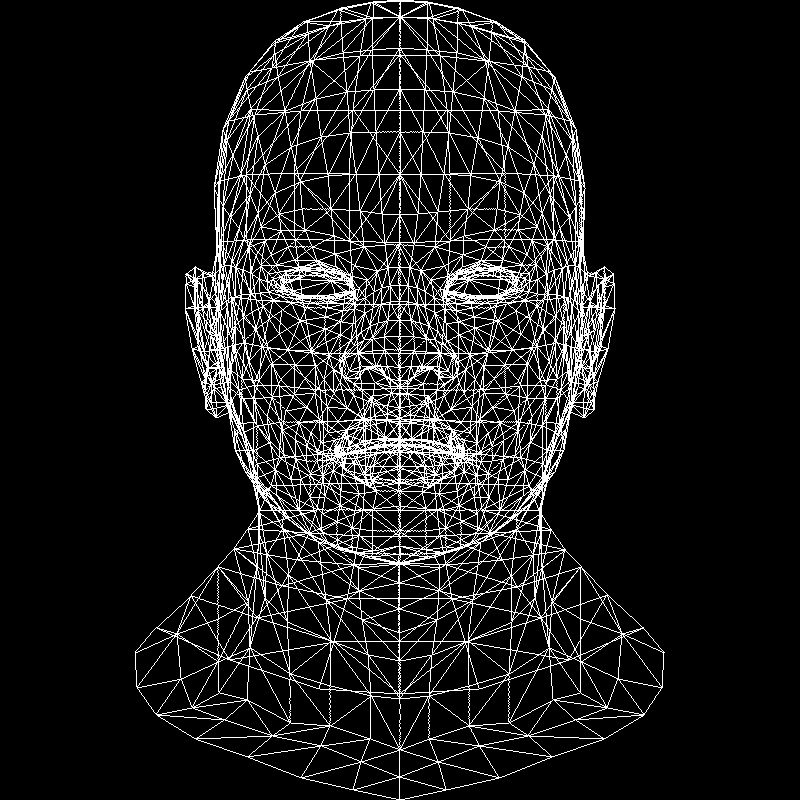

# ToyRenderer

Aoi的CPU软渲染器笔记

参考资料：[tinyrenderer](https://github.com/ssloy/tinyrenderer/)

## Lesson 0: getting started

TinyRenderer是不能实时渲染的，它只能把渲染结果输出到tga图片上，该Demo提供了输出tga文件的代码，详见[ssloy/tinyrenderer at 909fe20934ba5334144d2c748805690a1fa4c89f (github.com)](https://github.com/ssloy/tinyrenderer/tree/909fe20934ba5334144d2c748805690a1fa4c89f)

## Lesson 1: Bresenham's Line Drawing Algorithm

画线

### 插值

```cpp
void line(int x0, int y0, int x1, int y1, TGAImage &image, TGAColor color) 
{ 
    for (float t=0.; t<1.; t+=.01) 
    { 
        int x = x0 + (x1-x0)*t; 
        int y = y0 + (y1-y0)*t; 
        image.set(x, y, color); 
    } 
}
```

### t取值问题

在上述插值算法中，t的取值是个常量，当dx过长时，点会变得不连续，而dx过短时，点又会被重复计算

因此，我们应该动态地计算t的取值

```cpp
void line(int x0, int y0, int x1, int y1, TGAImage &image, TGAColor color) { 
    for (int x=x0; x<=x1; x++) { 
        float t = (x-x0)/(float)(x1-x0); 
        int y = y0*(1.-t) + y1*t; 
        image.set(x, y, color); 
    } 
}
```

### |k| > 1 和 x0 > x1 问题

当 |k| > 1时，相邻两个点的y值范围过大，可能会导致线不连续

x0 > x1时，在上述算法中不会被计算，因此线无法画出

```cpp
void line(int x0, int y0, int x1, int y1, TGAImage &image, TGAColor color) 
{ 
    bool steep = false; 
    if (std::abs(x0-x1)<std::abs(y0-y1)) 
    { // if the line is steep, we transpose the image 
        std::swap(x0, y0); 
        std::swap(x1, y1); 
        steep = true; 
    } 
    if (x0>x1) 
    { // make it left−to−right 
        std::swap(x0, x1); 
        std::swap(y0, y1); 
    } 
    for (int x=x0; x<=x1; x++) 
    { 
        float t = (x-x0)/(float)(x1-x0); 
        int y = y0*(1.-t) + y1*t; 
        if (steep) 
        { 
            image.set(y, x, color); // if transposed, de−transpose 
        } else 
        { 
            image.set(x, y, color); 
        } 
    } 
}
```

### 性能优化

首先，关于linux平台的代码性能检测，可以用Linux自带的工具

```sh
# 用以下命令编译文件
g++ -ggdb -g -pg -O0 *.cpp
# 运行生成的文件
./a.out
# 运行后会在当前目录生成一个gmon.out文件，及检测结果
# 使用以下命令查看结果
gprof gmon.out
```

上述代码中，很多的内容都可以放在for循环之外计算

```cpp
void line(int x0, int y0, int x1, int y1, TGAImage &image, TGAColor color) { 
    bool steep = false; 
    if (std::abs(x0-x1)<std::abs(y0-y1)) { 
        std::swap(x0, y0); 
        std::swap(x1, y1); 
        steep = true; 
    } 
    if (x0>x1) { 
        std::swap(x0, x1); 
        std::swap(y0, y1); 
    } 
    int dx = x1-x0; 
    int dy = y1-y0; 
    float derror = std::abs(dy/float(dx)); 
    float error = 0; 
    int y = y0; 
    for (int x=x0; x<=x1; x++) { 
        if (steep) { 
            image.set(y, x, color); 
        } else { 
            image.set(x, y, color); 
        } 
        error += derror; 
        if (error>.5) { 
            y += (y1>y0?1:-1); 
            error -= 1.; 
        } 
    } 
} 
```

### 浮点数优化

该算法中，error处使用了浮点数，可以通过以下方法使用整型代替浮点数

```cpp
void line(int x0, int y0, int x1, int y1, TGAImage &image, TGAColor color) { 
    bool steep = false; 
    if (std::abs(x0-x1)<std::abs(y0-y1)) { 
        std::swap(x0, y0); 
        std::swap(x1, y1); 
        steep = true; 
    } 
    if (x0>x1) { 
        std::swap(x0, x1); 
        std::swap(y0, y1); 
    } 
    int dx = x1-x0; 
    int dy = y1-y0; 
    int derror2 = std::abs(dy)*2; 
    int error2 = 0; 
    int y = y0; 
    for (int x=x0; x<=x1; x++) { 
        if (steep) { 
            image.set(y, x, color); 
        } else { 
            image.set(x, y, color); 
        } 
        error2 += derror2; 
        if (error2 > dx) { 
            y += (y1>y0?1:-1); 
            error2 -= dx*2; 
        } 
    } 
} 
```

### 循环分支优化

在上述代码中，每一次for循环中都会对steep进行检测，但没啥必要，可以先进行分支判断，再进for循环，这样可以提两倍的速度，如下

```cpp
    if(steep) {
        for(int x = x0; x<=x1; ++x) {
            img.set_pixel_color(y, x, color);
            error2 += derror2;
            if(error2 > dx) {
                y += (y1>y0? 1 : -1);
                error2 -= dx*2;
            }
        }
    } else {
        for(int x = x0; x<=x1; ++x) {
            img.set_pixel_color(x, y, color);
            error2 += derror2;
            if(error2 > dx) {
                y += (y1>y0? 1 : -1);
                error2 -= dx*2;
            }
        }
    }
```

### 读取obj文件渲染

[ssloy/tinyrenderer at f6fecb7ad493264ecd15e230411bfb1cca539a12 (github.com)](https://github.com/ssloy/tinyrenderer/tree/f6fecb7ad493264ecd15e230411bfb1cca539a12)

