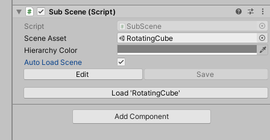
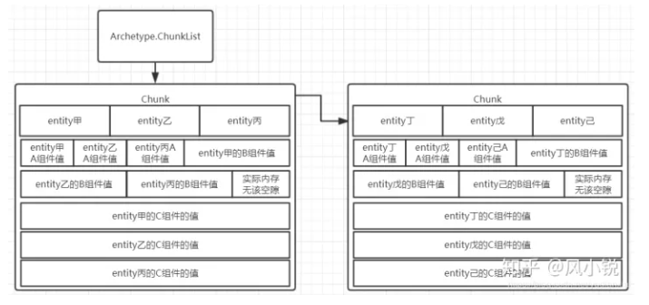

# Unity Dots初见

## Installation and Setup

**注意！！！0.51版本是preview版本，并且在预研过程中发现0.51版本有着暂时不可避免并且未知原因的恶性bug，这一部分内容可以忽略**

### Unity Editor version

2020.3.30+ or 2021.3.4+ with entities version: 0.51

### IDE support

Entities uses the [Microsoft Source Generator](https://docs.microsoft.com/en-us/dotnet/csharp/roslyn-sdk/source-generators-overview) feature for its code generation, which means it needs a high ide version.

Visual Studio 2022+

Rider 2021.3.3+

### Package installation

The Entities package isn't listed in the Package Manager, even if you've enabled the `Preview Packages` setting. You can use the following ways to install the Entities package:

1. Use `Add package from git URL` under the `+` menu at the top left of the package manager to add packages either by name (such as  `com.unity.entities`) or by Git URL (but this option isn't available for DOTS packages). If you want to use a Git URL instead of just a name in the Package Manager, you must have the git command line tools installed.
2. Directly edit the `Packages\manifest.json` file in the Unity project. 

```
com.unity.entities
com.unity.collections
com.unity.jobs
com.unity.rendering.hybrid
```


## 0.51版本官方案例笔记

**注意！！！0.51版本是preview版本，并且在预研过程中发现0.51版本有着暂时不可避免并且未知原因的恶性bug，这一部分内容可以忽略**

### HelloCube / 1. ForEach

创建第一个Dots程序

步骤：

1. 创建subscene
2. 在subscene下创建子物体
3. 编写脚本`RotationSpeed_ForEach`挂在子物体上
4. 编写脚本`RotationSpeedSystem_ForEach`用于控制组件的变化

```c#
using System;
using Unity.Entities;

// Unity看到[GenerateAuthoringComponent]，就会帮我们自动生成一个MonoBehaviour的class
// 包含继承的IComponent的struct定义的public字段，和一个转换函数
// 所以这个脚本是可以直接在Unity编辑器中拖到GameObject上的
[GenerateAuthoringComponent]	
public struct RotationSpeed_ForEach : IComponentData
{
    public float RadiansPerSecond;
}
```

```c#
using Unity.Entities;
using Unity.Jobs;
using Unity.Mathematics;
using Unity.Transforms;

// This system updates all entities in the scene with both a RotationSpeed_ForEach and Rotation component.

// ReSharper disable once InconsistentNaming
public partial class RotationSpeedSystem_ForEach : SystemBase
{
    // OnUpdate runs on the main thread.
    // 类似于MonoBehavior的Update，每一帧调用
    protected override void OnUpdate()
    {
        float deltaTime = Time.DeltaTime;

        // Schedule job to rotate around up vector
        Entities
            .WithName("RotationSpeedSystem_ForEach")
            // 这个Rotation也是Dots内置的继承于IComponentData的组件，类似于Transform的Rotation
            .ForEach((ref Rotation rotation, in RotationSpeed_ForEach rotationSpeed) =>
            {
                // math.mul是Dots的数学库，支持SIMD，性能大幅提升
                rotation.Value = math.mul(
                    math.normalize(rotation.Value),
                    quaternion.AxisAngle(math.up(), rotationSpeed.RadiansPerSecond * deltaTime));
            })
            .ScheduleParallel();
    }
}
```

### HelloCube / 2. IJobChunk

手写authoring component

步骤：

1. 编写组件脚本`RotationSpeed_IJobEntityBatch`
2. 编写Entities转换脚本`RotationSpeedAuthoring_IJobEntityBatch`挂载在目标对象上
3. 编写脚本`RotationSpeedSystem_IJobChunk`控制组件变化

```c#
using System;
using Unity.Entities;

// ReSharper disable once InconsistentNaming
[Serializable]
public struct RotationSpeed_IJobEntityBatch : IComponentData
{
    public float RadiansPerSecond;
}
```

```c#
using Unity.Entities;
using Unity.Mathematics;
using UnityEngine;

// ReSharper disable once InconsistentNaming
[AddComponentMenu("DOTS Samples/IJobEntityBatch/Rotation Speed")]
[ConverterVersion("joe", 1)]
public class RotationSpeedAuthoring_IJobEntityBatch : MonoBehaviour, IConvertGameObjectToEntity
{
    public float DegreesPerSecond = 360.0F;

    // The MonoBehaviour data is converted to ComponentData on the entity.
    // We are specifically transforming from a good editor representation of the data (Represented in degrees)
    // To a good runtime representation (Represented in radians)
    public void Convert(Entity entity, EntityManager dstManager, GameObjectConversionSystem conversionSystem)
    {
        var data = new RotationSpeed_IJobEntityBatch { RadiansPerSecond = math.radians(DegreesPerSecond) };
        dstManager.AddComponentData(entity, data);
    }
}
```

```c#
using Unity.Burst;
using Unity.Collections;
using Unity.Entities;
using Unity.Jobs;
using Unity.Mathematics;
using Unity.Transforms;

// This system updates all entities in the scene with both a RotationSpeed_IJobChunk and Rotation component.

// ReSharper disable once InconsistentNaming
// 这里实现了IJobChunk
// 用IJobChunk能适应更复杂的情况，拥有更好的性能
public partial class RotationSpeedSystem_IJobChunk : SystemBase
{
    EntityQuery m_Query;

    // 要在System里用IJobChunk需要重载OnCreate函数
    // 然后用EntityQuery的成员变量把需要的Component先存起来
    protected override void OnCreate()
    {
        // Cached access to a set of ComponentData based on a specific query
        // 用于找所有拥有Rotation和RotationSpeed_IJobEntityBatch组件的Entities
        // 其中RotationSpeed_IJobEntityBatch组件只读
        m_Query = GetEntityQuery(typeof(Rotation), ComponentType.ReadOnly<RotationSpeed_IJobEntityBatch>());
    }

    // Use the [BurstCompile] attribute to compile a job with Burst. You may see significant speed ups, so try it!
    [BurstCompile]
    struct RotationSpeedJob : IJobEntityBatch
    {
        public float DeltaTime;
        // handle，句柄，即唯一标识符
        public ComponentTypeHandle<Rotation> RotationTypeHandle;
        [ReadOnly] public ComponentTypeHandle<RotationSpeed_IJobEntityBatch> RotationSpeedTypeHandle;
		
        // 具体要做什么样的操作
        public void Execute(ArchetypeChunk batchInChunk, int batchIndex)
        {
            // 根据句柄获取数组
            var chunkRotations = batchInChunk.GetNativeArray(RotationTypeHandle);
            var chunkRotationSpeeds = batchInChunk.GetNativeArray(RotationSpeedTypeHandle);
            for (var i = 0; i < batchInChunk.Count; i++)
            {
                var rotation = chunkRotations[i];
                var rotationSpeed = chunkRotationSpeeds[i];

                // Rotate something about its up vector at the speed given by RotationSpeed_IJobChunk.
                chunkRotations[i] = new Rotation
                {
                    Value = math.mul(math.normalize(rotation.Value),
                        quaternion.AxisAngle(math.up(), rotationSpeed.RadiansPerSecond * DeltaTime))
                };
            }
        }
    }

    // OnUpdate runs on the main thread.
    protected override void OnUpdate()
    {
        // Explicitly declare:
        // - Read-Write access to Rotation
        // - Read-Only access to RotationSpeed_IJobChunk
        var rotationType = GetComponentTypeHandle<Rotation>();
        // 参数为true，表示只读
        var rotationSpeedType = GetComponentTypeHandle<RotationSpeed_IJobEntityBatch>(true);
        // 在上一个示例中，job以lambda表达式形式出现
        var job = new RotationSpeedJob()
        {
            RotationTypeHandle = rotationType,
            RotationSpeedTypeHandle = rotationSpeedType,
            DeltaTime = Time.DeltaTime
        };

        Dependency = job.ScheduleParallel(m_Query, Dependency);
    }
}
```

### HelloCube / 3. SubScene

在一个大场景中可以有多个子场景，这是为了实现分块加载，以达到不同的时间加载不同物体的目的。

对于子场景，保存时会DOTS化（native, binary format）。加载它时，能将它的数据最小化到RAM中。这个RAM应该是cpu的cache。我理解是重新组织了Scene的数据，让其适应DOTS。这些都是内置脚本SubScene.cs实现的。

文档中提到，子场景可以运行时自动加载，也可以用`RequestSceneLoaded`延迟加载。

inspector面板上有一个“Auto Load Scene”选项的。如果不勾选这个，运行时，子场景是不会加载的。



### HelloCube / 4.SpawnFromMonoBehaviour

Entities生成器

步骤：

1. 创建Prefab，并在它身上挂上Entities组件
2. 创建`Spawner_FromMonoBehaviour`脚本用于生成

```c#
using Unity.Entities;
using Unity.Mathematics;
using Unity.Transforms;
using UnityEngine;

// ReSharper disable once InconsistentNaming
[AddComponentMenu("DOTS Samples/SpawnFromMonoBehaviour/Spawner")]
public class Spawner_FromMonoBehaviour : MonoBehaviour
{
    // Prefab上应该要挂载组件的脚本
    public GameObject Prefab;
    public int CountX = 100;
    public int CountY = 100;

    void Start()
    {
        // Create entity prefab from the game object hierarchy once
        var settings = GameObjectConversionSettings.FromWorld(World.DefaultGameObjectInjectionWorld, null);
        // 根据设置把GameObject转换成Entity
        var prefab = GameObjectConversionUtility.ConvertGameObjectHierarchy(Prefab, settings);
        var entityManager = World.DefaultGameObjectInjectionWorld.EntityManager;

        for (var x = 0; x < CountX; x++)
        {
            for (var y = 0; y < CountY; y++)
            {
                // Efficiently instantiate a bunch of entities from the already converted entity prefab
                var instance = entityManager.Instantiate(prefab);

                // Place the instantiated entity in a grid with some noise
                // noise.cnoise是Dots数学库自带的柏林噪声
                var position = transform.TransformPoint(new float3(x * 1.3F, noise.cnoise(new float2(x, y) * 0.21F) * 2, y * 1.3F));
                // 修改Component数据
                entityManager.SetComponentData(instance, new Translation {Value = position});
            }
        }
    }
}
```

## Entities 1.0.8版本配置

### 参考网址

官方文档：https://docs.unity3d.com/Packages/com.unity.entities@1.0/manual/getting-started-installation.html

官方案例GitHub仓库：https://github.com/Unity-Technologies/EntityComponentSystemSamples/tree/master

### Unity Editor Version

2022.2.15f1+

### IDE Support

- Visual Studio 2022+
- Rider 2021.3.3+

### Package

- com.unity.entities

- com.unity.jobs

- com.unity.entities.graphics

- com.unity.collections

- com.unity.mathematics

可以直接加入Graphics和Jobs，其他内容会自动加入

### Domain Reload setting

To get the best performance in your Entities project, you should disable Unity's [Domain Reload](https://docs.unity3d.com/Manual/ConfigurableEnterPlayMode.html) setting. To do this, go to **Edit > Project Settings > Editor** menu, and enable the **Enter Play Mode Options** setting, but leave the **Reload Domain** and **Reload Scene** boxes disabled.

## ECS

**以下主要是一些参考了其他资料的较为主观的个人理解**

ECS即Entity Component System架构，简单来说就是把实体、组件数据、方法三者分离开来，并且在这三个模块内部避免直接的数据通信。

所谓实体其实就是一个ID，同时标记了这个ID的entity有哪些Component，而System则表示方法。不过与其说Entity和Component的关系是has，倒不如说是and，因为在数据查找的过程中往往并不是根据Entity定位的Component，而是根据Component去定位Entity，甚至可以说，比起Entity，System更关心拥有满足要求的Component集的与其关联的整个Component集。

ECS相比于传统的OOP有着结构简单清晰、易于扩展、易于优化的特点。

OOP把属性和方法封装在一个类中，强调每一个类的行为以及类与类之间的关系，如继承多态、管理者，它更为强调程序员对每个类的认知和理解，举个例子，我们在这里定义一个Class Person，但是可能程序员A认为衣服clothes是Person的一个属性，但程序员B认为一个Person就应该是赤身裸体的不该穿衣服，衣服不是人的组成部分，那么在这个时候就会出现认知上的差别，因此OOP部分依赖于每个人对Person的定义和理解，OOP架构虽然清晰易读，符合我们常用的思维方式，但是它不可避免地会出现个人偏主观的解读以及人与人之间的认知差异的问题，另外，由于OOP继承多态的特性，也导致了我们在软件工程架构中难以规避的多重继承的问题，导致代码的可扩展性低，维护困难。

而ECS用组合的方式代替继承，弱化了实体之间的关联性，并且每个系统之间不能进行直接通信，这会使得系统与系统之间分离开来，这更方便与代码的扩展和维护，并且由于缺少了错从复杂的调用关系，ECS会更利于多线程的使用。我的理解是，ECS会尽可能少的去使用引用类型来保持每个独立系统的独立性，如果系统和系统之间要进行数据传递，可以用单例Component来实现，这在系统实现的过程中是难以避免的，例如在OW中使用到的单例Component就占了40%，因此对于ECS而言重要的并不是对于每个类的理解，而是更为强调对于每个Component的理解。

## Unity Dots

[Unity Entities 1.0.8 官方文档](https://docs.unity3d.com/Packages/com.unity.entities@1.0/manual/systems-isystem.html)

### Entity 概念

在Unity中，`Entity`实际上只拥有两个整型数值：`Index`和`Version`，`Index`即每个`Entity`的ID，而`Version`用于帮助程序员去侦测每个实体的变化

`Entity`集合被存储在`World`中，每个`World`会有一个`EntityManager`去管理，它可以管理它所在世界的`Entity`的创建、销毁、修改数据等操作

| **Method**        | **Description**                                              |
| :---------------- | :----------------------------------------------------------- |
| `CreateEntity`    | Creates a new entity.                                        |
| `Instantiate`     | Copies an existing entity and creates a new entity from that copy. |
| `DestroyEntity`   | Destroys an existing entity.                                 |
| `AddComponent`    | Adds a component to an existing entity.                      |
| `RemoveComponent` | Removes a component from an existing entity.                 |
| `GetComponent`    | Retrieves the value of an entity's component.                |
| `SetComponent`    | Overwrites the value of an entity's component.               |

### Component概念

Component即Entity的组件，存储了具体的数据，它继承了`IComponentData`或`ISharedComponentData`等接口，这些接口并没有方法要实现，它们起到一个标记作用。在Unity中可以通过代码和Baker类将`GameObject`转化为`Entity`。想要创建`Unmanaged component`可以用`struct`，而想要创建`Managed component`可以用`class`。 

其中`Managed Component`虽然能做的操作很多很方便，但也有以下的限制

- You can't access them in [jobs](https://docs.unity3d.com/2022.2/Documentation/Manual/JobSystem.html).
- You can't use them in [Burst](https://docs.unity3d.com/Packages/com.unity.burst@latest) compiled code.
- They require garbage collection.
- They must include a constructor with no parameters for serialization purposes.

### System 概念

在Unity Dots中主要有`ISystem`和`SystemBase`，`ISystem`主要负责访问未托管的数据，而`SystemBase`适合访问托管数据，另外`ISystem`能使用`Burst`，相比`SystemBase`会更快一些。`ISystem`接口和`SystemBase`基类各有三个方法可以被重写，分别是`OnUpdate`、`OnCreate`和`OnDestroy`，其中`OnUpdate`方法每一帧执行一次。

| **Feature**                                                  | **ISystem compatibility** | **SystemBase compatibility** |
| :----------------------------------------------------------- | :------------------------ | :--------------------------- |
| Burst compile `OnCreate`, `OnUpdate`, and `OnDestroy`        | Yes                       | No                           |
| Unmanaged memory allocated                                   | Yes                       | No                           |
| GC allocated                                                 | No                        | Yes                          |
| Can store managed data directly in system type               | No                        | Yes                          |
| [Idiomatic `foreach`](https://docs.unity3d.com/Packages/com.unity.entities@1.0/manual/systems-systemapi-query.html) | Yes                       | Yes                          |
| [`Entities.ForEach`](https://docs.unity3d.com/Packages/com.unity.entities@1.0/api/Unity.Entities.SystemBase.Entities.html#Unity_Entities_SystemBase_Entities) | No                        | Yes                          |
| [`Job.WithCode`](https://docs.unity3d.com/Packages/com.unity.entities@1.0/api/Unity.Entities.SystemBase.Job.html#Unity_Entities_SystemBase_Job) | No                        | Yes                          |
| [`IJobEntity`](https://docs.unity3d.com/Packages/com.unity.entities@1.0/api/Unity.Entities.IJobEntity.html) | Yes                       | Yes                          |
| [`IJobChunk`](https://docs.unity3d.com/Packages/com.unity.entities@1.0/api/Unity.Entities.IJobChunk.html) | Yes                       | Yes                          |
| Supports inheritance                                         | No                        | Yes                          |

每一个`System`只能对一个世界中的entities进行处理，默认情况下，Unity会自动创建每个`System`并且用[`System Group`](https://docs.unity3d.com/Packages/com.unity.entities@1.0/manual/systems-update-order.html)来管理每个`System`，默认有三个`System Group`，分别是`InitializationSystemGroup`、`SimulationSystemGroup`和`PresentationSystemGroup`，默认情况下，一个`System`的`instance`被放在`SimulationSystemGroup`中。可以用`[UpdateInGroup]`这个`attribute`来重写这个`behavior`

可以通过这玩意儿取消上述的自动创建的过程`#UNITY_DISABLE_AUTOMATIC_SYSTEM_BOOTSTRAP`

目前有4中`system`类型：

- `SystemBase`：为managed system提供了一个基类
- `ISystem`：为unmanaged system提供了一个基类
- `EntityCommondBufferSystem`：Provides entity command buffer instances for other systems. This allows you to group [structural changes](https://docs.unity3d.com/Packages/com.unity.entities@1.0/manual/concepts-structural-changes.html)（简单来说就是一些需要Unity重新组织chunk的操作） together to improve the performance of your application. 我的简单理解是，它给其他systems提供了一个命令缓冲区的实例，它可以统合管理structural changes，来方便代码管理。
- `ComponentSystemGroup`：Provides a nested organization and update order for systems. 简而言之就是`SystemGroup`的基类，它是可嵌套的，并且主要负责管理system的更新顺序

编辑器中的System标识：

| **Icon**                                                     | **Represents**                                               |
| :----------------------------------------------------------- | :----------------------------------------------------------- |
|  | A system group                                               |
|  | A system                                                     |
|  | An entity command buffer system set to execute at the beginning of a system group with the [OrderFirst](https://docs.unity3d.com/Packages/com.unity.entities@1.0/api/Unity.Entities.UpdateInGroupAttribute.OrderFirst.html) argument. |
|  | An entity command buffer system set to execute at the end of a system group with the [OrderLast](https://docs.unity3d.com/Packages/com.unity.entities@1.0/api/Unity.Entities.UpdateInGroupAttribute.OrderLast.html) argument. |

### World 概念

一个world就是大量的entities的集合，并且每个entity的ID只在它所存在的世界中是唯一的，在每个world中可以通过一个struct `EntityManager`来 创建、销毁、修改entity。每个world中的systems只能访问同一个世界中的entities，另外，同一个世界中用有相同component类型的entity一起存在一个`archtype`中，这个`archtype`决定了这些components是如何在内存中被组织的。

默认情况下，进入Play mode的时候，unity会自动创建一个`World`的实例并给这个默认的世界增加每一个系统。

### Archtype 概念

一个archtype是一个world中所有具有相同components组合的entities集合的一个唯一表示符。当一个entity增加或删除一个component的时候，它所在world的`EntityManager`会把它转移给一个新的Archtype，如果不存在拥有同样组件组合的archtype，`EntityManager`会创建要给新的archtype

**注意：改变entity结构的操作是十分占用资源的，所以不能频繁使用**

archtype没有一个销毁的接口，只有在它所在的world被销毁时它才会被销毁

所有拥有相同archtype的entities和components被存放在统一大小的内存块中，这些内存块被称为`chunk`，每个`chunk`只对应一个archtype，每个`chunk`有16KB的大小，并且每个`chunk`中可存的entity的数量取决于这个archtype中components的数量和大小。`chunk`已满且有新entity加入时，`EntityManager`会创建新的`chunk`，而当`chunk`中最后一个entity删除时，`EntityManager`会销毁该`chunk`。



### Structural changes concepts

导致Unity重新组织chunk内存或chunk中的内容的操作被称为structural changes，其主要包括：

- 创建或销毁一个entity
- 增加或删除组件
- 设置一个shared component的值

参考资料：

[漫谈Entity Component System（ECS）](https://zhuanlan.zhihu.com/p/270927422)

[浅谈Unity ECS（一）Uniy ECS基础概念介绍：面向未来的ECS](https://zhuanlan.zhihu.com/p/59879279)

[Overwatch Gameplay Architecture and Netcode](https://link.zhihu.com/?target=https%3A//www.youtube.com/watch%3Fv%3DW3aieHjyNvw)

[浅谈《守望先锋》中的 ECS 构架](https://link.zhihu.com/?target=https%3A//blog.codingnow.com/2017/06/overwatch_ecs.html%23more)

[MarkAction关于ECS的演讲](https://www.youtube.com/watch?v=rX0ItVEVjHc)

