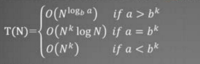

# 算法设计与分析考试要点

## 题型

填空题10-12分

单项选择题20分

四道综合题70分

​	无简答题，不考概念

​	涉及到算法设计，复杂度、设计算法、推导

​	程序填空

​	手工操作，动态规划递归方程的执行顺序

## 第一章

复杂度分析，高阶记号，比较两个函数的大小

NP问题概念

## 第二章

**算法设计**

**复杂度推导**

**递推公式**

循环赛不考

最接近点对问题不出大题

## 第三章

多边形游戏、图像运算、调度不考

1、动态规划方程写出来

2、分情况讨论

可以做一下算法实现题：流水作业调度、十子合并等

## 第四章

贪心策略的证明

**搞清楚贪心策略是什么**

贪心选择策略的复杂度一般是 $ n*log_2n+O(n) $

## 第五章

剪枝策略

算法填空

把解空间的数量标注出来

## 第六章

画解空间的树

遍历次序

# 复习整理

## 第一章 算法概述

### 1.1 算法与程序

算法定义：是一个有穷规则的集合。这些规则规定了解决某一问题的一个运算序列。

算法应该具有五个特性：有限性、确定性、输入、输出、可行性  

输入： 算法开始执行之前指定初始值（有零个或多个输入）
输出：产生与输入相关的量（至少有一个）。
确定性：每一条规则都是明确、无二义的。
有限性：求解问题的运算序列，必须在有限的计算步后停止。
可行性：每一计算步都是基本的、可实现的。

程序定义：程序是算法用某种程序设计语言的具体体现
程序=算法 + 数据结构（Nicklaus Wirth）
程序可以不满足算法的性质(4)有限性。
例如：操作系统，是一个在无限循环中执行的程序，因而不是一个算法  

### 1.2 算法复杂性分析

1. 计算机资源：时间、空间
2. 复杂性：所需资源多少
3. 算法复杂性：算法运行时所需资源的量
4. 算法复杂性分析目的： 分析问题复杂性、算法是否可行，选择最好算法
5. 时间复杂性：所需时间资源的量T(n)
6. 空间复杂性：所需空间资源的量S(n)

​	其中n是问题的规模（输入大小）

​	时间复杂性细化--3种典型的复杂性：最坏、最好、平均复杂性

​	记T(I)为输入I时的问题的算法复杂性

P：多项式时间内可解的判定问题

NP：非确定性多项式时间可解的判定问题，可在多项式时间复杂度内对猜测进行验证

NPC：多项式时间内可转化为任意NP问题，可视为代表性NP问题

#### 时间复杂性

1） 最坏情况下的时间复杂性
$T_{max}(n) = max{ T(I) | size(I)=n }$
（2） 最好情况下的时间复杂性
$T_{min}(n) = min{ T(I) | size(I)=n }$
（3） 平均情况下的时间复杂性
$T_{avg}(n) = \sum_{size(I)=n} p(I)T(I)$
其中I是问题的规模为n的实例， p(I)是实例I出现的概率。  

(1) 渐近上界记号O
$O(g(n)) = \{ f(n) | 存在正常数c和n_0使得对所有n\ge n_0有：
0 \le f(n) \le cg(n) \}$
(2) 渐近下界记号$\Omega$
$\Omega (g(n)) = \{ f(n) | 存在正常数c和n_0使得对所有n\ge n_0有：0\le cg(n)\le f(n) \}$  

(3)  高阶记号o
$$
o(g(n))=\{f(n)|对于任何正常数c>0,存在正数和n_0 >0使得对所有n\ge n_0有： 0 \le f(n)<cg(n) \}
$$
(4) 同阶记号θ
θ(g(n)) = { f(n) | 存在正常数$c_1$,$c_2$和$n_0$使得对所有$n\ge n_0$有： $c_1g(n) \le f(n) \le c_2g(n)$}   

各记号的记忆性比较
• f(n)= O(g(n)) ≈ f(n)阶不超过g(n)阶
• f(n)= Ω(g(n)) ≈ f(n)阶以g(n)阶为下界
• f(n)= θ(g(n)) ≈ f(n)与g(n)等同
• f(n)= o(g(n)) ≈ f(n)阶小于g(n)

#### 渐近分析记号的若干性质

1）传递性：
f(n)= θ(g(n))， g(n)= θ(h(n)) => f(n)= θ(h(n))；
f(n)= O(g(n))， g(n)= O (h(n)) => f(n)= O (h(n))；
f(n)= Ω(g(n))， g(n)= Ω (h(n)) => f(n)= Ω(h(n))；
f(n)= o(g(n))， g(n)= o(h(n)) => f(n)= o(h(n))；  

2）反身性：
f(n)= θ(f(n))；
f(n)= O(f(n))；
f(n)= Ω(f(n)  

3）对称性：
f(n)= θ(g(n)) <=> g(n)=θ(f(n))

4）互对称性：
f(n)= O(g(n)) <=> g(n)= Ω(f(n))  

5）算术运算：
O(f(n))+O(g(n)) = O(max{f(n),g(n)}) ；
O(f(n))+O(g(n)) = O(f(n)+g(n)) ；
O(f(n))\*O(g(n)) = O(f(n)\*g(n)) ；
O(cf(n)) = O(f(n)) ； C是正常数
g(n)= O(f(n)) => O(f(n))+O(g(n)) = O(f(n))   

## 第二章 递归和分治

$T(N) = aT(N/b)+N^k$

 

## 第三章 动态规划

