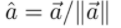

# 计算机图形学

 

## Lec2 Review of Linear Algebra（线性代数）

### 向量

 	

向量：方向和长度 

单位向量：

#### 向量乘法（点乘）：

公式：

 

在笛卡尔坐标系中，向量的点乘会变得更简单

投影：

#### 向量乘法（叉乘）：

 

此课程规定：使用右手螺旋法则

在笛卡尔坐标系中：

叉乘在图形学中的应用：判断左和右，判断内和外（例如是否在三角形内部）

### 矩阵

#### 矩阵乘法

条件：矩阵1的列数 == 矩阵2的行数

矩阵性质：

注意：矩阵无任何交换律

矩阵转置：

单位矩阵： 

由单位矩阵引出矩阵的逆

向量的点乘和叉乘可以写成矩阵的形式：

## Lec3 Transformation

Scale，缩放变换

可写成矩阵形式：

xy轴如果缩放比例不同：

Shear Matrix 切变：

Rotation Matrix 旋转：

​	注意：

​	即旋转的转置矩阵 = 它的逆矩阵

​	___数学上，转置和逆相同的矩阵为正交矩阵___

对称变换：

###### 线性变化

 

###### 齐次坐标

线性变换无法满足需求，需要加入额外的变量

点与向量之间的转换：

使用齐次坐标进行转换

 ##### Inverse Transition 逆变换

​		即一种变换的反向操作

###### 注意：复杂的操作可以通过简单操作的组合实现，简单操作的顺序会影响最终的结果

###### 可以通过结合律将多种简单变换组合成一种复杂变换

## Lec4 Transformation Cont

### 3D transformations

使用齐次坐标表示：

三维变换：

​	注：t为平移变换，a~i为线性变换

旋转：

任意复杂旋转可转变为简单旋转的组合：

Rodrigues' Rotation Formula:

#### 坐标系变换

$$
P_B = A_B * P_A
$$

顶点P在B坐标系下的坐标 = A坐标系的基向量在B坐标系下的坐标所构成的矩阵 * 顶点P在A坐标系下的坐标

### View/Camera Transformation

##### 正交投影

##### 透视投影

其中A是矩阵中三行三列的值，B是三行四列的值，三行一、二列均为0

## Lec5 Rasterization1(Triangles)

 在物体的位置固定在-1到1的位置之后需要改变的东西：宽高比、可视范围（垂直可视角度）

 光栅化：把东西画在屏幕上的过程

  

三角形光栅化过程： 遍历全部像素，遍历过程中，利用叉乘对每个像素进行计算，判断其是否在三角形内部

## Lec6 Rasterization2（Antialiasing and Z-Buffering）

采样和光栅化过程中可能会走样或者锯齿。

###### 走样：不同的函数，在相同采样频率之下，得到的结果相同

###### 滤波：去掉一系列的频率

解决方案：在采样之前，首先对图形进行模糊化处理，对处理过后的图形进行采样和光栅化

走样：在频域上，指会重合

抗锯齿方案：MSAA、FXAA、TAA

MSAA（Multi Sampling Anti-Aliasing）：增加样本数，对其做平均，得出区域均值

FXAA（Fast Approximate AA）：图像后期处理，先得到有锯齿的图，再把有锯齿的地方找到，将其换成没有锯齿的边

TAA（Temporal AA）：在时间上进行反走样，将上一帧检测到的结果复用，相当于将MSAA的结果运用在时间上

超分辨率抗锯齿：即将一个分辨率较低的图改编成分辨率较高的图，类似于MSAA的抗锯齿方法

​	常用方法：DLSS（Deep Learning Super Sampling）深度学习nb，即将缺失的分辨率猜出来

## Lec7 Shadings1（Illumination，Shading and Graphics Pipeline）

Painter's Algorithm：从背景往前景画，先画最远的，层层叠加

###### 但是！如果存在互相遮挡的状况，计算机就无法计算，例如：

 

#### Z-Buffer(深度缓存)

Idea：

​	Store current min. z-value for each sample(pixel)

​	Needs an additional buffer for depth values

  1. frame buffer stores color values				缓存原图

  2. depth buffer (z-buffer)  stores depth        缓存每个像素的深度

     注意！该处的深度不是颜色深浅，而是指距离相机的远近程度

     距离越远深度越大（即颜色越浅）

 

算法思路：

​	对任意一个三角形（即屏幕上由三个像素点构成的三角形区域），我们都可以把它光栅化。开始时，我们把每一个像素的深度都定为无穷大，然后对每一个三角形，计算它的深度值，如果小于对应像素点的深度，则覆盖，并更新深度图，否则，什么也不做

 

 画家算法和深度缓存算法对比：

​	画家算法：对n个三角形进行排序，然后对这些三角形进行光栅化，算法复杂度：O(nlogn)

​	深度缓存算法：并没有对算法进行排序，每次计算只是比较每个像素点的最小值，算法复杂度：O(n)

​	

### Shading

Blinn-Phong Reflectance Model 较为简单的模型，不考虑物理真实性

注意着色不代表阴影，着色只会影响物体表面明暗程度

##### Diffuse Reflection 漫反射

和反射点法线和光源的角度有关系，和人的视线方向没有关系

 

 

其中，I为光强，r为光源到反射点的距离，kd为漫反射系数

## Lec8 Shading 2 (Shading, Pipeline and Texture Mapping)

#### Specular Term (Blinn-Phong)  (高光)

 

对于高光，其半程向量（入射光、反射光夹角的一半）和法线方向接近

由于Blinn-Phong是经验模型，计算高光的过程中，不考虑吸收（n和l的点乘，同漫反射）

注意：该式中，p次的原因是，n点乘h的范围很大，曲线很平滑，当夹角为45度时仍然有很大的范围（见下图），即高光的范围很大。因此，为了使高光范围变小，通常加上指数，一般在100-200之间，高光区域为3-5度。指数p是为了控制高光的大小

 

#### Ambient Term (环境光)

假设，任何一个点接收到来自环境光的光照是完全相同的

 

#### Blinn-Phong Reflection Model

 

#### Shading Frequencies 着色频率

 

 

 

求顶点法线方法：

顶点周围三角形的法线的加权平均值（面积）

 

### Graphics (Real-time Rendering) Pipeline

 

着色器练习网站：http://shadertoy.com/view/ld3Gz2

### Texture Mapping 纹理映射

由于在一个具体的图形中，每一个像素可能有不同的着色方式，因此，我们需要用纹理映射的方式来决定每个像素的着色方式

对概念的理解：对一个无色的模型贴贴纸使其上色的过程

 

## Lec9 Shading 3 (Texture Mapping cont.)

### Interpolation Across Triangles: Barycentric Coordinates (重心坐标)

插值：比如一个三角形三个角分别是红、绿、蓝色三种颜色，我们需要通过计算使三角形中间的部分进行平滑的颜色过渡

 

有一个三角形，它的三个顶点为A、B、C，在三角形平面上的任意一个点可以表示成的形式，其中，如果该点在三角形内部，α、β、γ均大于0

求重心坐标的方法：

 

公式的一般形式：

 

重心坐标的缺点：进行投影变换之后，重心坐标可能会改变。比如将一个三角形从三维空间投影到二维空间之后，重心坐标很有可能会发生改变。

在纹理上的应用：比如一个三角形，对于三角形内部一个点的属性，先计算该点的重心坐标，然后在纹理对象中查找相应的坐标

### Texture Magnification

#### 纹理分辨率过低问题

 

##### Bilinear Interpolation 双线性插值

 

对一个点进行水平方向上两次线性插值，垂直方向上一次线性插值

 

#####  Bicubic Interpolation

和Bilinear类似，对周围16个点进行插值处理（不是线性插值）

#### 纹理分辨率更大问题

在距离远近不同的地方，一个像素覆盖的纹理上的区域大小是不一样的

##### Mipmap

 简而言之，就是，对一张纹理原图设为第0层，分辨率小1/4的图成为第二层，第三层、第四层以此类推

比如，128 * 128的纹理分辨率，第0层为128 * 128，第1层为64 * 64，第2层为32 * 32，以此类推，最后一层为1 * 1。该方法所需要的额外空间只占原图的1/3

为了使纹理的过渡更加平滑，我们需要用到小数层，比如第1.8层，如果要求第1.8层的点，可以这么做：对第1层和第2层进行插值处理，再对两层得出的结果做插值处理

###### Mipmap Limitation

在一个像素点覆盖的范围比较大的时候，很容易产生不规则的纹理覆盖面积（在纹理坐标之中），使用Mipmap很难处理这样的问题。

对应的，可以用多向异性过滤。

多向异性过滤：

 

### 纹理应用

环境光：凹凸贴图产生真实阴影效果

 

位移贴图：效果更好，但要求模型更精细

## Lec10 Geometry1 (Introduction)

"Implicit" Representations of Geometry: 几何的隐式表述：通过一些公式等形容一个几何形体，但是没有具体点的体现，比如一条直线: y = x + b

"Explicit" Representations of Geometry: 显式

方法1：直接给出具体的点

方法2：通过参数映射的方式，比如一个二维图片，通过一些方法、函数映射到三维空间之中

隐式表示方法：

​	数学公式：便于计算，但不直观

​	Constructive Solid Geometry：通过一些简单基础的几何形成一些复杂的几何

​	Distance Functions：比较适合两个几何体间做圆滑过渡

​	水平集：举例就是等高线

​	Fractals：递归，即不断放大不断循环

## Lec11  Geometry2 (Curves and Surfaces)

### Explicit Representation in Computer Graphics

#### Point Cloud

即是用全部用点表示

#### Polygon Mesh

用多个基本图形进行组合

 

 #### The WaveFront Object File(.Obj)  Format

通过两个文件存储图形数据

文件一存放顶点、法线

文件二存放顶点、法线之间的联系

### Bezier Curves

用一系列的控制点去定义一个曲线

#### de Casteljau Algorithm

不记得了就去看视频，20分钟左右

Bezier Curves性质：

​	仿射变换：取顶点做仿射变换，对变换后的顶点做相同Bezier曲线过程，得到的曲线与原曲线对应，此性质不适用于投影变换

​	凸包性质(Convex Hull)：由控制点构成的贝塞尔曲线必定在由控制点形成的凸包中

#### Piecewise Bezier Curves 逐段的贝塞尔曲线

每四个控制点形成一条贝塞尔曲线

 

C0连续(continuity)：一条曲线的起点等于另一条曲线的终点

C1连续(continuity)：当且仅当同一点的两条贝塞尔曲线共线、反向、等长的时候，该点处两条曲线的连接是光滑的。

Cn连续：即二次求导的结果，同上

### Other types of  splines(样条，即曲线的总称)

#### B-splines

 

Basis splines：基曲线，由基本曲线组成的曲线

理解为，更高阶的贝塞尔曲线，较为困难，本课程中不多做介绍

### Bezier Surface

实现方式：双线性插值的应用，即水平和竖直方向上做两次贝塞尔曲线的过程

难点：不同的贝塞尔曲面之间的结合，使拼接部分更为光滑，本节课中不多做介绍

## Lec12 Geometry3(Surfaces)

 

Mesh Subdivision（细分）：增加更多的面，使画面更精细

Mesh Simplification：使网格变少，画面简化

Mesh Regularization：在改变三角形质量的同时，不能改变模型本身的质量

### Mesh Subdivision

#### Loop Subdivision

分成两个步骤：1、增加三角形的数量；2、改变三角形的位置使画面更精细

###### 适用于以三角形为基本图形的模型的细分

 

上图：新顶点（白色点的位置） = A、B、C、D点的位置的加权平均

 

上图：旧顶点（白色点的位置）

​	n: 该顶点的度，u:其他旧顶点的权值 

#### Catmull-Clark Subdivision

###### 适用于非只有三角形网格的模型

 

### 

奇异点：度不是4的点

非四边形面：不是四边形的面

 

主要方法：每一个边取中点，每一个面也取中点，然后把它们连起来

由例图可知：奇异点增加2，非四边形面减少两个

由上理解可知，在做第一次Catmull-Clark Subdivision之后，非四边形面全部消失，减少的数量等于奇异点增加的数量，第二次细分开始，奇异点、非四边形面的数量不再改变

第二次细分如图：

点的更新方式：

### Mesh Simplification

#### Collapsing An Edge 边的坍缩

##### Quadric Error Metrics 二次误差度量

求一条边对应的新的顶点到相关联的面的平方和，取平方和最小的新顶点

 

 

注意：是边的坍缩，上图帮助理解探索的过程

#### Simplification via Quadric Error

核心算法： 对每一条边计算它的二次度量误差，从二次度量误差最小的边开始坍缩

问题：当对一条边进行坍缩之后，与这条边相关的边发生变化，对应的二次度量误差发生变化，影响核心算法的执行。

解决方法：选择堆作为数据结构，在更新某些变得二次度量误差之后，可以用最小的代价动态更新任何一点的值。

###### 注意：这种算法其实是一种贪心算法，无法获得实际最优解

### Shadow Mapping

第一步：对光源进行光栅化，记录光源可以看到的点及其深度

第二步：从实际摄像头位置看向这个点，计算这个点到光源的深度，与光源记录的最大可见深度比较，可见则着色，不可见则为阴影

问题：

​	1、数据精度问题，由于计算结果是浮点数，会产生误差

​	2、当Shadow Mapping精度过低（分辨率），会产生走样问题

​	3、只适合硬阴影

 

## Lec13 Ray Tracing 1(Whitted-Style Ray Tracing)

### Why Ray Tracing?

1、光栅化的局限性

​			很难去做阴影，尤其是全局化的阴影、软阴影

​			光线的多点反射也很困难（间接光照），比如镜面等

2、光栅化比较适合实施的应用，光追比较适合非实时的应用

### Light Rays

Three ideas about light rays

	1. Light travels in straight lines. (though this is wrong)
	2. Light rays do not "collide" with each other if they cross. (though this is still wrong)
	3. Light rays travel from the light sources to the eye. (but the physics is invariant under path reversal)

### 基础思路

从眼睛（摄像机）开始，对可视范围内的每一个像素点发出射线，找到第一个接触点，将该点和光源进行连线，根据结果着色

### Whited-Style Ray Tracing

 

要点：在找到第一个接触点之后，会根据折射、反射的性质找到第二个、第三个等等的接触点，且在每一个接触点都会判断是否是阴影，根据结果着色

第一根射线叫primary ray，之后的其他射线都叫secondary rays，向光源发出的射线叫shadow rays

#### Ray-Surface Intersection

##### Ray Equation

解释：任何一个点，在t时间，从光源o开始，往d方向射出的距离

##### 隐式表面

sphere:

 

 Plane equation: 

##### 显式表面

Axis-Aligned Box轴对齐包围盒：把一个复杂物体包裹起来的盒子，如果光线不和包围盒相交，那么也不可能和里面的物体相交

对面：同法线的面，轴对齐包围盒有三组对面

 

计算方法：计算包围盒的六个面所在的无限大的平面与光线的交点，计算每一组对面的进入点和离开点，三组对面中最晚的进入点即光线进入包围盒的时间，三组对面中最早的离开点即光线离开包围盒的时间。

## Lec14 Ray Tracing 2(Acceleration & Rrdiometry)

 ### Uniform Spatial Partitions(Grids)

过程：

​	1、对一个大场景取包围盒

​	2、把该包围盒分成若干个小包围盒

​	3、存取其中包含物体表面的包围盒（注意，仅包含物体内部的不需要记录）

​	4、光线打入，首先判断打到的小包围盒中是否包含物体表面，否则进入下一个包围盒；是，则继续判断是否与包含的物体表面相交，再根据结果做进一步计算

 

注意：第二步中，把大包围盒分成的小包围盒的数量会影响效率，要适中

该方法不适合物体聚集，在空间中分布不均匀的情况

### Spatial Partitions 空间划分

##### Oct-Tree 八叉树

在三维空间中，把包围盒均分成8块，并对其子块用此方法均分，直至达到某些条件停止均分，如包围盒过小，包围盒中无物体，等

注意，该方法在二维空间中为四叉树，如上图所示

在n维空间中为2^n叉树，也因此，在多维空间中较为复杂，不常使用

##### KD-Tree

每次沿一条轴进行划分，并对其子块用此方法划分，交替选取划分轴，使结果尽可能均匀

##### BSP-Tree

在斜向上选择一条直线进行划分，以此类推

该方法缺点：较难计算，因为包围盒的边不是横平竖直的（与轴平行），尤其是对于高维的图形

#### KD-Tree

 

KD-Tree问题：

1、很难判断图形是否和包围盒有交集

2、一个物体可能存在多个包围盒中

### Object Partition & Bounding Volume Hierarchy(BVH)

 

把物体分成两堆，求其包围盒

问题：由于是按物体划分，所以可能会产生包围盒的重叠

 技巧：

1、往最长的方向进行分割

2、找一个中位数，按其位置进行划分，使两边的三角形尽可能相同，使树的结构尽可能平衡

伪代码实现：

 

### Radiometry（辐射度量学）

Measurement system and units for illumination of light

Accurately measure the spatial properties of light

 - New terms: Radiant flux, intensity, irradiance, radiance

解释：在物理上准确定义光照的方法

Radiant Energy：

Definition: Radiant energy is the energy of electromagnetic radiation. It is measured in units of joules, and denoted bythe symbol:     Q[ J= Joule]

Radiant Flux：

Definition: Radiant flux (power) is the energy emitted, reflected, transmitted or received, per unit time.

Radiant Intensity: Light Emitted From A Source

Irradiance: Light Falling On A Surface

Radiance: Light Traveling Along A Ray

 

#### Radiant Intensity

Definition: The radiant(luminous) intensity is the power per unit solid angle(立体角) emitted by a point light source.

即每个立体角发出的光的能量

##### Angles and Solid Angles

Angle: l/r

Solid Angles: 二维Angles在三维空间上的延申

##### Differential Solid Angles

单位立体角: 即球面上很小的一块区域所对应的立体角

 

 

微分立体角：球面上任意一个点可以由两个角确定其位置，当这个点移动极小的距离，形成的新点与原点构成的新的区域对应的立体角即为微分立体角 

 

## Lec15 Ray Tracing 3(Light Transport & Global Illumination)

### Irradiance

Definition: The irrdiance is the power per (perpendicular/projected) unit area incident on a surface point. 

中文翻译(感谢b站老哥): 辐射度是入射到表面点上的单位面积的功率

注意：接收到的光线必须是与平面垂直的光线或者是光线的投影

 

 

### Radiance

Radiance is the fundamental field quantity that describes the distribution of light in an environment.

Definition: The radiance(luminance) is the power emitted, reflected, transmitted or  received by a surface, per unit solid angle, per projected unit area. 

 

比较Irridiance、Intensity、Radiance：

Intensity：每个点在单位立体角上发出的能量(点对面)

Irridiance：在单位面积上收到的能量(点对面)

Radiance：点对点的能量传送

 

### Bidirectional Reflectance Distribution Function(BRDF)

双向反射分布函数

BRDF解决的内容：

​	理解方式一：一条光线接触到反射点，往不同的方向会反射多少的能量

​	理解方式二：光线打到物体表面，被物体表面吸收，然后再从这一个点辐射出去

 

其中：L表示Radiance，E表示Irridiance

 

其中，sr是立体角单位(感谢弹幕老哥)

 

反射方程：也就是着色点对所有的入射光进行摄像机方向上的BRDF的转换结果之和。

渲染方程：即反射点反射的光 + 物体本身发出的光

 

 

 

上图最后一个方程的含义：全局光照的构成为经过0次、1次、2次、3次反射或折射的光线之和

光栅化只能实现0次或1次反射，更多次反射的光线很难通过光栅化去实现

### Probability Review

#### Random Variables

随机变量和概率分布

 

#### Probabilities

 

#### Expected Value of a Random Variable

 

#### Probability Distribution Function(PDF)

 

 #### Function of a Random Variable

 

## Lec16 Ray Tracing 4(Monte Carlo Path Tracing)

## Monte Carlo Integration

蒙特卡洛积分：

随机取点，求其面积(定积分)，重复上述操作，求结果均值

$$
F_N=\frac{1}{N}\sum^N_{i=1}\frac{f(X_i)}{p(X_i)}
$$

## Path Tracing

# 面试准备--by策

## 题目 1 判断两个三角形是否交叉

容易出在最后一道题

**解题思路**：

1. 判断AABB盒子是否相交：未相交，则两个三角形不可能交叉；相交，则进入步骤2。
2. 判断两个三角形是否交叉，其实只要知道其中任意一个三角形的一条边是否与另一个三角形有交点，则问题转换为求三角形和线段是否有交点的问题，进入步骤3。
3. 判断线段的两个端点是否在三角形面的同侧：在同侧，则两个三角形不可能交叉；有任意一点在三角形平面上，判断该点是否在三角形内部，具体情况具体分析；在异侧，求两个端点到三角形平面的投影，求其插值，得到线段与三角形平面的交点，进入步骤4。
4. 判断交点是否在三角形内部：在，则线段与三角形相交，即两个三角形交叉；不在，则线段与三角形不相交，进入步骤5。
5. 对每个三角形的每一条边进行步骤3、4的操作，直至找到线段与三角形平面的交点在三角形内部的情况，此时，证明两个三角形交叉；或者，当遍历完所有的情况，未发现线段与三角形平面的交点在三角形内部，此时，证明两个三角形不交叉。

## 题目 2  图像渲染的四个阶段

Application阶段：在CPU上运行

Geometry　processing：主要是transform，projection

Rasterization：三个顶点

Pixel　Processing：每个屏幕上点的颜色

### 应用程序阶段　application　stage

宏观上的、大范围的、物体级别的渲染处理。

这阶段CPU上运行的可能可以多线程，碰撞检测比较费

提供给下一阶段的数据：Draw Call，一般的优化方案：减少Draw Call的次数

简单来说，其实就是，生成指令，即这一块该怎么渲染，哪一部分应该先渲染，哪一部分应该后渲染

### 几何处理 Geometry Processing

微观的，顶点（三角面）级别的数据处理。

还是四个阶段。

#### Vertex Shading

空间变换：顶点空间->世界空间->Camera空间

​    tessellation, geometry shading, and stream output

#### Projection

生成屏幕空间的三角面数据，2D的，但带有深度信息

#### Clipping

裁剪

#### Screen Mapping

映射到屏幕空间，进行拉伸等操作

### Rasterization

光栅化

