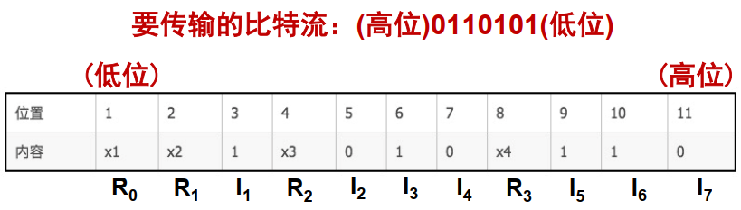
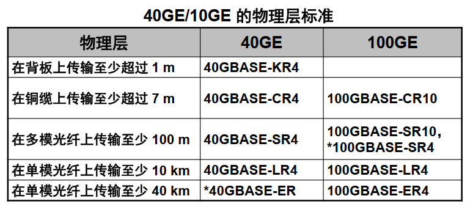

# 第一章 概述

## 1.1 计算机网络概述

计算机网络定义：由一些通用的、可编程的硬件互连而成的。

“可编程的硬件”表明这种硬件一定包含有中央处理器 (CPU)  

由若干结点(node)和连接这些结点的链路(link)组成

21世纪重要特征：数字化、网络化、信息化，它是一个以网络为核心的信息时代

三大类网络：电信网络、有线电视网络、计算机网络

随着技术发展，网络技术互相融合——三网融合

## 1.2 互联网概述

互联网重要基本特点：连通性和共享

互联网+：把互联网的创新成果深度融合于经济社会各领域之中

网络把许多计算机连接在一起

互联网把许多网络通过路由器连接在一起

与网络相连的计算机常称为主机

### 互联网基础结构发展的三个阶段

第一阶段：单个网络APRANET向互联网发展的过程

第二阶段：建成三级结构的互联网

 

第三阶段：形成多层次ISP结构的互联网，出现了互联网服务提供者ISP(Internet Service Provider)
	根据覆盖面积大小以及所拥有的IP地址数目的不同，ISP分为主干ISP、地区ISP、本地ISP

　

## 1.3 互联网的组成

从工作方式可分为两大块：

1、边缘部分：由所有连接在互联网上的主机组成。这部分是用户直接使用的，用来进行通信（传送数据、音频或视频）和资源共享。  

2、核心部分：由所有连接在互联网上的主机组成。这部分是用户直接使用的，用来进行通信（传送数据、音频或视频）和资源共享。  

### 1.3.1 边缘部分

互联网边缘的部分就是连接在互联网上的所有的主机，这些主机又被称为端系统。

端系统可以是PC、智能手机、网络摄像头、大型计算机等等

计算机之间的通信：主机A的某个进程（程序）和主机B上的另一个进程（程序）进行通信

#### 端系统之间通信方式

##### 客户-服务器方式（C/S 方式）

客户 (client) 和 服务器 (server) 都是指通信中所涉及的两个应用进程。  

客户是服务的请求方，服务器是服务的提供方。服务请求方和服务提供方都要使用网络核心部分所提供的服务。

客户软件的特点：

​	被用户调用后运行， 在打算通信时主动向远地服务器发起通信（请求服务）。 因此，客户程序必须知道服务器程序的地址。
​	不需要特殊的硬件和很复杂的操作系统。  

服务器软件的特点：

​	一种专门用来提供某种服务的程序， 可同时处理多个远地或本地客户的请求。
​	系统启动后动调即自用并一直不断地运行着，被动地等待并接受来自各地的客户的通信请求。因此，服务器程序不需要知道客户程序的地址。
​	一般需要强大的硬件和高级的操作系统支持。

​	客户与服务器的通信关系建立后， 通信可以是双向的， 客户和服务器都可发送和接收数据。  

##### 对等方式（P2P 方式）

只要两个主机都运行了对等连接软件 (P2P 软件) ，它们就可以进行平等的、对等连接通信。
双方都可以下载对方已经存储在硬盘中的共享文档。

对等连接方式从本质上看仍然是使用客户服务器方式，只是对等连接中的每一个主机既是客户又是服务器。 

### 1.3.2 核心部分

提供连通性

路由器在核心部分中起特殊作用

路由器是实现分组交换 (packet switching) 的关键构件，其任务是转发收到的分组，这是网络核心部分最重要的功能。  

#### 电路交换

两部电话机之间需要1对电线直接连接

N 部电话机两两直接相连，需 N(N – 1)/2 对电线。 这种直接连接方法所需要的电线对的数量与电话机数量的平方 成正比。  

 

使用交换机：

 

每一部电话都直接连接到交换机上，而交换机使用交换的方法，让电话用户彼此之间可以很方便地通信。所采用的交换方式就是电路交换 (circuit switching)。  

交换：转接，把一条电话线转接到另一条电话线。照某种方式动态分配传输线路的资源

电路交换必定是面向连接的

过程：

​	建立连接：建立一条专用的物理通路，保证通话时资源不被占用

​	通话：占用通信资源

​	释放连接：释放占用的所有通信资源

缺点：突发性、线路利用率低

#### 分组交换

采用存储转发技术

步骤：

1、在发送端，先把较长的报文划分成较短的固定长度的数据段

2、每一个数据段前面添加上首部（包头）构成分组（包）

3、以”分组“作为数据传输单元，依次把各分组发送到接收端

分组首部：含有地址等控制信息

每个分组独立选择传输路径

核心部分中的路由器之间一般由高速链路连接

边缘部分的主机接入到核心部分以相对较低速率的链路连接

主机的用途：为用户处理信息

路由器的用途：分组交换

路由器处理分组的过程：
	把收到的分组先放入缓存（暂时存储）；
	查找转发表， 找出到某个目的地址应从哪个端口转发；
	把分组送到适当的端口转发出去。  

| 优点 |                        所采用的手段                        |
| :--: | :--------------------------------------------------------: |
| 高效 |   在分组传输的过程中动态分配传输带宽，对通信链路逐段占用   |
| 灵活 |            为每一个分组独立选择最合适的转发路由            |
| 迅速 | 以分组作为传送单位，可以不先建立连接就能向其他主机发送分组 |
| 可靠 |                    保证可靠性的网络协议                    |

问题：

​	分组在个结点存储转发时需要排队，造成一定时延

​	分组必须携带首部，造成一定开销

若要连续传送大量的数据，且其传送时间远大于连接建立时间，则电路交换的传输速率较快。
报文交换和分组交换不需要预先分配传输带宽，在传送突发数据时可提高整个网络的信道利用率。
由于一个分组的长度往往远小于整个报文的长度，因此分组交换比报文交换的时延小，同时也具有更好的灵活性  

## 1.4 计算机网络的类别

## 1.5 计算机网络的类别

### 按照网络作用范围分类

广域网 WAN (Wide Area Network)： 作用范围通常为几十到几千公里（跨越国家），是互联网的核心部分。
城域网 MAN (Metropolitan Area Network)： 作用距离约为 5 ~ 50 公里（几个街区甚至整个城市）。
局域网 LAN (Local Area Network) ： 局限在较小的范围（如 1 公里左右） ，校园网或企业网。
个人区域网 PAN (Personal Area Network) ： 范围很小，大约在 10 米左右，通过无线技术连接。
若中央处理机之间的距离非常近（如仅1米的数量级甚至更小些），则一般就称之为多处理机系统， 而不称它为计算机网络。  

### 按照网络的使用者分类

公用网 (public network)
	电信公司建造的大型网络。按规定交纳费用的人都可以使用的网络。因此也可称为公众网。
专用网 (private network)
	某个单位为特殊业务工作的需要而建造的网络，例如军队、铁路、银行、电力等系统。
公用网和专用网都可以提供多种服务。如传送的是计算机数据，则分别是公用计算机网络和专用计算机网络。  

### 用来把用户接入到互联网的网络

接入网AN(Access Network)，它又称为本地接入网或居民接入网  

起到让用户能够与互联网连接的“桥梁”作用  

接入网技术：电话线拨号、宽带

不属于互联网的核心和边缘部分

接入网是从某个用户端系统到互联网中的第一个路由器（也称为边缘路由器）之间的一种网络。

从覆盖的范围看，很多接入网还是属于局域网。  

## 1.6 计算机网络的性能

### 1.6.1 计算机网络的性能指标

主要包括：速率、带宽、吞吐率、时延、时延带宽积、往返时间RTT、利用率

 #### 速率

数据的传送速率，也成为数据率、比特率

单位：bit/s, kbit/s, Mbit/s, Gbit/s

速率往往是指指定速率或标称速率，非实际运行速率

#### 带宽

本来指信号具有的频带宽度，单位赫(Hz)

计算机网络中，带宽表示网络中某通道传送数据的能力，即单位时间内网络中的某信道所能通过的"最高数据率"，单位bit/s

在带宽的上述两种表示中，前者为频域称谓，后者为时域称谓，本质相同。

一条通信链路的带宽越宽，最高数据率越高。

#### 吞吐量

在单位时间内通过某个网络(或信道、接口)的数据量

吞吐量受网络的带宽或网络的额定速率的限制

表示单位时间实际传输数据量

#### 时延

数据(一个报文或分组，甚至比特)从网络(或链路)的一端传送到另一端所需的时间，单位s

别称：延迟、迟延

网络中时延由以下几个不同部分组成：1、发送时延，2、传播时延，3、处理时延，4、排队时延

##### 发送时延

别称：传输时延

发送数据时，数据帧从结点进入到传输媒体所需要的时间

即从发送数据帧的第一个比特算起，到该帧的最后一个比特发送完毕的时间

 

##### 传播时延

电磁波在信道中需要传播一定的距离而花费的时间

电磁波在自由空间的传播速率是光速

 

##### 处理时延

主机或路由器在收到分组时，为处理分组所花费的时间

##### 排队时延

分组在路由器输入、输出队列中排队等待处理所经过的时间

排队时延的长短往往取决于网络中当时的通信量

队列溢出时，相当于排队时延无限大

##### 总时延

总时延 = 发送时延 + 传播时延 + 处理时延 + 排队时延

 

对于告诉网络链路，我们提高的仅仅是发送速率而不是传输速率

#### 时延带宽积

别称：以比特为单位的链路长度

时延带宽积 = 传播时延 * 带宽

 

#### 往返时间 RTT(Round-Trip Time)

从发送方发送数据开始，到发送方收到来自接收方的确认，总共经历的时间

互联网中，RTT还包括各中间结点的处理时延、排队时延以及转发数据时的发送时延

使用卫星通信时，RTT相对较长，是很重要的一个性能指标

　

#### 利用率

分为信道利用率和网络利用率

信道利用率：某信道有百分之几的时间是被利用的(有数据通过)，完全空闲的信道的利用率是零。

网络利用率：全网络的信道利用率的加权平均值

信道利用率并非越高越好，某信道的利用率增大，该信道引起的时延增加

##### 时延与网络利用率的关系

 

 

### 1.6.2 计算机网络的非性能特征

费用、质量、标准化、可靠性、可扩展性和可升级性、易于管理和维护

## 1.7 计算机网络的体系结构

### 国际标准

开放系统互联参考模型 OSI/RM  (Open Systems Interconnection Reference Model)

TCP/IP

### 协议与划分层次

计算机网络中的数据交换必须遵守事先约定好的规则。
这些规则明确规定了所交换的数据的格式以及有关的同步问题（同步含有时序的意思）。
网络协议 (network protocol)，简称为协议，是为进行网络中的数据交换而建立的规则、标准或约定。

#### 网络协议的三个组成要素

语法：数据与控制信息的结构或格式

语义：需要发出何种控制信息，完成何种动作以及做出何种响应

同步：时间实现顺序的详细说明

#### 协议的两种形式

for people：文字描述

for computers：程序代码

目的：对网络上信息交换过程做出精确的解释

#### 网络协议各层主要功能

① 差错控制： 使相应层次对等方的通信更加可靠。
② 流量控制： 发送端的发送速率必须使接收端来得及接收，不要太快。
③ 分段和重装 ： 发送端将要发送的数据块划分为更小的单位，在接收端将其还原。
④ 复用和分用： 发送端几个高层会话复用一条低层的连接，在接收端再进行分用。
⑤ 连接建立和释放： 交换数据前先建立一条逻辑连接，数据传送结束后释放连接。  

#### 计算机网络的体系结构

计算机网络的体系结构 (architecture) 是计算机网络的各层及其协议的集合。
体系结构就是这个计算机网络及其部件所应完成的功能的精确定义。
实现 (implementation) 是遵循这种体系结构的前提下用何种硬件或软件完成这些功能的问题。
体系结构是抽象的，而实现则是具体的，是真正在运行的计算机硬件和软件。  

### 1.7.3 具有五层协议的体系结构

OSI 的七层协议体系结构的概念清楚，理论也较完整，但它既复杂又不实用。
TCP/IP 是四层体系结构：应用层、运输层、网际层和网络接口层。但最下面的网络接口层并没有具体内容。
因此往往采取折中的办法，即综合 OSI 和TCP/IP 的优点，采用一种只有五层协议的体系结构。  

 

#### 五层协议的体系结构

应用层 (application layer)
	通过应用进程间的交互来完成特定网络应用
	如 域名系统DNS，万维网HTTP协议，电子邮件SMTP协议
运输层 (transport layer)
	向两台主机中进程之间的通信提供通用的数据传输服务
	传输控制协议TCP、用户数据报协议UDP
网络层 (network layer)
	为分组交换网上的不同主机提供通信服务；选择合适的路由
	网际协议IP和路由选择协议
数据链路层 (data link layer)
	两个相邻节点之间传送数据
物理层 (physical layer)
	传输数据单位为比特，要考虑多大的电压代表1或0
	不包含物理媒介  

#### OSI七层协议的体系结构

应用层
	网络服务与最终用户的一个借口
	如域名系统DNS，万维网HTTP，电子邮件SMTP
表示层
	数据的表示、安全、压缩
	把应用层提供的信息变换为能够共同理解的形式，提供字符代码、数据格式、控制信息格式、加密等的统一表示。表示层仅对应用层信息内容的形式进行变换，而不改变其内容本身。
会话层
	建立、管理、终止会话
	对应主机进程，指本地主机与远程主机正在进行的会话
	依靠传输层以下的通信功能使数据传送功能在开放系统间有效地进行  

#### 主机1向主机2发送数据

主机1：

应用进程数据先传送到应用层
	加上应用层首部，成为 应用层 PDU
		PDU (Protocol Data Unit)：协议数据单元。
		OSI 参考模型把对等层次之间传送的数据单位称为该层的协议数据单元 PDU。  

应用层 PDU 再传送到运输层
	加上运输层首部，成为运输层报文  

运输层报文再传送到网络层
	加上网络层首部，成为 IP 数据报（或分组）  

IP 数据报再传送到数据链路层
	加上链路层首部和尾部，成为数据链路层帧  

数据链路层帧再传送到物理层
	最下面的物理层把比特流传送到物理媒体  

电信号（或光信号）在物理媒体中传播
	从发送端物理层传送到接收端物理层  

主机2：

物理层接收到比特流，上交给数据链路层  

数据链路层剥去帧首部和帧尾部，取出数据部分，上交给网络层  

网络层剥去首部，取出数据部分，上交给运输层  

运输层剥去首部，取出数据部分，上交给应用层  

应用层剥去首部，取出应用程序数据，上交给应用进程  

 

OSI 参考模型把对等层次之间传送的数据单位称为该层的协议数据单元 PDU (Protocol Data Unit)。这个名词现已被许多非 OSI 标准采用。
任何两个同样的层次把数据（即数据单元加上控制信息）通过水平虚线直接传递给对方。这就是所谓的“对等层” (peer layers)之间的通信。
各层协议实际上就是在各个对等层之间传递数据时的各项规定。

### 1.7.4 实体、协议、服务和服务访问点

#### 实体(entity)表示任何可发送或接受信息的硬件或软件进程

#### 协议是控制两个对等实体进行通信的规则的集合

​	语法规则定义了信息的格式，语义规则定义了发送者或接收者所要完成的操作
在协议的控制下，两个对等实体间的通信使得本层能够向上一层提供服务。

#### 要实现本层协议，还需要使用下层所提供的服务。

协议的实现保证了能够向上一层提供服务

本层的服务用户只能看见服务而无法看见下层的协议，下面的协议对上面的服务用户是透明的

协议：水平的，控制对等实体之间通信的规则

服务：垂直的，服务是由下层向上层通过层间接口提供

上层使用下层提供的服务必须通过服务原语

#### 服务访问点

同一系统相邻两层的实体进行交互的地方，成为服务访问点SAP(Service Access Point)

服务访问点SAP是一个抽象的概念，实际是一个逻辑接口

OSI把层与层之间交换数据的单位称为服务数据单元SDU(Service Data Unit)

SDU可以与PDU不一样，例如：可以是多个SDU合成为一个PDU，也可以是一个SDU划分成为几个PDU

 

# 第二章 物理层

## 2.1 物理层的基本概念

物理层考虑的是怎样才能在连接计算机的各种传输媒体上传输数据比特流，而不是指具体的传输媒体

物理层的作用是要尽可能地屏蔽掉不同传输媒体和通信手段的差异，使数据链路层感觉不到这些差异

用于物理层的协议也常称为物理层规程(procedure)

## 2.2 数据通信的基础知识

### 2.2.1 数据通信的基本概念

通信的目的就是传递信息。

**信源**：一次通信中产生和发送信息的一端

**信宿**：一次通信中接收信息的一端

信源和信宿之间要有通信线路才能互相通信

**信道**：信源和信宿之间的通信线路

#### 信道

**信道(channel)**——一般用来表示向一个方向传送信息的媒体。

​	一条通信电路往往包含发送信道和接收信道。

**单向通信(单工通信)**——只能有一个方向的通信而没有反方向的交互。
	例：无线电广播

**双向交替通信(半双工通信)**——通信的双方都可以发送信息，但不能双方同时发送(当然也就不能同时接收)

**双向同时通信(全双工通信)**——通信的双方可以同时发送和接收信息

#### 数据通信系统

##### 源系统

**源点(信源)**：源点设备产生要传输的数据，例如计算机键盘输入汉字通过计算机产生输出的数字比特流。

**发送器**：数字比特流要经过发送器编码后才能在传输系统中传输，例如：调制器

##### 传输系统

传输系统可以是传输线，也可以是复杂的网络系统

##### 目的系统

**终点(信宿)**：终点设备将数字比特流转换成信息输出，例如把汉字显示在屏幕上

**接收器**：接收器把来自传输线路上的模拟信号进行解调，还原出数字比特流。例如：解调器

#### 数据通信系统的模型

 

#### 常用术语

数据在信道中以电信号的形式传送，电信号分为：模拟信号和数字信号

​	模拟信号(analogous signal)：代表信息的参数的取值是连续的

​	数字信号(digital signal)：代表信息的参数的取值是离散的

​	码元(code)：在使用时间域(或简称为时域)的波形表示数字信号时，代表不同离散数值的基本波形

​	使用二进制编码时，只有两种不同的码元(代表0和1)

数据(data)：运送信息(话音、文字、图像等)的实体

信号(signal)：数据的电气的或电磁的表现

调制：把数字信号转换为模拟信号的过程

解调：把模拟信号转换为数字信号的过程

#### 模拟的和数字的数据、信号

 

 

#### 有关信道的几个基本概念

调制/解调技术：在计算机提供的二进制数字信号与电话网提供的模拟信号之间进行转换，这类的技术统称为调制/解调技术

基带信号(即基本频带信号)：来自信源的信号，就是将数字信号1或0直接用两种不同的电压来表示，然后送到线路上去传输基带信号

包含较多低频成分，无法直接在电话网中传输，因为电话网只能提供300~3400Hz的带宽，在发送端将基带信号转换成适合传输的音频信号为调制，在接收端再将音频信号转换成基带信号为解调

**调制分为几大类：**

基带调制：仅对基带信号的波形进行变换，使它能够与信道特性相适应，变换后的信号仍然是基带信号，把这种过程称为编码(coding)

带通调制：使用载波(carrier)进行调制，把基带信号的频率范围搬移到较高的频段，并转移为模拟信号，这样就能够更好地在模拟信道中传输，经过载波调制后的信号称为带通信号。

### 2.2.2 数字信号编码

#### 常用编码方式

##### 不归零码

正电平代表1，负电平代表0

在一个码元的全部时间内，电压保持恒定

连续发送多个1码和0码时，码元之间没有间隙，不容易区分

 

##### 归零码

正脉冲代表1，负脉冲代表0

在一个码元的全部时间内，非零电压的持续时间小于一个码元的时间

在一个码元的后半部分时间内，电压总是归于零的

好处：解决了不归零码在连续发送“码”或“0”码不容易区分的问题

 

##### 曼彻斯特编码

位周期中心的向上跳变代表0，位周期中心的向下跳变代表1，但也可以反过来定义

##### 差分曼彻斯特编码

在每一位的中心处始终都有跳变

利用每个码元的开始时有无跳变来表示0或1

位开始边界有跳变代表0，没有跳变代表1

 

 

从信号波形中可以看出，曼彻斯特编码和差分曼彻斯特编码产生的信号频率比不归零制高

从自同步能力来看，不归零制不能从信号波形本身中提取信号时钟频率(这叫做没有自同步能力)，而曼彻斯特编码和差分曼彻斯特编码具有自同步能力

### 2.2.3 数字调制技术

选取一个适合于在线路上传输的正弦波作为载波，让载波的某些特性(幅度、频率、相位)随基带信号的变化而变化（即波形变换）。

#### 基本的三种二元制调制方法：
​	调幅(AM)：载波的振幅随基带数字信号而变化。
​	调频(FM)： 载波的频率随基带数字信号而变化。
​	调相(PM)： 载波的初始相位随基带数字信号而变化。  

 

调幅(AM)：实现起来简单, 但抗干扰性能差
调频(FM)：抗干扰性能好, 但占用带宽较大
调相(PM)：抗干扰性能最好，且相位的变化也可以同步发送器和接收器的时钟  

上述三种调制方式，一个码元仅包含2个状态，即1个码元携带1bit信息
想要让1个码元携带多位信息，必须采用多元制混合调制方法

#### 正交振幅调制QAM(Quadrature Amplitude Modulation)

 

#### 脉冲编码调制PCM(Pulse Code Modulation)

话音、图像等模拟信号在时间上和取值上都是连续的，对其进行数字信号编码，是将其转换成一系列在时间和取值上都是离散的二进制数码脉冲，最常用的编码方法就是脉冲编码调制 PCM (Pulse Code Modulation)

现在的数字传输系统均采用脉码调制 PCM 体制。  

PCM包括三个步骤：采样、量化、编码

##### 采样

采样：实现时间上的离散化
	方法：每隔一定时间间隔，取模拟信号的当前值作为样本，该样本代表了模拟信号在某一时刻的瞬时值

采样的依据：奈奎斯特(Nyquist)采样定理
	若对连续变化的模拟信号进行周期性的采样，如果采样速率大于模拟信号最高频率的二倍，则可以用得到的样本空间恢复原来的模拟信号，即：

话音信号带宽在0.3~3.4kHz内，采样频率定位8kHz，即采样周期为125μs

##### 量化

量化：使采样值在取值上离散化
	方法：将原始信号的取值范围划分为若干个等级，即每个采样值“取整”到离它最近的一个等级上。
	量化后的抽样信号会有所失真，表现为噪声
	离散值的个数(等级划分)决定了量化的精度
	我国电话信号的PCM机制中，量化等级为256，即8位

##### 编码

编码：将量化后的采样值用一定位数的二进制数码来表示
	编码的位数和量化的级数有关，若量化级数为N，则每个采样值就可以编码成$Log_2N$的二进制码
	我国的PCM体制的编码位数是8，即每个脉冲信号为8bit信息，由于每秒8000个脉冲，话音的标准编码速率为64Kb/s

##### 脉冲编码调制PCM例子

 

 

### 2.2.4 信道的极限容量

任何实际的信道都不是理想的，在传输信号时会产生各种失真以及带来多种干扰

 

使失真严重的因素：码元的传输速率高、信号传输距离远、噪声干扰大、传输媒体质量差

限制码元在信道上传输速率的因素：信道能够通过的频率范围、信噪比

#### 信道能够通过的频率范围

具体的信道能够通过的频率范围(信道的带宽Hz)是有限的，信号中的许多高频分量往往不能通过信道。

**理想低通信道**：信号的所有低频分量，只要频率不超过某个上限，都能够不失真地通过信道。

**理想带通信道**：信号的频率在某个范围之间的频率分量能够不失真地通过信道，其他分量不能通过。

##### 奈氏准则

在假定的理想条件下，为了避免码间串扰，码元的传输速率的上限值

理想低通信道的最高码元传输速率 = 2W码元/秒 (码元/秒 = 波特率)
	其中W是带宽，单位是赫(Hz)
即，每赫带宽的理想低通信道的最高码元传输速率是每秒2个码元

 

理想带通信道的最高码元传输速率 = W码元/秒
即，每赫带宽的理想低通信道的最高码元传输速率是每秒1个码元

 

##### 比特率与波特率

比特率：数据传输速率，单位”比特/秒“
波特率：码元传输速率，单位”码元/秒“

若1码元携带1bit信息量，则比特率 = 波特率
若1码元携带nbit信息量，则比特率 = n *波特率

若码元状态数位N，则n = $log_2N$
	N = 2，一种状态表示1，一种状态表示0
	N = 4，可表示00，01，11，10

##### 码间串扰

在任何信道中，码元传输的速率是有上限的，否则就会出现码间串扰的问题，使接收端对码元的判决(即识别)成为不可能

如果信道的频带越宽，也就是能够通过的信号高频分量越多，那么就可以用更高的速率传送码元而不出现码间串扰

#### 信噪比

噪声存在于所有的电子设备和通信信道中

噪声是随机产生的，它的瞬时值有时会很大。因此噪声会使接收端对码元的判决产生错误。

但噪声的影响是相对的。如果信号相对较强，那么噪声的影响就相对较小

信噪比就是信号的平均功率和噪声的平均功率之比。常记为S/N，并用分贝(dB)作为度量单位，即：
$$
信噪比(dB) = 10 log_{10}(S/N)	(dB)
$$
信道的极限信息传输速率C可表示为(香农公式)：
$$
C = Wlog_2(1+S/N) (bit/s)
$$
其中，W为信道的带宽(Hz)，S为信道内所传信号的平均功率，N为信道内部的高斯噪声功率

香农公式表明：

信道的带宽或信道中的信噪比越大，则信息的极限传输速率就越高。
只要信息传输速率低于信道的极限信息传输速率，就一定可以找到某种办法来实现无差错的传输。
若信道带宽 W 或信噪比 S/N 没有上限（当然实际信道不可能是这样的），则信道的极限信息传输速率 C 也就没有上限。
实际信道上能够达到的信息传输速率要比香农的极限传输速率低不少。

#### 请注意

对于频带宽度已确定的信道，如果信噪比不能再提高了，并且码元传输速率也达到了上限值，那么还有办法提高信息的传输速率。
这就是： 用编码的方法让每一个码元携带更多比特的信息量。
通信领域的专家致力于寻找新的信号编码和调制方法

## 2.3 物理层下面的传输媒体

传输媒体也称为传输介质或传输媒介， 它就是数据传输系统中在发送器和接收器之间的物理通路。
传输媒体可分为两大类，即导引型传输媒体和非导引型传输媒体。
在导引型传输媒体中，电磁波被导引沿着固体媒体（铜线或光纤）传播。
非导引型传输媒体就是指自由空间。 在非导引型传输媒体中， 电磁波的传输常称为无线传输。

### 2.3.1 导引型传输媒体

#### 双绞线

古老但最常用的传输媒体。
电话系统使用的就是双绞线。
绞合可减少对相邻双绞线的电磁干扰。
模拟传输和数字传输都可以使用双绞线，其通信距离一般为几到十几公里。
带宽依赖于线的**粗细**和**传输距离**
屏蔽双绞线 STP (Shielded Twisted Pair)（带金属屏蔽层）
无屏蔽双绞线 UTP (Unshielded Twisted Pair)  

1991年，美国电子工业协会 EIA 和电信行业协会联合发布了一个用于室内传送数据的无屏蔽双绞线和屏蔽双绞线的标准 EIA/TIA-568。
1995年将布线标准更新为 EIA/TIA-568-A。
此标准规定了 5 个种类的 UTP 标准（从 1 类线到 5 类线）。
对传送数据来说，现在最常用的 UTP 是5类线（Category 5 或 CAT5） 。  

 

#### 同轴电缆

同轴电缆具有很好的抗干扰特性，被广泛用于传输较高速率的数据。
同轴电缆的带宽取决于电缆的质量。  

 

基带同轴电缆
	50Ω用于数字传输
	以10Mb/s可将基带数字信号，粗缆传送500米，细缆传送180米
	局域网发展初期常用
宽带同轴电缆
	75Ω用于模拟传输
	高质量同轴电缆带宽接近1GHz
	有线电视常用  

#### 光缆

 

##### 多模光纤

可以存在多条不同角度入射的光线在一条光纤中传输。这种光纤就称为多模光纤。

传输中光脉冲会逐渐展宽，造成失真，适合短距离传输 

##### 单模光纤

若光纤的直径减小到只有一个光的波长，则光纤就像一根波导那样，它可使光线一直向前传播，而不会产生多次反射。这样的光纤称为单模光纤  

使用昂贵的半导体激光源，光脉冲的衰耗小，适合长距离传输  

##### 光纤优点

(1) 通信容量非常大。
(2) 传输损耗小，中继距离长。
(3) 抗雷电和电磁干扰性能好。
(4) 无串音干扰，保密性好。
(5) 体积小，重量轻。  

### 2.3.2 非导引型传输媒体

将自由空间称为“非导引型传输媒体”。  

短波通信（即高频通信） 主要是靠电离层的反射，但短波信道的通信质量较差，传输速率低。  (波长100米~10米之间，频率范围3兆赫~30兆赫)

微波通信由于地球表面的弯曲，信号的直线传输有限，需要建微波中继站。
	波长为1m至0.1mm， 频率范围是300 MHz~300 GHz
	传统微波通信有两种方式：地面微波接力通信、卫星通信

#### 2.3.2 电信领域使用的电磁波的频谱

 

## 2.4 信道复用技术

复用(multiplexing)是将多路信号组合在一条物理信道上进行传输，在接收端再将各路信号分离开来，提高通信线路的利用率

### 2.4.1 频分复用FDM(Frequency Division Multiplexing)

频分复用的所有用户在同样的时间占用不同的带宽资源（请注意，这里的“带宽”是频率带宽而不是数据的发送速率）。   

### 2.4.2 时分复用TDM(Time Division Multiplexing)

时分复用则是将时间划分为一段段 等长的时分复用帧（TDM 帧）。每一个时分复用的用户在每一个 TDM帧中占用固定序号的时隙。
每一个用户所占用的时隙是周期性地出现（其周期就是 TDM 帧的长度）。
TDM 信号也称为等时(isochronous)信号。
时分复用的所有用户是在不同的时间占用同样的频带宽度。  

 

时分复用可能会造成线路资源的浪费

 

##### 统计时分复用STDM(Statistic TDM)

 

### 2.4.3 波分复用WDM(Wavelength Division Multiplexing)

 

### 2.4.4 码分复用CDM(Code Division Multiplexing)

常用的名词时码分多址CDMA(Code Division Multiple Access)

每个用户在同样的时间使用同样的频带进行通信。
各用户使用经过特殊挑选的不同码型，因此彼此不会造成干扰。
这种系统发送的信号有很强的抗干扰能力，其频谱类似于白噪声，不易被敌人发现。
特别在无线局域网中，采用CDMA可提高话音质量、数据传输可靠性、增大通信系统容量（是GSM的4～5倍），降低手机的平均发射功率。  

#### 码片序列(chip sequence)

每一个比特时间划分为 m 个短的间隔，称为码片 (chip)。设m=8
每个站被指派一个唯一的m bit 码片序列。
	如发送比特 1，则发送自己的m bit 码片序列。
	如发送比特 0，则发送该码片序列的二进制反码。
例如， S 站的 8 bit 码片序列是 00011011。
	发送比特 1 时，就发送序列 00011011，
	发送比特 0 时，就发送序列 11100100。
按惯例，0写成-1，1写成+1，S 站的码片序列：(–1 –1 –1 +1 +1 –1 +1 +1)  

 

#### CDMA的重要特性

每个站分配的码片序列不仅**必须各不相同**， 并且还**必须互相正交** (orthogonal)。
在实用的系统中是使用**伪随机码序列**。
令向量 S 表示站 S 的码片向量，令 T 表示其他任何站的码片向量。
两个不同站的码片序列正交，就是向量 S 和T的**规格化内积** (inner product) 等于 0：  

任何一个码片向量和该码片向量自己的规格化内积都是1。
一个码片向量和该码片反码的向量的规格化内积值是–1。  

 

#### CDMA工作原理

每个站各自发送扩频信号，在接收端形成叠加的信号。
当接收站打算接收S站的信号时，就用S站的码片序列与收到的叠加信号求规格化内积：
	若S站有信号发送，则内积结果为1(发送数据1)或-1（发送数据0）。
	若S站没有信号发送，则内积结果为0。  

 

## 2.5 数字传输系统

与模拟通信相比，数字通信无论是在传输质量上还是经济上都有明显的优势。  

因此， 目前长途干线大都采用时分复用 PCM 的数字传输方式。 模拟线路只剩下用户电话机到市话交换机之间几公里长的用户线上。
光纤成为长途干线最主要的传输媒体。

 

### 旧的数字传输系统存在许多缺点

1、速率标准不统一
	如果不对数字传输速率进行标准化，国际范围的基于光纤高速数据传输就很难实现。
2、不是同步传输
	同步通信要求接收端时钟频率和发送端时钟频率一致。发送端发送连续的比特流。
	异步通信时不要求接收端时钟和发送端时钟同步。发送端发送完一个字节后，可经过任意长时间间隔再发送下一个字节。
	为了节约经费，各国的数字网主要是采用**准同步**方式，给时分复用和分用带来许多麻烦。
当数据传输的速率很高时， 收发双方的时钟同步就成为很大的问题。  

### 同步光纤网SONET

SONET 为光纤传输系统定义了**同步传输的线路速率**等级结构，其传输基本速率为51.84Mb/s
	对电信号，第 1 级**同步传送信号** STS-1 (Synchronous Transport Signal)的传输速率是 51.84 Mbit/s。
	对光信号称为第 1 级**光载波** OC-1 (OC 表示Optical Carrier)。  

### 同步数字系列SDH

一般可认为 SDH 与 SONET 是同义词。
**其主要不同点是**： SDH 的基本速率为 155.52Mbit/s，称为第 1 级同步传递模块(Synchronous Transfer Module)，即 STM-1，相当于 SONET 体系中的 OC-3 速率。  

 

### SONET与SDH的关系

SDH与SONET之间差别很小。
SONET的基本速率为51.84Mb/s，而 SDH的基本速率为155.52Mb/s。
SONET/SDH，采用TDM技术，是同步系统， 由**主时钟控制**，时钟精度$10^9$。
SONET和PCM的采样速率一样，为每秒8000帧；
对于SONET的第1级同步传送信号STS-1每帧的长度为810字节，810*8bit。
一个STS-n帧的长度是STS-1帧长的n倍。  

### SONET/SDH标准的意义

使不同的数字传输体制在 STM-1 等级上获得了统一。并将此基础上的更高的数字传输速率作为国际标准。
第一次真正实现了数字传输体制上的世界性标准。
已成为公认的新一代理想的传输网体制。
SDH 标准也适合于微波和卫星传输的技术体制。  

## 2.6 物理层协议举例

### 物理层的主要任务

主要任务：确定与传输媒体的接口的一些特性。  

机械特性 ： 指明接口所用接线器的形状和尺寸、引线数目和排列、固定和锁定装置等。
电气特性： 指明在接口电缆的各条线上出现的电压的范围。
功能特性： 指明某条线上出现的某一电平的电压表示何种意义。
过程特性 ： 指明对于不同功能的各种可能事件的出现顺序。

### EIA-232-E接口标准

 

 

 

### RS-449接口标准

 

# 第三章 数据链路层

## 数据链路层基本概念

**链路**：(link)是一条无源的结点到相邻结点的物理线路（有线或无线），中间没有任何其他的交换结点。
	一条链路只是一条通路的一个组成部分。

**数据链路** (data link)：除了物理线路外，还必须有通信协议来控制这些数据的传输。若把实现这些协议的硬件和软件加到链路上，就构成了数据链路。
	现在最常用的方法是使用网络适配器（即网卡） 来实现这些协议的硬件和软件。
	一般的适配器都包括了数据链路层和物理层这两层的功能。  

**物理链路**就是上面所说的链路。

**逻辑链路**就是上面的数据链路，是物理链路加上必要的通信协议。

早期的数据通信协议曾叫做**通信规程**(procedure)。因此在数据链路层，规程和协议是同义语  

**帧**：常常在两个对等的数据链路层之间画出一个数字管道，而在这条数字管道上传输的数据单位是帧。
帧是数据链路层的协议数据单元

  

 

## 数据链路层使用的信道

**点对点信道**： 这种信道使用一对一的点对点通信方式。（PPP协议）
**广播信道**： 这种信道使用一对多的广播通信方式，因此过程比较复杂。广播信道上连接的主机很多，因此必须使用专用的共享信道协议来协调这些主机的数据发送。 （CSMA/CD协议）  

## 3.1 使用点对点信道的数据链路层

数据链路层协议有许多种，但有三个基本问题则是共同的。这三个基本问题是：  

1. 封装成帧：数据的传送以帧为单位(**帧定界**)

2.  透明传输：若所传的数据的比特片段与某一个控制信息相同，要有可靠机制，保证收方能正确识别

3.  差错控制：

   ​	纠错：通过编码技术，接收方自动将差错改正过来
   ​	检错：检测出帧有错误，要么忽略或重传  

### 3.1.1 封装成帧

**封装成帧** (framing) 就是在一段数据的前后分别添加首、部和尾部， 然后就构成了一个帧。 使接收方能确定帧的界限。
首部和尾部的一个重要作用就是进行帧定界。  

 

帧定界(帧同步)的方法
	1、字节计数法
	2、使用字符填充的首位定界法
	3、使用比特填充的首位定界法
	4、违法编码法

#### 字节计数法

思想：
	在帧头设置一个长度域，放置该帧的字节数，当收方收到帧后，通过帧的长度，确定帧的开始。

问题：
	当帧的长度域出错，帧同步完全丢失；
	该方法很少单独使用。  

#### 字符填充法

当数据是由可打印的ASCII码组成的文本文件时， 帧定界可以使用特殊的ASCII码（不可打印的控制字符） 作为帧定界符。
控制字符 SOH (Start Of Header) 放在一帧的最前面， 表示帧的首部 开始 。另一个控制字符EOT (End Of Transmission) 表示帧的结束。  

 

##### 透明传输问题

如果数据中的某个字节的二进制代码恰好和 SOH 或 EOT 一样，数据链路层就会错误地“找到帧的边界” 。 

解决方法：
发送端的数据链路层在数据中出现控制字符“SOH”或“EOT”的前面插入一个转义字符“ESC” (其十六进制编码是 1B)。
接收端的数据链路层在将数据送往网络层之前删除插入的转义字符。
如果转义字符也出现在数据当中，那么应在转义字符前面插入一个转义字符 ESC。当接收端收到连续的两个转义字符时，就删除其中前面的一个。  

#### 比特填充法

使用一个特殊的比特模式01111110作为帧的起始和结束标志。
**发送方**边发送边检查数据，每连续发送5个“1”后在后面自动插入一个“0”。这样数据中只会连续出现5个“1”，而不会出现定界符。

**接收方**在收到5个连续的“1”后将后面的“0”删掉而恢复出原始数据。
好处：数据传输的基本单位是比特而不是字符，可用来传输任意长度的二进制比特串，通用性强。  

#### 违法编码法

前提：物理介质上使用的信号编码有冗余码字时，使用这些冗余的码字来作为帧的定界。

举例：
	如曼彻斯特编码或差分曼彻斯特编码中，有效电平是“低－高”或“高－低”，而“低－低”和“高－高”电平没有定义，这种违法编码可以作为帧的边界。  

### 3.1.2 差错检测

在传输过程中可能会产生**比特差错**：1可能会变成0而0也可能变成1。  

在一段时间内，传输错误的比特占所传输比特总数的比率称为**误码率** BER (Bit Error Rate)。

误码率与信噪比有很大的关系。

为了保证数据传输的可靠性，在计算机网络传输数据时，必须采用各种差错检测措施。  

**差错控制**

​	差错编码技术：如何发现差错
​		检错码(奇偶校验码、CRC)：能检测出错误，但不能纠正错误
​		纠错码(海明码)：能知道错误，且知道错误的位置

​	差错控制技术：发现差错如何处理
​		前向纠错：由接收方来检查并纠正错误
​		自动重发请求：不能纠正，接收方反馈。若有错误则重发，否则给肯定应答

#### 前向纠错(FEC, Forward Error Correct)

发送方发送能使接收方**检错并纠错**的冗余位，纠错任务由接收方完成，常采用**海明码**

主要应用于没有反向信道或反向传输时间很长的场合

缺点：为纠错附加的冗余码较多，传输效率低；
优点：实时性好。  

#### 自动重发请求(ARQ, Automatic Repeat reQuest)

即发送方发送能使接收方**检错**的冗余位，若无差错，则接收方回送一个**肯定应答(ACK)**；若有差错，则接收方回送一个**否定应答(NAK)**，要求发送方重发。  

缺点：信息传递连贯性差
优点：接收端设备简单，只要请求重发，无需纠正错误。  

#### 检错码

**检错码**(码字、传输帧) ＝ 信息位＋冗余校验位 
**码字长**n = K(信息位位数)＋r(校验位位数)
**编码效率**R ＝ 有效数据位K／ 码字长n  

**信息字段**和**校验字段**之间的对应关系
校验字段越长，编码的检错能力越强，编码/解码越复杂；附加的冗余信息在整个编码中所占的比例越大，传输的有效成分越低，传输的效率下降。
检错码一旦形成， 整个检错码将作为一个整体被发往线路，通常的发送顺序是信息字段在前，校验字段在后。  

#### 奇/偶校验码

奇校验：使码字中“1”的总个数为奇数。
偶校验：使码字中“1”的总个数为偶数。
奇/偶校验码：最常用的一种检验码，包括：
	水平奇/偶校验码
	垂直奇/偶校验码
	水平垂直奇/偶校验码  

##### 水平奇/偶校验

其信息字段以字符为单位，校验字段仅含一个比特称为校验比特或校验位。

编码效率： Q/(Q+1) (信息字段占Q个比特)  

 

##### 垂直奇/偶校验

被传输的信息进行分组，并排列为若干行和若干列。组中每行的相同列进行奇/偶校验，最终产生由校验位形成的校验字符（校验行），并附加在信息分组之后传输

编码效率：PQ/P(Q+1)      （假设信息分组占Q行P列）

 

##### 水平垂直奇/偶校验

编码效率：PQ/(P+1)(Q+1) （假设被传信息分组占Q行P列）  

#### 循环冗余码(CRC, Cyclic Redundancy Check)

##### 发送端

在发送端，先把数据划分为组，假定每组 k 个比特
假设待传送的一组数据 M = 101001（现在 k = 6）。我们在 M 的后面再添加供差错检测用的 n 位冗余码一起发送。  

**计算方法**：

1、用二进制的模2运算进行 $2^n$ 乘 M 的运算，这相当于在M 后面添加 n 个 0。
2、得到的 (k + n) bit 的数除以事先选定好的长度为 (n + 1) bit 的除数 P，得出商是 Q 而余数是 R，余数 R 比除数 P 少 1 位，即 R 是 n 位。
3、将余数 R 作为冗余码（帧检验序列FCS (Frame Check Sequence)） 拼接在数据 M 后面发送出去。

注意：用模2运算进行加法时不进位。减法和加法一样，按加法规则进行运算。
	举例: 1111＋1010＝？答案为0101    

**计算举例**

 

**帧检验序列FCS(Frame Check Sequence)**：在数据后面添加上的冗余码称为帧检验序列FCS
CRC 是一种常用的检错方法，而 FCS 是添加在数据后面的冗余码。
FCS 可以用 CRC 这种方法得出，但 CRC 并非用来获得 FCS 的唯一方法。  

##### 接收端

把收到的每一个帧都除以相同的除数P（模2运算） ， 然后检查得到的余数R
	(1) 若得出的余数 R = 0， 则判定这个帧没有差错， 就接受 (accept)
	(2) 若余数 R ≠ 0， 则判定这个帧有差错， 就丢弃

缺点：无法定位差错的位置

漏检：CRC不能保证检测出所有的传输错误，但只要选择位数足够的P，可以使得差错的概率足够小

##### 生成多项式P

多项式表示：将k比特的数据用k项多项式表示
	例如：代码1010111对应的多项式为x6+x4+x2+x+1  

除数 P 可表示成生成多项式 P(X)
例如： P＝110101，即P(X)=X5+X4+X2+1(X0)（P为5阶多项式）；
生成多项式的最高位和最低位都必须为1；
若 P 为 r 阶（ r+1 bit），将产生 r 位冗余位；  

发送端帧检验序列FCS的生成和接收端CRC检验都是用硬件完成的，处理速度很快，不会延误数据的传输  

M(X) -------- 信息多项式
R(X) -------- 冗余多项式
T(X) -------- 传输帧多项式  

P为生成多项式，已有的国际标准

 

##### 注意

仅用循环冗余检验 CRC 差错检测技术只能做到**无差错接受** (accept)。
“无差错接受” 是指： “凡是接受的帧（即不包括丢弃的帧） ， 我们都能以非常接近于1的概率认为这些帧在传输过程中没有产生差错” 。
也就是说： “凡是接收端数据链路层接受的帧都无差错” （有差错的帧就丢弃而不接受） 。
区分“**无比特差错**” 与“**无传输差错**” (在运输层实现)
要做到“可靠传输” （即发送什么就收到什么） 就必须再加上**确认和重传机制**。  

传输差错 [#1]-[#2]-[#3]
	帧丢失 [#1]-[#3]
	帧重复 [#1]-[#2]-[#2]-[#3]
	帧失序 [#1]-[#3]-[#2]  

可靠传输
	帧编号
	确认：收到正确帧要发送确认
	重传机制：一定期限内，发送端未收到确认，则重传

本章介绍的数据链路层协议都**不是可靠传输**的协议

对于通信质量较差的无线传输链路， 数据链路层协议使用确认和重传机制可以提高通信效率  

#### 海明码

基本思想：在 k 比特信息上附加 r 比特冗余信息（校验比特），构成 n=k+r 比特的码字，其中每个校验比特和某几个特定的信息比特构成**偶校验**关系。

接收端对这 r 个偶校验关系进行校验，即将每个校验比特和与它关联的信息比特进行相加（异或），相加的结果为校正因子
	如果没有错，则 r 个校正因子都为0；
	若校正因子不全为0，根据校正因子的取值，确定错误发生的位置  

**码距**（海明距离Hamming Distance）

​	一个编码系统中任意两个合法编码（码字）之间不同的二进位（bit）数叫这两个码字的码距。
​	而整个编码系统中任意两个码字的的最小距离就是该编码系统的码距  

如果要**检测**出d个比特的错，则编码集的海明距离至少为d+1。
如果要**纠正** d个比特的错，则编码集的海明距离至少应为2d+1。  

 

##### 发送方冗余位计算

1、根据信息位长度(如每帧K位)，计算出所需冗余位位数r：
	求海明码时的一项基本考虑是确定所需**最少校验位数 r**，若需纠正1bit错，需满足： **$2^r ≥ K+r+1$**
	考虑长度为 K 位的信息，若附加了 r 个校验位，则所发送信息的总长度为 K+r
	在接收端中要进行 r 个奇偶检查，每个检查结果或是真或是伪。这个奇偶检查的结果确定最多 $2^r$ 种不同状态
	这些状态中必有一个是判定信息正确的条件
	剩下的（$2^r - 1$）种状态，可以用来判定误码的位置
	则导出关系： $2^r-1 ≥ K+r$
	例如：如果K＝4，则r=3，则n=K+r=7  

​	公式附加解释：主要判断的是错误的位置

2、确定校验比特和信息比特的位置

​	理论上校验比特可在任何位置，但习惯都是将校验比特放在1、 2、 4、 8、 16…位置上。
​	通常是将$2^k$位置上，放校验位，其余位置放信息位。
​	例： 7 bit 的二进制数  

 

将每个信息比特的位置写成2的次幂之和的形式有：
$I_4： 7＝2^2＋2^1 ＋2^0$（说明$I_4$参与$R_2$、$R_1$和$R_0$的生成）
$I_3 ： 6＝2^2＋2^1$（说明$I_3$参与$R_2$、$R_1$的生成）

$I_2 ： 5＝2^2＋2^0$（说明$I_2$参与$R_2$、$R_0$的生成）
$I_1 ： 3＝2^1 ＋2^0$（说明$I_1$参与$R_1$、$R_0$的生成）  

​	目的：计算每一个信息为与哪些校验位有关联

 

 

##### 接收方验证

接收端利用相应的偶关系进行验证：
	$S_1＝R_1 ⊕ I_1 ⊕ I_3 ⊕ I_4 ⊕ I_6 ⊕ I_7$
	同理可得$S_0、S_2、S_3$ 
这里$S_1$为校正因子，若校正因子为0，则无错；
校正因子不为0，有错， 错误位置为$S＝S_3S_2S_1S_0$处。
校正方式：将S位置的比特取反
	例如：若S＝0101＝5，则将位置5的比特取反
最后去掉校验比特即可得到正确的信息。  

## 3.2 点对点协议PPP(Point-to-Point Protocol)

### 3.2.1 PPP协议的特点

因特网服务提供者(ISP)

用户使用拨号电话线接入互联网时， 用户计算机 和 ISP 进行通信时所使用的数据链路层协议就是 PPP 协议  

 

**PPP协议的特点**

封装成帧
	必须规定特殊的字符作为帧定界符。
透明性
	保证数据传输的透明性。
支持多种网络层协议
	能够在同一条物理链路上同时支持多种网络层协议。
差错检测
	能够对接收端收到的帧进行检测，并立即丢弃有差错的帧。
**允许身份验证**
**允许网络层地址协商**
	提供一种机制使通信的两个网络层实体能够通过协商知道或能够配置彼此的网络层地址  

**PPP协议的组成**：

1. 一个将IP数据报封装到串行链路的方法
2. **链路控制协议 LCP (Link Control Protocol)** ： 建立、配置和测试数据链路的协议。
3. **网络控制协议 NCP (Network Control Protocol)** ： 如 

### 3.2.2 PPP协议的帧格式

PPP 帧的首部和尾部分别为 4 个字段和 2 个字段。
**标志字段** F = 0x7E （符号“0x”表示后面的字符是用十六进制表示。十六进制的 7E 的二进制表示是01111110）。
**地址字段** A 只置为 0xFF。地址字段实际上并不起作用
**控制字段** C 通常置为 0x03。
**帧检验序列**FCS采用CRC。
**PPP帧 是面向字节的，所有的 PPP 帧的长度都是整数字节**

 

#### 透明传输问题

异步传输时： **字符填充** （按帧封装）
	将信息字段中出现的每一个 0x7E 字节转变成为 2 字节序列 (0x7D, 0x5E)。
	若信息字段中出现一个 0x7D 的字节, 则将其转变成为 2 字节序列 (0x7D, 0x5D)。
	若信息字段中出现 ASCII 码的控制字符（即数值小于 0x20 的字符），则在该字符前面要加入一个0x7D 字节，同时将该字符的编码加以改变
同步传输时： **比特填充** （只传输信息比特位）
	在5个连续 1 的后面插入0  

#### PPP协议不提供序号和确认的可靠传输

PPP 协议之所以不使用序号和确认机制是出于以下的考虑：
① 在数据链路层出现差错的概率不大时，使用比较简单的 PPP 协议较为合理。
② 在因特网环境下， PPP 的信息字段放入的数据是 IP 数据报。 数据链路层的可靠传输并不能够保证网络层的传输也是可靠的。
③ 帧检验序列 FCS 字段可保证无差错接受。  

### 3.2.3 PPP协议的工作状态

当用户拨号接入 ISP 时，路由器的调制解调器对拨号做出确认，并建立一条物理连接。
PC 机向路由器发送一系列的 LCP 分组（封装成多个 PPP 帧）。
这些分组及其响应选择一些 PPP 参数
接着进行网络层配置， NCP 给新接入的 PC 机分配一个临时的 IP 地址，使 PC 机成为因特网上的一个主机。
通信完毕时， NCP 释放网络层连接，收回原来分配出去的 IP 地址。接着， LCP 释放数据链路层连接。最后，释放的是物理层的连接。
可见， **PPP 协议已不是纯粹的数据链路层的协议，它还包含了物理层和网络层的内容。**  

 

### 3.2.4 PPP协议的特点

PPP帧中增加了校验字段， PPP在链路层具有差错检测功能
PPP的LCP协议提供通信双方进行参数协商的手段
协商参数有：数据帧的最大帧长、身份认证、 NCP 协议、数据压缩方式等。
PPP帧中增加了协议字段，使得PPP可以支持多种网络层协议，有IP、 IPX、 OSI、 CLNP等。
支持IP的NCP可以在建立连接时动态分配IP地址，解决了家庭用户拨号上网的问题。  

## 3.3 使用广播信道的数据链路层

### 3.3.1 局域网的数据链路层

局域网的**概念**

​	局域网(Local Area Network, 简称LAN)是在一个较小范围(一个办公室、一幢楼、一家工厂等)，利用通信线路将众多计算机(一般为微机)及外围设备连接起来，以达到数据通信和资源共享的目的

局域网的主要**特点**

​	网络为一个单位所拥有；地理范围和站点数目有限。
​	具有较高的数据量、较低的时延和较小的误码率

局域网的主要**优点**

​	具有广播功能，从一个站点可很方便地访问全网。局域网上的主机可共享连接在局域网上的各种硬件和软件资源。
​	便于系统的扩展和逐渐地演变，各设备的位置可灵活调整和改变。
​	提高了系统的可靠性、可用性和生存性。  

 

#### 局域网信道分配策略

广播网中所有站点共享同一个信道，任一站点发送的信息能被所有其他站点接收到。  

问题：
	若有两个或两个以上的站点同时发送数据，则信号在信道中发生碰撞，数据发送失败，为冲突。
	广播网中，如何将单一的信道分配各各个不同的用户，是个重要的问题。  

用户使用的信道称为媒体（介质） ，决定由谁来使用信道的协议为“**媒体（介质）访问控制协议**”。  

#### 媒体(介质)共享技术

##### 静态

**静态划分信道**

​	频分复用
​	时分复用
​	波分复用
​	码分复用

**静态分配的特点**

​	站点数目少且固定，且每个站点有大量数据发送，控制协议简单且传输的效率高。
​	对于大部分计算机网络，站点数目多且不固定，数据传输有突发性，信道的利用率低。
​	代价较高，不适合于局域网使用  

##### 动态

动态媒体接入控制

​	信道不是在用户通信时固定分配给用户。

​		例如：异步时分多路复用STDM，各站点仅当有数据发送时，才占用信道发送数据。  

动态接入控制类型

​	随机接入

​		用户发送前不需要取得发送权，有数据就发送，发生冲突（碰撞） 后采取措施解决冲突

##### 代表性媒体访问控制方法

**争用协议**

​	ALOHA协议
​	CSMA/CD协议
​	**随机访问**：意味着对任何站都无法预计其发送的时刻
​	**竞争发送**：指所有发送的站自由竞争信道的使用权

#### ALOHA系统

思想：

​	任何用户有数据发送就可以发送(会带来冲突)
​	每个用户通过**监听信道**来获知数据传输是否成功
​	发现数据传输失败后，各自**等待一段随机时间**，再重新发送

竞争系统中，一方面不断有新的数据帧发送，另一方面冲突帧需要重发，系统的**吞吐量**是一个重要的指标。
**吞吐量**：单位时间内系统能够成功发送的新的数据帧的平均数量。
结论：
	ALOHA系统最大的信道利用率为18.4%；
	对ALOHA系统改进的时分ALOHA系统的最大信道利用率为36.8%
	ALOHA系统的信道利用率是非常低的。原因主要是各个站自由发送数据，碰撞概率增大。  

#### CSMA/CD协议

CSMA/CD含义：**载波监听 多点接入/碰撞检测**

“多点接入”指总线型网络，表示许多计算机以多点接入的方式连接在一根总线上。
“载波监听”就是用电子技术检测总线上有没有其他计算机发送的数据信号。  “碰撞检测”就是计算机边发送数据边检测信道上的信号电压大小。  

载波监听：先听后发；碰撞检测：边发边听

##### 检测到碰撞之后

立即停止发送数据，避免继续浪费资源，等待一段随机时间后再次发送

发生碰撞的根本原因：电磁波在总线上的传播速度有限

##### CSMA/CD重要特性

使用CSMA/CD协议的以太网不能全双工通信，只能双向交替通信(**半双工通信**)

**发送的不确定性**：每个站在发送数据后的一小段时间内，存在着遭遇碰撞的可能性。这种不确定性使整个以太网的平均通信量远小于以太网的最高数据率。

##### 争用期

最先发送数据帧的站，在发送数据帧后至多经过时间 **2τ （两倍的端到端往返时延）** 就可知道发送的数据帧是否遭受了碰撞。  

以太网的端到端往返时延 2τ 称为**争用期**， 或**碰撞窗口**。  

##### 二进制指数类型退避算法

发生碰撞的站在停止发送数据后，要推迟（退避）一个**随机时间**才能再发送数据。
	基本退避时间取为争用期 2τ。
	从整数集合 [0, 1, 2， 3， 4， … , (2k -1)] 中随机地取出一个数，记为 r。重传所需的时延就是 r 倍的基本退避时间。
	参数 k 按下面的公式计算：	k = Min[重传次数, 10]
	当 k ≤ 10 时，参数 k 等于重传次数。
	当重传达 16 次仍不能成功时即丢弃该帧，并向高层报告  

##### 争用期的长度

10 Mbit/s 以太网取 **51.2 µs** 为争用期的长度。
对于 10 Mbit/s 以太网，在争用期内可发送 512 bit，即 **64 字节（最短有效帧长）** 。
如果发生冲突，就一定是在发送的前 64 字节之内。
由于一检测到冲突就立即中止发送，这时已经发送出去的数据一定小于 64 字节。
以太网规定了最短有效帧长为 64 字节，凡长度小于64 字节的帧都是由于冲突而异常中止的**无效帧**。

##### 强化碰撞

当发送数据的站一旦发现发生了碰撞时：
 (1) 立即停止发送数据；
 (2) 再继续发送若干比特的**人为干扰信号**(jamming signal)，以便让所有用户都知道现在已经发生了碰撞。  

##### CSMA/CD工作流程图

 

##### CSMA/CD协议要点

(1) 准备发送。 但在发送之前，必须先检测信道。
(2) 检测信道。 若检测到信道忙，则应不停地检测，一直等待信道转为空闲。
		若检测到信道空闲，并在 96 比特时间内信道保持空闲（保证了帧间最小间隔 9.6 µs ），就发送这个帧。
(3) 检查碰撞。 在发送过程中仍不停地检测信道，即网络适配器要边发送边监听。这里只有两种可能性：
	①发送成功： 在争用期内一直未检测到碰撞。这个帧肯定能够发送成功。发送完毕后，其他什么也不做。然后回到 (1)。
	②发送失败： 在争用期内检测到碰撞。这时立即停止发送数据，并按规定发送人为干扰信号。适配器接着就执行指数退避算法，等待 r 倍 512 比特时间后，返回到步骤 (2)，继续检测信道。但若重传达 16 次仍不能成功，则停止重传而向上报错。  

##### 帧间最小间隔

帧间最小间隔为 9.6 µs，相当于 96 bit 的发送时间。
一个站在检测到总线开始空闲后，还要等待 9.6µs 才能再次发送数据。
这样做是为了使刚刚收到数据帧的站的接收缓存来得及清理，做好接收下一帧的准备。  

### 3.3.3 信道利用率

多个站在以太网上同时工作就可能会发生碰撞。
当发生碰撞时，信道资源实际上是被浪费了。
	因此，当扣除碰撞所造成的信道损失后， **以太网总的信道利用率并不能达到 100%**。
假设 τ 是以太网单程端到端传播时延。则争用期长度为 2τ，即端到端传播时延的两倍。检测到碰撞后不发送干扰信号。
设帧长为 L (bit)， 数据发送速率为 C (bit/s)，则帧的发送时间为 $T_0 = L/C (s)$。  

 

成功发送一个帧需要占用信道的时间是$T_0 + τ$

这是因为当一个站发送完最后一个比特时，这个比特还要在以太网上传播  

$T_0$ 指从一个站在无碰撞的情况下发出第一个帧开始到发出最后一个帧的时间，不包括数据到达终点的时间

#### 参数α 与利用率  

$a = τ/T_0$ 

 α →0，表示一发生碰撞就立即可以检测出来， 并立即停止发送，因而**信道利用率很高**。
 α 越大，表明争用期所占的比例增大，每发生一次碰撞就浪费许多信道资源，使得**信道利用率明显降低**。

#### 信道利用率的最大值$S_{max}$

在**理想化**的情况下， 以太网上的各站发送数据都不会产生碰撞（这显然已经不是 CSMA/CD， 而是需要使用一种特殊的调度方法） ， 即总线一旦空闲就有某一个站立即发送数据。
发送一帧占用线路的时间是 $T_0 + τ$， 而帧本身的发送时间是 $T_0$。 于是我们可计算出**理想情况下的极限信道利用率 $S_{max}$ 为**：
$$
S_{max} = \dfrac{T_0}{T_0+τ} = \dfrac{1}{1+a}
$$
只有当参数 a 远小于 1 才能得到尽可能高的极限信道利用率。
据统计，当以太网的利用率达到 30%时就已经处于重载的情况。很多的网络容量被网上的碰撞消耗掉了。

## 3.4 以太网

### 3.4.1 传统以太网

**以太网(Ethernet)**指的是由美国施乐(Xerox)公司创建并由Xerox、 Intel和DEC公司联合开发的基带局域网规范，是当今现有局域网采用的最通用的通信协议标准。
**传统以太网（10Mbits/s速率）** 最初是使用粗同轴电缆，后来演进到使用比较便宜的细同轴电缆，最后发展为使用更便宜和更灵活的双绞线。

以太网有四种不同的物理层：  

 

#### 星形以太网 10BASE-T

1990 年， IEEE 制定出星形以太网 10BASE-T的标准 802.3i

特点：采用双绞线和星型拓扑。中心增加了**集线器(hub)**

10BASE-T 的通信距离稍短，每个站到集线器的距离不超过 100 m  

 

#### 集线器

使用电子器件模拟实际电缆线的工作，因此整个系统仍然像一个传统的以太网那样运行

**特点**：

​	使用集线器的以太网在**逻辑上仍是一个总线网**，各工作站使用的还是 CSMA/CD 协议，并**共享逻辑上的总线**。

​	集线器很像一个多接口的转发器，**工作在物理层，不进行碰撞检测**

#### 以太网(Ethernet)的两个标准

**DIX Ethernet V2**——世界上第一个局域网产品(以太网)的规约——10M/s的以太网规约

I**EEE802.3**是抵押给IEEE802委员会指定的局域网标准

#### IEEE802标准

IEEE于1980年2月成立一个局域网标准委员会，形成一系列的标准为**IEEE 802 标准**。  

 

### 3.4.2 以太网的层次结构

IEEE 802委员会提出的局域网参考模型主要定义了物理层和数据链路层的规范

**物理层**：物理层负责与传输介质的连接，并在传输介质上传输比特流，因此，它描述和规定了与传输介质接口的特性。  

**数据链路层**： OSI模型中数据链路层的功能在IEEE802模型中分成了**两个子层(MAC和LLC)**。

#### MAC和LLC

**逻辑链路控制 LLC (Logical Link Control)子层**：屏蔽对各种不同物理网络的访问方法的差异，向上提供数据传输服务的统一的逻辑接口

**媒体接入控制 MAC (Medium Access Control)子层**：控制对传输介质的访问，并在物理层的基础上实现无差错通信。该子层随不同的物理网络差异较大

好处：

​	与接入到传输媒体有关的内容都放在 MAC子层，而 LLC 子层则与传输媒体无关。
​	**不管采用何种协议的局域网，对 LLC 子层来说都是透明的。**  

 

TCP/IP一般不考虑LLC子层：该体系经常使用的局域网是DIX Ethernet V2

### 3.4.3 以太网的MAC层

计算机要连接到局域网需要依靠网络接口板。
网络接口板又称为**适配器** (adapter) 或**网络接口卡** NIC (Network Interface Card)，或“**网卡**”

适配器的重要功能：
	进行串行/并行转换。
	对数据进行缓存。
	在计算机的操作系统安装设备驱动程序。
	实现以太网协议。  

 

#### 1. MAC层的硬件地址

局域网中，硬件地址又称**物理地址**，或**MAC地址**

地址严格来说是每一个站的”名字“或标识符，采用6字节(48位)，固化在网卡ROM中的

前三个字节(高位24位)：组织唯一标识符OUI

后三个字节(低位24位)：扩展唯一标识符EUI，**必须保证生产出的适配器没有重复地址**

 

**I/G 位**(Individual/Group)：字段的第一字节的最低位
	I/G 位 = 0时，地址字段表示一个**单位地址**
	I/G 位 = 1时，地址字段表示一个**组地址**，用来进行多播，此时，IEEE只分配地址字段前3个字节中的23位
	当 I/G 位分别为 0 和 1 时，一个地址块可分别生成 223个单个站地址和 223 个组地址。
	所有 48 位都为 1 时，为广播地址。只能作为目的地址使用  

**G/L 位**(Global/Local)：第一字节的最低第2位
	G/L 位 = 0时，是**全球管理**(保证在全球没有相同的地址)
	G/L 位 = 1时，是**本地管理**

适配器检查MAC地址：
	如果是**发往本站的帧**则收下，然后再进行其他的处理
	否则就将此帧丢掉

发往本站的帧：
	**单播**(unicast)帧(一对一)
	**广播**(broadcast)帧(一对全体)
	**多播**(multicast)帧(一对多)

所有的适配器都至少能够识别前两种帧，即**能够识别单播地址和广播地址**。
有的适配器可用编程方法识别多播地址。
只有目的地址才能使用广播地址和多播地址。
以**混杂方式** (promiscuous mode) 工作的以太网适配器只要“听到”有帧在以太网上传输就都接收下来。  

#### 2.MAC帧的格式

以太网MAC帧格式标准：**DIX Ethernet V2标准(常用)**、IEEE的802.3标准

##### DIX Ethernet V2标准

 

类型字段：用来标识上一层使用的是什么协议，以便把收到的MAC帧交给上一层的协议。

同步码：实际传送的比MAC帧多8个字节；因为当一个站开始接收MAC帧时，没有与到达的比特流同步，因此MAC帧的开始若干比特无法接收，这样使得整个帧无效。这样需要插入同步码。  

数据字段：全称是**MAC客户数据字段**：46~1500字节

​	当数据字段的长度小于46字节时，应在数据字段的后面加入整数字节的**填充字段**，以保证以太网的 MAC 帧长不小于 64 字节。  

无效的MAC帧：
	帧的长度不是整数个字节
	FCS检查有差错
	数据字段不在46~1500字节之间

对于检查出的无效 MAC 帧就简单地丢弃。以太网不负责重传丢弃的帧。  

##### IEEE802.3MAC标准

与以太网V2 MAC 帧格式相似， 区别在于：
(1) IEEE 802.3 规定的 MAC 帧的第三个字段是“**长度 / 类型**”。
	当这个字段值大于 0x0600 时（相当于十进制的 1536），就表示“类型”。这样的帧和以太网 V2 MAC 帧完全一样。
	当这个字段值小于 0x0600 时才表示“长度” 。

(2) 当“长度/类型”字段值小于 0x0600 时，数据字段必须装入上面的逻辑链路控制 LLC 子层的 LLC 帧。

现在市场上流行的都是以太网V2 的 MAC 帧，但大家也常常把它称为 IEEE 802.3 标准的 MAC 帧。  

### 3.4.4 扩展以太网

局域网互联的原因：
(1) 局域网覆盖的距离有限
	单个局域网覆盖的距离往往不能满足应用的需要。
(2) 局域网能支持的连网计算机数目有限
	单个局域网所能连接的计算机数目往往不能满足应用的需要
(3) 局域网上能传输的通信量有限
	单个局域网所容许的通信量往往不能满足应用的需要。  

互联的本质：由于网络是分层次实现的，而局域网又各有不同的标准，因此网络互联的本质就是在不同的协议层次上实现协议的彼此转换。  

互联设备：
	在物理层上扩展：转发器(Repeater，重发器，中继器)、集线器(Hub)
	在数据链路层上扩展：网桥(Bridge)、交换机(Switch)

#### 转发器

别称：重发器、中继器

工作在物理层上，扩展以太网的物理覆盖范围

功能：
	连接两个同轴电缆以太网，将信号放大整形后，延申网络的传输距离
	不具有信号通路的选择功能
	随着双绞线成为以太网主流，已很少使用转发器

#### 集线器

使用多个集线器可连成更大的、 多级星形结构的以太网。  

 

(1) 集线器是使用电子器件来模拟实际电缆线的工作，因此整个系统仍然像一个传统的以太网那样运行。

(2) 使用集线器的以太网在**逻辑上仍是一个总线网**，各工作站使用的还是 CSMA/CD 协议，并**共享逻辑上的总线**。

(3) 集线器很像一个多接口的转发器， **工作在物理层**。

(4) 集线器采用了专门的芯片，进行自适应串音回波抵消，减少了近端串音。  

优点：
	使原来属于不同碰撞域的以太网上的计算机能够进行跨碰撞域的通信。
	扩大了以太网覆盖的地理范围。  

缺点
	碰撞域增大了，但总的吞吐量并未提高。
	如果不同的碰撞域使用不同的数据率，那么就不能用集线器将它们互连起来
	集线器是个多接口的转发器，  不能把帧进行缓存

#### 网桥

网桥工作在数据链路层。

根据 MAC 帧的目的地址对收到的帧进行**转发**和**过滤**

网桥的工作原理
	网桥从端口接收网段上传送的各种帧；
	**每当收到一个帧时，先暂存在缓存中。**
	若此帧未出错，且欲发送的目的站的MAC地址属于另外一个网段，则通过**查找“转发表”** ，将收到的帧送往对应的端口转发。
	若此帧出错，则丢弃该帧。
	同一个网段内的帧，不会被网桥转发，不会增加网络负担  

 

网桥使各网段成为隔离开的碰撞域

优点
	过滤通信量、扩大了物理范围、提高了可靠性。
	可互连不同物理层、不同 MAC 子层和不同速率（如10 Mb/s 和 100 Mb/s 以太网）的局域网。
缺点
	存储转发增加了时延。
	在 MAC 子层并没有流量控制功能。
	具有不同 MAC 子层的网段桥接在一起时时延更大。
	网桥只适合于用户数不太多(不超过几百个)和通信量不太大的局域网，否则有时还会因传播过多的广播信息而产生网络拥塞。这就是所谓的广播风暴。  

**广播风暴**：

​	广播风暴（broadcast storm） 简单的讲是指当广播数据充斥网络无法处理， 并占用大量网络带宽，导致正常业务不能运行，甚至彻底瘫痪，这就发生了“广播风暴”。
​	一个数据帧或包被传输到本地网段 （由广播域定义）上的每个节点就是广播；由于网络拓扑的设计和连接问题，或其他原因导致广播在网段内大量复制，传播数据帧，导致网络性能下降，甚至网络瘫痪，这就是广播风暴。  

##### 网桥和集线器的区别

集线器在转发帧时，不对传输媒体进行检测。

网桥在转发帧之前必须执行 CSMA/CD 算法。
	若在发送过程中出现碰撞，就必须停止发送和进行退避。
	在这一点上网桥的接口很像一个网卡。但网桥却没有网卡。

由于网桥没有网卡，因此网桥并不改变它转发的帧的源地址。  

#### 多端口网桥——以太网交换机

以太网交换机的实质是：交换式集线器，是一个多接口的网桥

工作在数据链路层

##### 以太网交换机的特点

1. 每个接口都直接与一个单台主机或另一个以太网交换机相连，并且一般都**工作在全双工方式**。

2. 以太网交换机具有**并行性**。
   	能同时连通多对接口， 使每一对相互通信的主机都能像独占通信媒体那样，进行无碰撞地传输数据。

3. 相互通信的主机都是独占传输媒体，无碰撞地传输数据。  
4. 以太网交换机的**接口有存储器**， 能在输出端口繁忙时把到来的帧进行缓存。
5. 以太网交换机是一种即插即用设备，其内部的帧交换表（又称为地址表）是通过**自学习算法**自动地逐渐建立起来
6. 以太网**交换机**使用了**专用的交换结构芯片**，**用硬件转发**，其转发速率要比**使用软件转发的网桥**快很多。  

##### 以太网交换机的优点

**用户独享带宽，增加了总容量。**

对于普通 10 Mbit/s 的共享式以太网，若共有 N 个用户，则每个用户占有的平均带宽只有总带宽 (10 Mbit/s)的 N 分之一。
使用以太网交换机（交换式以太网）时，虽然在每个接口到主机的带宽还是 10 Mbit/s，但由于一个用户在通信时是独占而不是和其他网络用户共享传输媒体的带宽，因此对于拥有 N 个接口的交换机的总容量为 N×10Mbit/s

 

##### 以太网交换机的交换方式

**存储转发方式**
	把整个数据帧先缓存后再进行处理。
直通 (cut-through) 方式
	接收数据帧的同时就立即按数据帧的目的 MAC 地址决定该帧的转发接口，因而提高了帧的转发速度。
	**缺点**是它**不检查差错**就直接将帧转发出去，因此有可能也将一些无效帧转发给其他的站。

在某些情况下，仍需要采用**基于软件的**存储转发方式进行交换，例如，当需要进行线路速率匹配、协议转换或差错检测时。

##### 以太网交换机的自学习功能

以太网交换机运行自学习算法自动维护交换表。

开始时，以太网交换机里面的交换表是空的。

 

**自学习算法**：

A 先向 B 发送一帧，从接口 1 进入到交换机。步骤如下：

1. 交换机收到帧后，**先查找交换表**，没有查到应从哪个接口转发这个帧。
2. 交换机把这个帧的**源地址 A** 和**接口 1 写入交换表**中，并向除接口1以外的所有的接口**广播这个帧**。
3. C 和 D 将丢弃这个帧，因为目的地址不对。只 B 才收下这个目的地址正确的帧。这也称为**过滤**。
4. 从新写入交换表的项目 (A, 1) 可以看出，以后不管从哪一个接口收到帧，只要其目的地址是A，就应当把收到的帧从接口1转发出去。  

B 通过接口 3 向 A 发送一帧。步骤如下：

1. 交换机查找交换表， 发现交换表中的 MAC 地址有 A。表明要发送给A的帧（即目的地址为 A 的帧）应从接口1转发。 于是就把这个帧传送到接口 1 转发给 A。 显然，现在已经没有必要再广播收到的帧。
2. 交换表这时新增加的项目 (B, 3)，表明今后如有发送给 B 的帧，就应当从接口 3 转发出去。
3. 经过一段时间后， 只要主机 C 和 D 也向其他主机发送帧， 以太网交换机中的交换表就会把转发到 C 或 D 应当经过的接口号（2 或 4）写入到交换表中。  

**有效时间**：考虑到可能有时要在交换机的接口更换主机，或者主机要更换其网络适配器，这就需要更新交换表中的项目。为此，在交换表中每个项目都设有一定的有效时间（计时器）。过期的项目就自动被删除。

以太网交换机的这种自学习方法使得以太网交换机能够即插即用，不必人工进行配置，因此非常方便。

##### 交换机自学习和转发帧的步骤归纳

交换机收到一帧后先查找交换表中与收到帧的源地址有无相匹配的项目。
	如没有，就在交换表中增加一个项目（源地址、进入的接口和有效时间）。
	如有，则把原有的项目进行更新（进入的接口或有效时间）。

转发帧。 查找交换表中与收到帧的目的地址有无相匹配的项目。
	如没有，则向所有其他接口（进入的接口除外）转发(Flooding)。
	如有，则按交换表中给出的接口进行转发。
	若交换表中给出的接口就是该帧进入交换机的接口，则应丢弃这个帧（因为这时不需要经过交换机进行转发）。  

#### 交换机使用了生成树协议

为了增加网络的可靠性，会增加**冗余链路**。 自学习的过程就可能导致以太网帧在网络的某个环路中无限制地兜圈子。  

如图， 假定开始时， 交换机 #1 和 #2 的交换表都是空的， 主机 A 通过接口交换机 #1 向主机 B 发送一帧。  

 

按交换机自学习和转发方法，该帧的某个走向如下：离开交换机 #1 的接口 3 → 交换机 #2 的接口 1 → 接口 2 → 交换机 #1 的接口 4 → 接口 3 → 交换机 #2 的接口 1 →……。这样就无限制地循环兜圈子下去，白白消耗了网络资源  

IEEE 802.1D 标准制定了一个**生成树协议 STP** (Spanning Tree Protocol)。
	其要点是： 不改变网络的实际拓扑，但在逻辑上则切断某些链路，使得从一台主机到所有其他主机的路径是**无环路的树状结构**，从而消除了兜圈子现象。

基本原理：选择一个交换机作为生成树的根，然后以最短路径为依据，找到树上的每一个结点，使整个连通的网络中不存在回路  

 

##### 总线以太网和星形以太网比较

早期， 以太网采用无源的总线结构。

现在， 采用以太网交换机的星形结构成为以太网的首选拓扑。

总线以太网使用 CSMA/CD 协议，以半双工方式工作。

以太网交换机不使用共享总线，没有碰撞问题，因此不使用 CSMA/CD 协议，而是以全双工方式工作。 但**仍然采用以太网的帧结构**。  

### 3.4.5 虚拟局域网

利用以太网交换机可以很方便地实现虚拟局域网 VLAN (Virtual LAN)。

**虚拟局域网 VLAN** 是由一些局域网网段构成的与物理位置无关的逻辑组， 这些网段具有某些共同的需求。

每一个 VLAN 的帧都有一个明确的标识符，指明发送这个帧的计算机是属于哪一个 VLAN。

**虚拟局域网其实只是局域网给用户提供的一种服务，而并不是一种新型局域网。**  

 

10台计算机划分为三个虚拟局域网：$VLAN_1, VLAN_2, VLAN_3$

当$B_1$向$VLAN_2$工作组内成员发送数据时，工作站$B_2$和$B_3$将会收到广播的信息。

$B_1$发送数据时，工作站$A_1$，$A_2$和$C_1$都不会收到$B_1$发出的广播信息。  

虚拟局域网限制了接收广播信息的工作站数，使得网络不会因传播过多的广播信息(即**广播风暴**)而引起性能恶化。  

#### 虚拟局域网使用的以太网帧格式

IEEE 批准了 802.3ac 标准， 该标准定义了以太网的帧格式的扩展， 以支持虚拟局域网。
虚拟局域网协议允许在以太网的帧格式中插入一个4字节的标识符，称为 **VLAN 标记 (tag)**，用来指明发送该帧的计算机属于哪一个虚拟局域网。
插入 VLAN 标记得出的帧称为 802.1Q 帧或带标记的以太网帧。  

 

#### 冲突域/碰撞域与广播域

连接在同一个网桥或交换机端口的计算机构成一个冲突域，即处于同一个端口的计算机在某一个时刻只能有一台计算机发送数据，其他处于监听状态，如果出现两台或两台以上的计算机同时发送数据，便会冲突。

网桥或交换机的本质是通过将网络分割成多个冲突域来增强网络服务。

因为网桥会向所有端口转发未知目的端口的数据帧，所以网桥/交换网络会产生广播风暴。  

#### 虚拟局域网的优点

1. 安全性好

   没有路由的情况下，不同虚拟局域网间不能相互通信

2. 网络分段

   可将物理网络按逻辑分段，而不是按物理分段。

   可将不同地点、不同部门的计算机划分在一个虚拟局域网上

3. 提供较好的灵活性

   方便地将一个站点加入或从一个VLAN中删除。  

### 3.4.6 高速以太网

#### 100BASE-T以太网

速率达到或超过 100 Mbit/s 的以太网称为**高速以太网**  

100BASE-T 在双绞线上传送 100 Mbit/s 基带信号的星形拓扑以太网，仍使用 IEEE 802.3 的CSMA/CD 协议，工作方式为**半双工**。

100BASE-T 以太网又称为**快速以太网** (Fast Ethernet)。

用户使用100Mbit的适配器或100Mbit/s的集线器或交换机，可以升级到100Mbit/s

1995 年IEEE已把 100BASE-T 的快速以太网定为正式标准，其代号为 **IEEE 802.3u**。  

##### 100BASE-T 以太网的特点

可在全双工方式下工作而无冲突发生。 **在全双工方式下工作时，不使用 CSMA/CD 协议。**

**MAC 帧格式仍然是 802.3 标准规定的。**

保持最短帧长不变，仍为64字节

一个网段的最大电缆长度为 100 m

争用期使5.12 µs

帧间时间间隔从原来的 9.6 µs 改为现在的 0.96µs。  

##### 100 Mbit/s 以太网的三种不同的物理层标准  

 

#### 吉比特以太网

允许在 1 Gbit/s 下以全双工和半双工两种方式工作。

使用 IEEE 802.3 协议规定的帧格式。

**在半双工方式下使用 CSMA/CD 协议，全双工方式不使用 CSMA/CD 协议。**

与 10BASE-T 和 100BASE-T 技术向后兼容。

吉比特以太网可用作现有网络的主干网，也可在高带宽（高速率）的应用场合中。  

##### 吉比特以太网的物理层

使用两种成熟的技术： 一种来自现有的以太网，另一种则是美国国家标准协会 ANSI 制定的光纤通道 FC (Fiber Channel)  

 

##### 半双工方式工作的吉比特以太网

吉比特以太网工作在半双工方式时，就必须进行碰撞检测。

由于数据率提高了，因此只有减小最大电缆长度或增大帧的最小长度。
为保持 64 字节最小帧长度，以及 100 米的网段的最大长度，吉比特以太网增加了两个功能：
	**载波延伸** (carrier extension)
	**分组突发** (packet bursting)
当吉比特以太网工作在全双工方式时， **不使用**载波延伸和分组突发  

##### 载波延伸

使最短帧长仍为 64 字节（这样可以保持兼容性），同时**将争用时间增大为 512 字节**。
凡发送的 MAC 帧长不足 512 字节时，就用一些特殊字符填充在帧的后面，使MAC 帧的发送长度增大到 512 字节。接收端在收到以太网的 MAC 帧后，要将所填充的特殊字符删除后才向高层交付。  

 

##### 分组突发

当很多短帧要发送时，第一个短帧要采用载波延伸方法进行填充，随后的一些短帧则可一个接一个地发送，只需留有必要的帧间最小间隔即可。这样就形成可一串分组的突发，直到达到1500 字节或稍多一些为止。  

 

##### 吉比特以太网配置举例

 

#### 10吉比特以太网和更快的以太网

10 吉比特以太网（10GE） 并非把吉比特以太网的速率简单地提高到 10 倍，其主要特点有：
	与 10 Mbit/s、 100 Mbit/s 和 1 Gbit/s 以太网的帧格式完全相同。
	保留了 802.3 标准规定的以太网最小和最大帧长，便于升级。
	**只工作在全双工方式**， 因此没有争用问题，也不使用 CSMA/CD 协议。  

 

##### 更快的以太网

以太网的技术发展得很快。

在 10GE 之后又制订了 40GE/100GE（即 40 吉比特以太网和 100 吉比特以太网）的标准 IEEE 802.3ba-2010 和802.3bm-2015。

40GE/100GE 只工作在全双工的传输方式（因而不使用CSMA/CD 协议），并仍保持了以太网的帧格式以及 802.3标准规定的以太网最小和最大帧长。

100GE 在使用单模光纤传输时，仍然可以达到 40 km 的传输距离，但这是需要波分复用（使用 4 个波长复用一根光纤，每一个波长的有效传输速率是 25 Gbit/s）。

 

##### 端到端的以太网传输

以太网的工作范围已经从局域网（校园网、企业网）扩大到城域网和广域网，从而实现了**端到端的以太网传输**。

这种工作方式的好处有：
	技术成熟；
	互操作性很好， 不同厂商生产的以太网都能可靠地进行互操作；
	在广域网中使用以太网时价格便宜；
	采用统一的以太网帧格式，简化了操作和管理， 不需要在进行帧的格式转换。  

##### 以太网从 10 Mbit/s 到100 Gbit/s 的演进  

以太网从 10 Mbit/s 到 100 Gbit/s 的演进证明了以太网是：
	可扩展的（从 10 Mbit/s 到 100 Gbit/s）；
	灵活的（多种传输媒体、全/半双工、共享/交换）；
	易于安装；
	稳健性好。  

#### 使用以太网进行宽带接入

IEEE 在 2001 年初成立了 802.3 EFM 工作组，专门研究高速以太网的宽带接入技术问题。

以太网宽带接入具有以下特点：
	可以提供**双向**的宽带通信。
	可以根据用户对带宽的需求灵活地进行带宽**升级**。
	可以实现端到端的以太网传输，**中间不需要再进行帧格式的转换**。 这就提高了数据的传输效率且降低了传输的成本。
	**但是不支持用户身份鉴别。**

##### PPPoE

PPPoE (PPP over Ethernet) 的意思是“在以太网上运行 PPP” ，它把 PPP 协议与以太网协议结合起来 —— 将 PPP 帧再封装到以太网中来传输。

现在的光纤宽带接入 FTTx 都要使用 PPPoE 的方式进行接入，不需要使用调制解调器，只有一个RJ-45插口。

在 PPPoE 弹出的窗口中键入在网络运营商购买的用户名和密码，就可以进行宽带上网了。

利用 ADSL 进行宽带上网时，从用户个人电脑到家中的 ADSL调制解调器之间，也是使用 RJ-45 和 5 类线（即以太网使用的网线）进行连接的，并且也是使用 PPPoE 弹出的窗口进行拨号连接的。 ADSL调制解调器将以太网帧转换成PPP帧。  

# 第四章 网络层

## 4.1 网络层提供的两种服务

### 面向连接的服务

可靠交付由**网络**负责

通信之前先建立**虚电路** (Virtual Circuit)，以保证双方通信所需的一切网络资源。  

再使用**可靠传输**的网络协议，就可使所发送的分组无差错按序到达终点，不丢失、不重复  

可靠传输采用应答来实现，即可靠/不可靠可用有/无应答来区分  

面向连接

​	本质是保证数据的**顺序传送**；
​	特征是数据传送必须经过建立连接、传送数据和拆除连接三个阶段。  

**可靠性与是否连接没有关系**

虚电路服务：主机1给主机2发送的所有分组都沿着同一条虚电路传送
	虚电路表示这只是一条**逻辑上的连接**，分组都沿着这条逻辑连接**按照存储转发方式传送**， 而并不是真正建立了一条物理连接。  

数据链路：相邻两节点间的数据传输通道。
逻辑信道：相邻两点间的一条数据链路可支持多条逻辑信道，为多对通信服务  
					大白话就是两节点之间的其中一条数据链路

### 无连接

网络提供数据报服务

即网络层向上只提供简单灵活的、 **无连接的、尽最大努力交付(不可靠)**的数据报服务，对源主机没有任何承诺。  

网络在发送分组时不需要先建立连接。每一个分组（即 IP数据报）携带完整的地址信息， **独立传输，独立寻址**，彼此之间不需要保持任何的顺序关系（不进行编号）。  

**网络层不提供服务质量的承诺。**  所传送的分组可能出错、丢失、重复和失序（不按序到达终点），当然也不保证分组传送的时限。  

好处：网络的造价大大降低，运行方式灵活，能够适应多种应用  

### 虚电路服务与数据报服务的优缺点

#### 传送代价方面

网络上传送的报文长度，在很多情况下都很短。

用数据报既迅速又经济。

若用虚电路，为了传送一个分组而建立虚电路和释放虚电路就显得太浪费网络资源了。  

#### 交换节点存储转发方面

在使用数据报时，每个分组必须携带完整的地址信息。

在使用虚电路的情况下，每个分组不需要携带完整的目的地址，而仅需要有个很简单的虚电路号码的标志。

这就使分组的控制信息部分的比特数减少，因而减少了额外开销。  

#### 差错和流量控制方面

在使用数据报时，主机承担端到端的差错控制和流量控制。

在使用虚电路时，分组按顺序交付，网络可以负责差错控制和流量控制。  

#### 使用场合

数据报服务对军事通信有其特殊的意义。当某个结点发生故障时，后续的分组就可另选路由，因而提高了可靠性。

但在使用虚电路时，结点发生故障就必须重新建立另一条虚电路。

数据报服务还很适合于将一个分组发送到多个地址(即广播或多播)。  

| 对比的方面                  | 虚电路服务                                     | 数据报服务                                         |
| --------------------------- | ---------------------------------------------- | -------------------------------------------------- |
| 思路                        | 可靠通信应当由网络来保证                       | 可靠通信应当由用户主机来保证                       |
| 连接的建立                  | 必须有                                         | 不需要                                             |
| 终点地址                    | 仅在连接建立阶段使用，每个分组使用短的虚电路号 | 每个分组都有终点的完整地址                         |
| 分组的转发                  | 属于同一条虚电路的分组均按照同一路由进行转发   | 每个分组独立选择路由进行转发                       |
| 当结点出故障时              | 所有通过出故障的结点的虚 电路均不能工作        | 出故障的结点可能会丢失分组，一些路由可能会发生变化 |
| 分组的顺序                  | 总是按发送顺序到达终点                         | 到达终点时不一定按发送顺序                         |
| 端到端的差错处 理和流量控制 | 可以由网络负责，也可以由 用户主机负责          | 由用户主机负责                                     |

## 4.2 网际协议IP(Internet Protocol)

与 IP 协议配套使用的还有三个协议：
	地址解析协议 ARP(Address Resolution Protocol)
	网际控制报文协议 ICMP(Internet Control Message Protocol)
	网际组管理协议 IGMP(Internet Group Management Protocol)  

 

###  4.2.1 虚拟互连网络

将网络互相连接起来要使用一些中间设备，中间设备又称为**中间系统**或**中继 (relay)系统**。有以下五种不同的中间设备：
	物理层中继系统： **转发器** (repeater)。
	数据链路层中继系统： **网桥** 或 **交换机**。
	网络层中继系统： **路由器** (router)。
	网络层以上的中继系统： **网关** (gateway)。  

转发器或网桥知识把一个网络扩大，仍然是一个网络

网络互连都是指用**路由器**进行网络互连和路由选择。   

**虚拟互连网络**也就是逻辑互连网络，它的意思就是互连起来的各种**物理网络的异构性**本来是客观存在的，但是我们利用 **IP 协议**就可以使这些性能各异的网
络在网络层上看起来好像是一个**统一的网络**。  

使用 IP 协议的虚拟互连网络可简称为 **IP 网**。

**如果在这种覆盖全球的 IP 网的上层使用 TCP 协议，那么就是现在的互联网 (Internet)。**  

### 路由器

**路由器**在网际互连中的作用：主机 A 向主机 B 发送数据报  ，先要检查目的主机 B 是否与源主机 A 连接在同一个网络上，是则将数据报**直接交付**给目的主机B，否则通过路由器转发则是间接交付

路由器是一种**网络层设备**

主要作用：**连通不同的网络**、**选择信息传送的线路**。

#### 路由器的结构

路由器是一种具有多个输入端口和多个输出端口的**专用计算机**，其任务是**转发分组**。

**路由器的转发分组正是网络层的主要工作。**  

##### 典型的路由器结构

整个的路由器结构可划分为两大部分：路由选择部分、分组转发部分

**路由选择部分**
	也叫做控制部分，其核心构件是路由选择处理机。
	路由选择处理机的任务是根据所选定的路由选择协议构造出**路由表**，同时经常或定期地和相邻路由器交换路由信息而不断地更新和维护路由表。  

**分组转发部分**由三部分组成：
	**交换结构** (switching fabric)：又称为交换组织，其作用是根据转发表  (forwarding table) 对分组进行处理。
	**一组输入端口**
	**一组输出端口**
（请注意：这里的端口就是硬件接口）  

“**转发**”(forwarding) 就是路由器根据转发表将用户的 IP 数据报从合适的端口转发出去。
“**路由选择**”(routing) 则是按照分布式算法，根据从各相邻路由器得到的关于网络拓扑的变化情况，动态地改变所选择的路由。
路由表是根据路由选择算法得出的。而转发表是从路由表得出的。

输入端口中的**查找和转发功能**：

 

输出端口：

 

##### 分组丢弃

​	若路由器处理分组的速率赶不上分组进入队列的速率，则队列的存储空间最终必定减少到零，这就使后面再进入队列的分组由于没有存储空间而只能被丢弃。

​	**路由器中的输入或输出队列产生溢出是造成分组丢失的重要原因。**

#### 交换结构

**交换结构把分组从一个输入端口转移到某个合适的输出端口。**

实现交换有多种方法。常用交换方法有三种：通过存储器、通过总线、通过纵横交换结构

##### 通过存储器

最早使用的路由器就是利用普通的计算机，用计算机的CPU作为路由器的路由选择处理机，路由器的输入和输出端口和操作系统中的I/O设备一样。  

输入端口收到分组时，用中断方式通知路由选择处理机

 

##### 通过总线

数据报从输入端口通过**共享的总线**直接传送到合适的输出端口，而**不需要路由选择处理机的干预。**

现代技术将总线的带宽提高到**每秒吉比特**的速度

 

##### 通过纵横交换结构

这种交换结构常称为**互连网络**

 

### 4.2.2 分类的IP地址

#### IP地址及其表示方法

IP 地址就是给每个连接在互联网上的主机（或路由器）分配一个在全世界范围是**唯一的 32 位的标识符**。  

IP地址的编址方法：分类的IP地址、子网的划分、构成超网

##### 分类IP地址

将IP地址划分为若干个固定类（A - E类）。

每一类地址都由两个固定长度的**字段**组成，其中一个字段是**网络号 net-id**，它标志主机（或路由器）所连接到的网络，而另一个字段则是**主机号 host-id**，它标志该主机（或路由器）。

**主机号在它前面的网络号所指明的网络范围内必须是唯一的。**

由此可见， **一个 IP 地址在整个互联网范围内是唯一的**。  

 

这种两级的IP地址可以记为：IP地址 ::={<网络号>, <主机号>}  

​	::= 代表 “定义为”

 

好处：

​	各种网络差异很大，有的网络拥有很多主机，而有的网络拥有的主机数目很少。

​	将IP地址划分成不同类别A、 B、 C可以满足不同用户的需求。

​	当一个单位申请到一个IP地址时，只是申请了一个网络号Net-id，具体的主机号由各个单位自行分配。  

##### 点分十进制记法

 

#### 常用的三种类别的IP地址

| 网络类别 | 最大可指派的网络数     | 第一个可指派的网络号 | 最后一个可指派的网络号 | 每个网络中最大主机数  |
| -------- | ---------------------- | -------------------- | ---------------------- | --------------------- |
| A        | $126 (2^7 – 2) $       | 1                    | 126                    | $16777214 (2^{24}-2)$ |
| B        | $16383 (2^{14} – 1)$   | 128.1                | 191.255                | $65534 (2^{16}-2)$    |
| C        | $2097151 (2^{21} – 1)$ | 192.0.1              | 223.255.255            | $254 (2^8-2)$         |

##### 2个特殊的host-id

​	**全“0”**的Host-id表示该IP地址是“本主机”所连接的单个网络地址。
​		如IP地址为 5.6.7.8，则网络地址为 5.0.0.0；
​	**全“1”**的Host-id表示“所有(all)”，即该网络上的所有主机。  

##### 特殊的net-id

A类地址
	(1) IP地址的全“0”表示“这个（This）” 。 0.0.0.0
	(2) Net-id为全“0”，是保留地址，表示“本网络”。
	(3) Net-id为127，为本地软件的环路测试，本主机使用。
B类地址
	Net-id全为“0”不使用 10000000 00000000 = 128.0
C类地址 11000000 00000000 00000000
	Net-id全为“0”不使用 = 192.0.0  

##### 一般不使用的特殊的 IP 地址  

| 网络号 | 主机号                 | 源地址使用 | 目的地址使用 | 代表的意思                                |
| ------ | ---------------------- | ---------- | ------------ | ----------------------------------------- |
| 0      | 0                      | 可以       | 不可         | 在本网络上的本主机（见 6.6 节 DHCP 协议） |
| 0      | host-id                | 可以       | 不可         | 在本网络上的某台主机 host-id              |
| 全 1   | 全 1                   | 不可       | 可以         | 只在本网络上进行广播（各路由器均不转发）  |
| net-id | 全 1                   | 不可       | 可以         | 对 net-id 上的所有主机进行广播            |
| 127    | 非全 0 或全 1 的任何数 | 可以       | 可以         | 用作本地软件环回测试之用                  |

##### IP地址的重要特点

(1) IP 地址是一种分等级的地址结构。   

(2) 实际上 IP 地址是标志一个主机（或路由器）和一条链路的接口。  

​	当一个主机同时连接到两个网络上时，该主机就必须同时具有两个相应的 IP 地址，其网络号 net-id 必须是不同的。这种主机称为**多归属主机**  

(3) 用转发器或网桥连接起来的若干个局域网仍为一个网络，因此这些局域网都具有同样的网络号 net-id。  

(4) 所有分配到网络号 net-id 的网络，无论是范围很小的局域网，还是可能覆盖很大地理范围的广域网，都是平等的。  

### 4.2.3 IP地址与硬件地址

IP 地址与硬件地址是不同的地址。  

从层次的角度看，
	**硬件地址（或物理地址）** 是数据链路层和物理层使用的地址。
	**IP 地址**是网络层和以上各层使用的地址，是一种逻辑地址（称 IP 地址是逻辑地址是**因为 IP 地址是用软件实现的）**。  

IP 地址放在 IP 数据报的首部，而硬件地址则放在 MAC帧的首部。  

IP 层抽象的互联网屏蔽了下层很复杂的细节

 

 

### 4.2.4 地址解析协议ARP(Address Resolution Protocol)

通信时使用了两个地址：
	IP 地址（网络层地址）
	MAC 地址（数据链路层地址）  

APR的作用：从网络层使用的 IP 地址，解析出在数据链路层使用的硬件地址。  

**只作用在同一个局域网中**

每一个主机都设有一个 **ARP 高速缓存** (ARP cache)，里面有所在的局域网上的各主机和路由器的 IP 地址到硬件地址的**映射表**，动态更新（新增或超时删除）。  

 

主机A向本局域网上的主机B发送IP数据报，先在ARP告诉缓存种查看有无主机B的IP地址

​	如有，则查出对应IP地址
​	如没有，ARP在本局域网广播发送ARP请求分组，主机B发送ARP相应分组，写入自己的硬件地址，A收到后，更新ARP高速缓存

#### ARP要点

**ARP请求分组**的内容是发送方硬件地址 / 发送方 IP 地址 / 目标方硬件地址(未知时填 0) / 目标方 IP 地址。

本地广播 ARP 请求（**路由器不转发ARP请求**），本局域网上所有主机都收到此ARP请求分组。

**ARP 响应分组**的内容是发送方硬件地址 / 发送方 IP地址 / 目标方硬件地址 / 目标方 IP 地址。

**ARP 分组封装在帧中传输**。

ARP请求分组是 **广播**， ARP响应分组是**单播**  

#### ARP高速缓存的作用

**存放最近获得的 IP 地址到 MAC 地址的绑定，以减少ARP 广播的数量。**

对每一个映射地址项目都设置**生存时间**。  

#### 应当注意的问题

ARP 是解决**同一个局域网**上的主机或路由器的 IP 地址和硬件地址的映射问题。

从 IP 地址到硬件地址的**解析是自动进行**的，主机的用户对这种地址解析过程是不知道的。

只要主机或路由器要和**本网络上**的另一个已知 IP 地址的主机或路由器进行通信， ARP 协议就会自动地将该 IP 地址解析为链路层所需要的硬件地址。

如果所要找的主机和源主机不在同一个局域网上，那么**就要通过 ARP 找到一个位于本局域网上的某个路由器的硬件地址**， 然后把分组发送给这个路由器，让这个路由器把分组转发给下一个网络。 剩下的工作就由下一个网络来做  

不直接使用硬件地址进行通信的原因：由于全世界存在着各式各样的网络， 它们**使用不同的硬件地址**  

### 4.2.5 IP 数据报的格式

IP 数据报由**首部**和**数据**两部分组成  

 

固定部分固定长度，共20字节，所有IP数据报必须具有的

可选字段长度可变

#### IP 数据报首部的固定部分中的各字段  

版本——占 4 位，指 IP 协议的版本。目前的 IP 协议版本号为 4 (即 IPv4)。  

首部长度——占 4 位，可表示的最大数值是 15 个单位(一个单位为 4 字节)，因此 IP 的首部长度的最大值是 60 字节。  

区分服务——占 8 位，用来获得更好的服务。在旧标准中叫做服务类型，但实际上一直未被使用过。1998 年这个字段改名为区分服务。只有在使用区分服务（DiffServ）时，这个字段才起作用。在一般的情况下都不使用这个字段  

总长度——占 16 位，指首部和数据之和的长度，单位为字节，因此数据报的最大长度为 65535 字节。**总长度必须不超过最大传送单元 MTU。**  

标识(identification) ——占 16 位，它是一个计数器，用来产生 **IP 数据报的标识**  

标志(flag) ——占 3 位，目前只有前两位有意义。**标志字段的最低位是 MF (More Fragment)**。MF = 1 表示后面“还有分片”。 MF = 0 表示最后一个分片。**标志字段中间的一位是 DF (Don't Fragment)** 。只有当 DF = 0 时才允许分片  

片偏移——占13 位，指出：较长的分组在分片后某片在原分组中的相对位置。**片偏移以 8 个字节为偏移单位。**  

###### 例4.1

 

 

 

生存时间——占8 位，记为 TTL (Time To Live)，指示数据报在网络中可通过的路由器数的最大值。  

协议——占8 位，指出此数据报携带的数据使用何种协议，以便目的主机的 IP 层将数据部分上交给那个处理过程  

首部检验和——占16 位， **只检验数据报的首部**， 不检验数据部分。这里不采用 CRC 检验码而采用简单的计算方法。  

 

#### IP 数据报首部的可变部分  

IP首部的可变部分就是一个选项字段， 用来支持排错、 测量以及安全等措施， 内容很丰富。

选项字段的长度可变， 从 1 个字节到 40 个字节不等， 取决于所选择的项目。

增加首部的可变部分是为了增加 IP 数据报的功能， 但这同时也使得 IP 数据报的首部长度成为可变的。 这就增加了每一个路由器处理数据报的开销。

实际上这些选项很少被使用。  

### 4.2.6 分组转发的流程

**按主机所在的网络地址来制作路由表**  

**路由表指出，到某个网络应当先到某个路由器（即下一跳路由器） 。**  

分组转发大都是**基于目的主机所在的网络**， 但也有特例。  

特定主机路由，**这种路由是为特定的目的主机指明一个路由**。  

路由器还可采用**默认路由**以**减少路由表所占用的空间和搜索路由表所用的时间**  

**路由器分组转发算法**
(1) 从数据报的首部提取**目的主机的 IP 地址 D**, 得出**目的网络地址为 N**。
(2) 若网络 N 与此路由器直接相连， 则把数据报**直接交付**目的主机 D；否则是**间接交付**， 执行 (3)。
(3) 若路由表中有目的地址为 D 的**特定主机路由**， 则把数据报传送给路由表中所指明的下一跳路由器；否则， 执行 (4)。
(4) 若路由表中有**到达网络 N 的路由**， 则把数据报传送给路由表指明的下一跳路由器；否则， 执行 (5)。
(5) 若路由表中有一个**默认路由**， 则把数据报传送给路由表中所指明的默认路由器；否则， 执行 (6)。
(6) 报告转发分组出错。  

## 4.3 划分子网和构造超网

